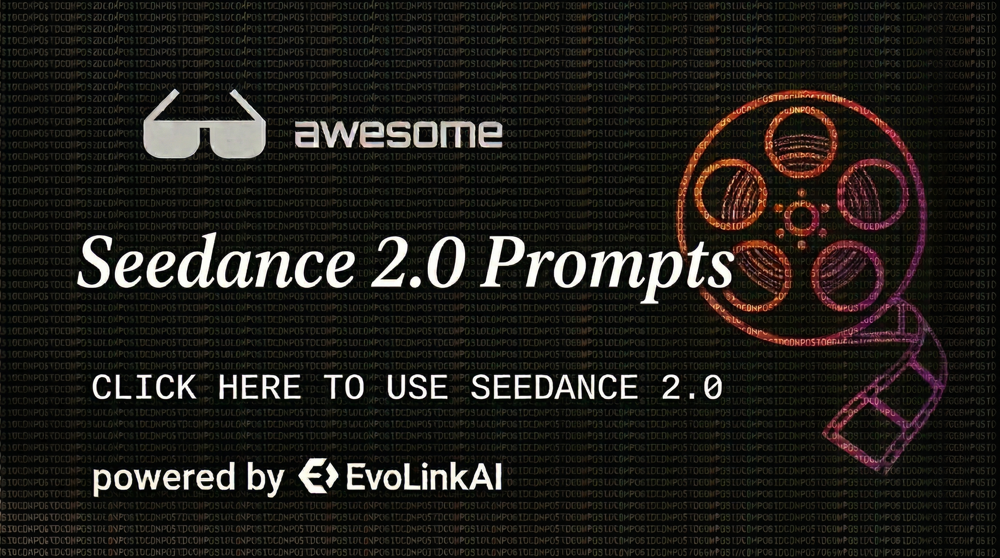

# Awesome Seedance 2.0 Prompts

<p align="center">
  
</p>

A curated Seedance 2.0 prompt library cleaned from public community posts and organized for GitHub-native browsing.

Language: **English**

## Description

This repository focuses on **usable prompts**, not commentary about prompts. The collection is cleaned from a larger raw dataset and kept in a README-friendly format for fast discovery and reuse.

- Non-prompt commentary, repost captions, and discussion-only entries are removed.
- Social-handle mentions are removed when they are not part of the prompt itself.
- Source links are preserved per entry for attribution and verification.
- Prompt numbers in this README match the current order of the cleaned dataset.

## Table of Contents

- [Statistics](#statistics)
- [How to Use This Repository](#how-to-use-this-repository)
- [Category Guide](#category-guide)
- [Featured Prompts](#featured-prompts)
- [All Prompts](#all-prompts)
- [Copyright Notice](#copyright-notice)

## Statistics

| Metric | Value |
| --- | --- |
| Total prompts | 125 |
| Source languages | 4 |
| Latest source date | `05 Apr 2026` |

## How to Use This Repository

1. Start with the `Category Guide` to narrow the style or use case you want.
2. Open a few candidate prompts and compare how they handle camera, timing, environment, and subject detail.
3. Adapt the structure, not just the nouns. Good Seedance prompts usually become stronger when you keep the shot logic and replace the subject, setting, or mood.
4. Treat numbered entries as stable references for the current cleaned dataset. If the dataset is cleaned again later, the numbering should be regenerated together with this README.
5. Keep prompt-internal material references such as `@image1` or `<<<Image1>>>` when they are part of the prompt syntax.

## Category Guide

| Category | Description | Prompt IDs |
| --- | --- | --- |
| Reference-Driven | Prompts that depend on image references, character consistency, or first/last-frame control. | `#6`, `#12`, `#16`, `#26`, `#30`, `#51`, `#62`, `#74`, `#84`, `#91` + 3 more |
| Cinematic Realism | Live-action leaning prompts with grounded camera language, emotion, and physical detail. | `#38`, `#48` |
| Action / Fantasy | Combat, chase, fantasy, anime, wuxia, monster, and large-scale spectacle prompts. | `#8`, `#10`, `#19`, `#23`, `#33`, `#37`, `#41`, `#44`, `#45`, `#50` + 13 more |
| Commercial / Product | Ads, fashion, music-video styling, product showcases, and brand-style visual pieces. | `#15`, `#35`, `#36`, `#49`, `#112`, `#124` |
| POV / FPV | First-person, drone-like, helmet, or body-mounted camera prompts built around immersion. | `#4`, `#5`, `#11`, `#29`, `#40`, `#43`, `#52`, `#55`, `#72`, `#96` + 3 more |
| Surreal / VFX | Experimental, dreamlike, abstract, or heavy-effect prompts where transformation and impossible visuals matter. | `#9`, `#13`, `#14`, `#22`, `#24`, `#34`, `#54`, `#58`, `#69`, `#73` + 11 more |
| Templates & Structured Formats | Prompt skeletons, schema-like JSON prompts, and reusable structured writing formats. | `#17`, `#20`, `#56`, `#64`, `#65`, `#66`, `#86`, `#93`, `#97`, `#101` + 5 more |
| General Cinematic | Useful prompts that do not fit the tighter buckets above but are still actionable. | `#1`, `#2`, `#3`, `#7`, `#18`, `#21`, `#25`, `#27`, `#28`, `#31` + 22 more |

## Featured Prompts

These examples are selected for range: reference-driven action, cinematic realism, structured formats, commercial work, and reusable prompt design.

### #91
- Date: `02 Apr 2026`
- Original language: `zh` (Chinese)
- Source: [View original post](https://x.com/john87445528/status/2039496153641660508)

```text
Chapter 1 (0-15 seconds): Rooftop Awakening · Running and Leaping Down (Front to Back View) Style: Rugged, primitive realism style, using 35mm handheld film camera, with natural film grain and subtle shake. The dazzling direct sunlight of Chongqing noon creates high-contrast strong shadows and flares. Camera: A single continuous third-person handheld follow shot (no cuts), starting from a low front angle and smoothly transitioning to an over-the-shoulder/back view, following the protagonist 
Image 1
 throughout. Atmosphere: High-altitude strong winds howling, dust and mist flying, realistic physical floating effects for cloth, hair, and mechanical parts. Sound Effects: Immersive spatial sound effects: metallic echo of mechanical high heels striking concrete, heavy rhythmic breathing, howling wind, sound of mechanical joints operating, violent flapping of clothing, sudden silence at the moment of the leap, followed by the high-speed wind cutting shriek of the descent. [Visual Reference / Description]: Must fully retain the elegant female character from the reference image, wearing a white suit, silver mechanical chest plate and neck collar, silver mechanical hands, and silver high-heeled boots (long straight black ponytail, delicate facial features, large earrings). Her physical characteristics and clothing details (silver trim on white suit, exposed chest design of mechanical chest plate, mechanical spine details on the back, mechanical gloves) must be completely consistent. The scene is the rooftop of Raffles City Chongqing skyscraper, surrounded by tall buildings, with the wide Yangtze River visible in the distance. [Timeline per Second] 0-4s: [Front Start] Handheld camera captures the character's full body from a low front angle. She stands at the edge of the rooftop platform, looking directly at the camera with a calm, resolute expression. The mechanical cervical spine reflects the noon sun strongly, and the ponytail floats in the high-altitude wind. She slowly turns around. 4-9s: [Over-the-Shoulder Follow · Full Sprint] The camera switches to an over-the-shoulder view, closely following her. She sprints across the concrete platform, mechanical high heels sparking metal with every step. The suit hem and mechanical spine exoskeleton violently move in the airflow, dust is kicked up from the roof, and the cloth physics effect is extremely realistic. 9-12s: [Leaping Down] She suddenly leaps out. As her feet leave the ground, the camera slightly dips and switches to a fast downward tracking view. The suit violently billows in the extreme airflow, the glass curtain walls of Raffles City rapidly move upward on both sides, and motion blur intensely erupts. [Style and Quality Enhancement] Realistic 8K quality, ultra-fine mechanical texture and cloth physics effects, cinematic lighting and high contrast, perfect motion blur, high dynamic range, no artifacts, coherent multi-modal physical effects, cinematic picture stability.

Chapter 2 (0–15 seconds): Freefall · Purple AITO M7 Enters the Frame Style: Rugged realism style, 35mm handheld camera, natural film grain, subtle organic shake. Camera: Primarily handheld follow shots, allowing for quick cuts (protagonist's falling perspective ↔ ground car chase perspective alternating) to create an extremely tense rhythm. Maintain real-time high-speed pace throughout, no slow motion. Lighting: Dazzling high-contrast direct sunlight of Chongqing noon, strong reflections on Raffles City glass curtain walls, heat haze emanating from the road surface. Sound Effects: Wind cutting shriek continuously intensifies → engine roar of a car approaching from the distance → sharp sound of tires friction on asphalt → cyber energy hum → metallic thud at the moment of contact → dull impact of four wheels landing → engine roar continues without diminishing, accelerating further. [Visual Reference/Description] The protagonist is the same female character from the reference image, retaining all details. Scene: Chongqing ramp road below Raffles City, a purple Huawei AITO M7 (智界R7) is driving normally at high speed. It uses the uphill ramp to naturally launch, precisely catching the protagonist falling from the rooftop with its inertia. No slow-motion close-ups throughout, maintaining a realistic high-speed cinematic rhythm. [Timeline per Second] Continuing from 
Video 1
, extending by 15 seconds. 0–4s: [Extreme Speed Fall · Overlooking the Ground] Protagonist 
Image 1
 falls at high speed, maintaining a balanced gliding posture with arms spread throughout. The camera locks onto her back. The Raffles City curtain walls rapidly fly upward on both sides, the ground rapidly enlarges, and motion blur is extreme. The screen quickly inserts a ground view: a purple Huawei AITO M7 is speeding on the ramp road below Raffles City. The car emits a cyber blue-purple energy glow, the engine roars, and tires leave two black marks on the asphalt. 4–9s: [Ramp Launch · Trajectory Intersection] The purple AITO M7 rushes to the top of the ramp. Using the ramp's inertia, the front of the car lifts into the air, and the sunroof automatically slides open instantly. The camera alternates rapidly between the falling protagonist and the ramping AITO M7—the protagonist maintains a high-speed falling posture with arms spread, and the AITO M7 continues to accelerate up the ramp. The two trajectories rapidly converge, compressing the sense of time to the limit, maximizing tension. 9–11s: [Last Second · Posture Change · Precise Entry] With only one second remaining until the sunroof—the protagonist instantly tightens her spread arms, abruptly adjusting her body from a horizontal gliding posture to a vertical upright position. Her legs are pointed straight down towards the open sunroof of the airborne purple AITO M7. The action is swift, decisive, and without hesitation. The next instant, she vertically drops into the open sunroof, her body entering the car at extremely high speed, landing in the driver's seat. No slow motion throughout; the impact is realistic and violent. 11–13s: [Four Wheels Landing · Maintaining Drive] The car body slightly compresses upon catching the protagonist's impact, and the four wheels firmly return to the asphalt road surface. The suspension system violently absorbs the double impact. Immediately after landing, the engine roar escalates. Without slowing down or stopping, the four wheels friction the asphalt, leaving new black wheel marks, and continue driving forward at full speed. 13–15s: [Stable Inside Car · Energy Accumulation] The AITO M7 maintains high-speed driving. The camera tracks the car from a low angle close to the side: the blue-purple energy patterns on the car body begin to spread from the four wheels to the body. The sound of mechanical transmission subtly rises from the car's underside and continuously strengthens. The car body slightly vibrates during high-speed driving. The precursory energy for the impending transformation surges and churns beneath the car paint. [Style and Quality Enhancement] Realistic 8K quality, ultra-fine mechanical and energy light effect textures, cinematic volumetric light and heat haze effects, perfect speed blur, HDR energy glow, no artifacts, real-time speed throughout with no slow motion.

Chapter 3 (0–15 seconds): AITO M7 Transforms · Becomes F-14 · Protagonist Stands on Aircraft Back and Takes Off Style: Rugged realism style, 35mm handheld film aesthetic, natural grain, subtle shake. Camera: Multi-angle cut follow shots (ground tracking / low-angle close to the ground / side of the aircraft / protagonist's first person), closely following the aircraft throughout. Transformation details must be clearly visible. Atmosphere: Light smoke and heat haze permeate the Chongqing road. Cyber blue-purple light and shadow refract between buildings. Noon sunlight forms dazzling reflections and strong shadows on the metal structure. Sound Effects: Engine roar suddenly escalates → sound of metal skin bursting and folding → low tremor of hydraulic wings unfolding → sound of the protagonist's 
Image 1
 metallic grip while climbing the exterior of the aircraft → sound of the cockpit seal bursting "pop" immediately drowned out by wind noise → explosive roar of dual engines igniting → piercing shriek of the F-14 taking off and breaking the air → strong high-altitude airflow howling covers all sound tracks. [Visual Reference/Description] The purple AITO M7 completes a full transformation while driving on the Chongqing road, transforming from a car shape into an F-14 fighter jet 
Image 2
. The protagonist perilously clings to and climbs the exterior of the aircraft during the transformation process. The protagonist ultimately stands centered on the back of the F-14 fighter jet, legs slightly spread to stabilize her center of gravity. Her white suit and ponytail violently flutter in the extreme airflow. The F-14 takes off directly from the Chongqing road, and the protagonist remains standing firmly on the aircraft's back. [Timeline per Second] 0–4s: [Road Acceleration · Transformation Start] The AITO M7 rapidly accelerates on the Chongqing road. The car panels sequentially burst open and unfold. The front hood rolls up and transforms into mechanical structures. The doors fold to the sides. The metal skin cracks along structural lines, revealing the cold mechanical internal structure. The protagonist perilously climbs towards the top of the aircraft on its exterior during the violent transformation, firmly gripping the transforming metal skeleton. She jumps and shifts position with the changing shape of the aircraft. The action is tense and exciting. The camera tracks every climbing detail from close to the side of the aircraft. 4–6s: [Wings Unfold · Engines Fully Reassemble] The F-14's iconic swept wings suddenly unfold from their folded state and lock. The camera shoots a low-angle, close-to-the-ground full view of the wings unfolding. Heat haze and dust are violently kicked up by the wing airflow. The dual engine nacelles violently reassemble into jet structures, emitting blue-purple thrust flames. The road surface is scorched by the exhaust plume. The protagonist has now climbed to the center of the aircraft's back, her feet firmly planted on the aircraft structure, and her body stands upright as the transformation completes. 6–8s: [Protagonist Stands on Aircraft Back · Takes Off] The moment the transformation completes, the protagonist stands completely upright on the F-14 fighter jet's back. The white suit hem violently lifts in the strong airflow, and the ponytail floats horizontally. The silver mechanical parts strongly reflect the noon sun. The F-14's dual engines ignite at full power. The aircraft suddenly accelerates, the front wheel lifts off the ground, and the rear wheels push off the asphalt at the last moment. The nose pitches up, carrying the protagonist on its back into the Chongqing sky. 8–15s: [Taking Off and Skimming the City · Protagonist Stands Firm] The F-14 climbs vertically and then abruptly lowers its nose, skimming over Chongqing at an extremely low altitude.
```

### #24
- Date: `15 Mar 2026`
- Original language: `en` (English)
- Source: [View original post](https://x.com/JiahaoYang_art/status/2033119940216344616)

```text
15-second cinematic Japanese drama pure love ambiguous short film, ultra-realistic quality, warm golden sunlight in an empty classroom in the afternoon, spilling through the blinds onto the side-by-side desks, fine dust motes slowly floating in the light beams, old wooden desks, extremely natural subtle movements, breathing, and eye tension, characters maintain consistent faces, clothing, and hairstyles throughout without deformation, drift, or artifacts, real slight chest rise and fall synchronized with breathing, shallow depth of field, creamy blurred background, warm film grain, 8K sharp, Japanese youth restrained heart-fluttering suffocating atmosphere.
0-4 seconds: Extremely slow push-in shot from a medium shot of the desktop to a close-up of the two people's side profiles sitting side-by-side. A pure girl in a summer school uniform is focused on writing notes with her head down, long black hair and stray hairs by her ears are gently lifted by a slight breeze, long eyelashes cast subtle shadows, skin is naturally pink and tender, a slight, unintentional upturn of the corner of her mouth in concentration, light and even breathing.
4-9 seconds: Switch to a close-up of the boy. His school uniform collar is slightly loose, he props his elbow on the desk and secretly turns his head to gaze at her, his eyes filled with gentle, restrained affection and tenderness, pupils slightly dilated, his Adam's apple gently rolls. Suddenly noticing her pen pause, he quickly and flusteredly turns his head to pretend to look at his own notes, his earlobes quickly turn slightly red, his fingertips tremble slightly as he grips the pen, occasionally glancing at her from under his bangs, his breathing is slightly disordered, and his lips are tightly pressed in an effort to remain calm.
9-15 seconds: Extreme close-up of both faces in the same frame, slow-motion eyes suddenly meet: the girl slowly turns her head, first showing a dazed surprise, then quickly and shyly lowers her head for 0.3 seconds, gently biting her lower lip, her cheeks and earlobes instantly bloom with cherry blossom pink, her moist eyelashes timidly look up to meet his gaze again, while softly and shyly whispering, "...What are you looking at?"; the boy freezes completely, his pupils dilate, and he is stunned for 0.4 seconds, then flusteredly and quietly stutters in response, "N-nothing...". The girl whispers even quieter, biting her lip and peeking at him again, continuing to whisper, "...Liar.". The boy pauses, then gently sighs and whispers, "...Just looking at you.", the corner of his mouth slowly curls up into a shy, gentle, crooked smile, fine lines appear at the corners of his eyes, and his breathing noticeably deepens. An invisible current seems to pull the ambiguous tension between their faces, sharing each other's breathing temperature, the background completely melts into layers of creamy, dreamy light spots, warm halos, and fine air particles.
Lip synchronization is natural and precise, emotional micro-tremors and breathing are synchronized, dialogue is low-energy whispering with a shy tone, natural short pauses between 200-400 milliseconds, the mouth only moves slightly when speaking, without exaggeration or robotic feel, perfect natural lip-sync and emotional authenticity.
Overall Sound Effects: Distant summer cicada chirping faintly, the soft scratching sound of the pen touching the paper, the almost inaudible low-frequency pulse of their heartbeats, finally fading into a very light, airy piano. The dialogue is completely naturally integrated into the scene as whispers, the girl's voice is soft and shy, the boy transitions from flustered stuttering to gentle.
Character identity is maintained throughout, real subtle head tilts, eye movements, and breathing synchronization, no text, watermarks, or subtitles, pure Japanese style youth secret crush heart-fluttering suspense.
```

### #32
- Date: `03 Apr 2026`
- Original language: `zh` (Chinese)
- Source: [View original post](https://x.com/Adam38363368936/status/2039932977287979053)

```text
跑车商业摄影分镜

镜头一 (1.5s): 画面开头是跑车，正面镜头，展示标志性的“愤怒”前脸。

镜头二 (1s): 近景镜头，虚拟摄像机慢慢围绕车标进行环绕运动（不转圈，纯环绕），特写法拉利跃马标志。

镜头三 (1.5s): 近景镜头，斜看LaFerrari独特的蝴蝶门（车身侧面），进行缓慢环绕运镜，强调其车身线条。

镜头四 (1s): 镜头移动至车尾处，进行近景拍摄，随后慢慢往后拉，运用希区柯克镜头（Dolly Zoom）效果，呈现视觉冲击感。

镜头五 (1s): 近景镜头拍摄车的后视镜，保持缓慢环绕运镜。

镜头六 (1s): 镜头缓慢向前推进，采用低角度推进运镜。车静止，呈现强烈透视感、光影渐变。专业汽车摄影，深邃背景，电影级构图，重心沉稳，高清实拍画质。

镜头七 (1s): 横向轨道滑动运镜，镜头平行扫过LaFerrari车身。车静止不动，流畅平移画面。侧光勾勒腰线，轮毂特写，细腻反光，高级感，电影运镜，干净构图。

镜头八 (1s): 俯视视角，镜头缓慢下降运镜。静态跑车，完美车身比例，顶光质感，干净地面反射，航拍感运镜，车静止，构图对称，奢华质感，8K超写实，广告级画面。

镜头九 (1s): 镜头缓慢推近特写，从整车推到车灯/轮毂/腰线。车静止，微距细节，光影渐变，电影感浅景深，高级质感，细节锐利，商业摄影。

说明：

画面与画面之间无需转场。

画面中不出现任何人。

最高画质：8K。
```

### #64
- Date: `03 Apr 2026`
- Original language: `en` (English)
- Source: [View original post](https://x.com/TechTalkNAVI/status/2039941029265355123)

```text
{
 "location": "Tokyo Cityscape (Night)",
 "duration": "10s",
 "prompt": "A cinematic POV shot riding an invisible rollercoaster through Tokyo at night. A glowing neon rail 'creates itself' milliseconds before the camera hits it, weaving through the steel structures of Tokyo Tower and nearby buildings. As the camera passes, each building it touches instantly transforms into a stack of glowing cubes that rotate and re-assemble. The shot ends with the camera diving straight down into a sea of neon lights, which turns into a giant QR code or a logo just before the screen goes black.",
 "vfx_focus": [
 "Procedural rail generation",
 "Dynamic environment transformation (Geometry nodes style)",
 "Extremely high-speed camera motion with light streaks"
 ]
}
```

### #78
- Date: `03 Apr 2026`
- Original language: `en` (English)
- Source: [View original post](https://x.com/ChrisTheNerv/status/2040043939109953944)

```text
100% real-life shooting texture, Hollywood IMAX blockbuster quality, natural light and shadow, cold documentary style, natural light on a cloudy day, handheld one-shot throughout, breathing shake, random focus shift, 16:9 widescreen.
【Scene Environment】
A destroyed city street extending into the distance. On both sides are ruined concrete buildings, exposed rebar, shattered windows, and some buildings are still burning, with orange flames and black smoke rising. Abandoned cars are scattered on the cracked asphalt road, several of which are burning. The sky is gloomy gray, with smoke and dust suspended in the air. Multiple meteorites streak across the sky with long trails of fire and dense smoke. In the background, terrified civilians scatter among the ruins, some falling, others dragging the injured.
【Main Character】
Chinese beauty, deep red hair tied in a loose, messy bun, with a few strands hanging by her face. Fair skin, sharp features, defined jawline, natural makeup, detailed eye makeup. Attire: Black long leather trench coat over a black vest, black denim mini skirt, black flat combat boots, no belt, wearing black futuristic gauntlets on both hands. Expression is tense and restrained, slightly painful, with slightly furrowed brows—eyes filled with despair and strong will.
【15-Second One-Shot · Awakening Strike Version】
0-2 seconds · Awakening
Low-angle shot, framing her upper body and face, looking up at her standing alone in the center of the destroyed street. The wind blows her black leather trench coat. She opens her lips and screams in Japanese: "Kakusei shiro!" She suddenly opens her right hand, and the black futuristic gauntlet crackles. Purple crystal-textured electric arcs burst from her arm and gauntlet. Air compresses inward, and space warps and distorts. The shockwave emits a low sonic boom. Purple rune lines appear and circulate around her body.
2-5 seconds · Eruption
The camera begins to orbit around her. Dark gold cracks burst from her chest, and thick golden liquid oozes out like blood. She screams in pain. Purple mist and fine electric arcs shoot outward. All her clothing tears open and explodes from the inside, burning into ash—leaving nothing. Organic armor fragments shoot outward, then retract unnaturally to reattach to her body. Purple patterns symmetrically spread across her face. A crack opens on her cheek, revealing pulsating purple light underneath. Simultaneously, multiple mechanical arm-like appendages violently burst from her back—dark metallic texture, blade-shaped, spreading outward like devil's wings. Sparks, blue electric arcs, and golden energy particles explode from the eruption point. The camera captures the complete unfolding from behind—her silhouette outlined against the gray sky, mechanical appendages spread like a fan. The eruption sound is like tearing metal mixed with arc discharge.
5-8 seconds · Growth
Organic matter seeps from her body, the surface shimmering with iridescent light. White armor plates collide and fuse, leaving burn marks. The armor extends downward, completely engulfing and replacing her flat combat boots, forming white and dark purple interwoven armored boots, locking into place with tiny sparks. She grits her teeth and lets out a painful roar. The core in her chest flickers like embers. Purple-black metal spreads over her face, forming an uneven mask, the left eye covered before the right. Compound eyes begin to form, irregularly flashing with liquid light medium. The camera continues to orbit around her.
8-12 seconds · Completion
The camera continues to slowly orbit her. The mask completely seals. Horn-like structures grow upward from the top of her head, burning with purple-gold flames. One compound eye glows steadily, the other flickers with unstable current. The armor is interwoven with white and dark purple, uneven and covered in battle damage, with glowing purple cracks oozing light fluid. Mechanical appendages sway slightly behind her. Each armor plate emits a crisp metallic click when locked, followed by distinct mechanical reset sounds. She slowly lowers her head to examine her hands—the knuckles of the white and dark purple interwoven armored gauntlets seep purple light. She slowly raises her head to look straight ahead, and the compound eyes suddenly glow fully.
12-15 seconds · Supersonic Charge
The camera rapidly retreats. She pushes off the ground with her feet, and the asphalt instantly explodes into a deep crater. A violent purple energy explosion spreads outward from the takeoff point, sending gravel and asphalt fragments flying into the air. She shoots into the air at supersonic speed, charging directly towards the camera—a conical sonic boom cloud forms behind her, the mechanical appendages are flattened backward by the airflow, and the image generates strong dynamic blur. Her figure grows larger and closer, filling the entire frame. A purple energy trail drags behind her. In the final frame, her armored faceplate almost hits the lens, the compound eyes glow scarlet red, and the screen suddenly cuts to black.
【Ambient Sound】
Low sonic boom during awakening, tearing metal and arc discharge sounds, painful screams, crisp metallic clicks, heavy metal sounds of mechanical appendages unfolding, crackling sounds of burning in the background and distant explosions, the final supersonic charge accompanied by the sound of the takeoff explosion, sonic boom impact, and rapidly approaching wind pressure. Everything falls silent the moment the screen cuts to black.
【Physical Texture Enhancement】
Real light and shadow, visible skin texture on the face before transformation, visible real wear and tear on the leather trench coat before transformation. Mechanical appendages possess physical weight and inertia—they sway slightly after unfolding, not rigidly fixed. The armor plates are interwoven with white and dark purple, with visible scratches, welding marks, and uneven edges—not clean and smooth. All movements are steady and powerful, full of pain but resolute—she awakens while enduring. Occasional slight camera shake, pure handheld follow-shot feel.
【Sound Design】
Layered progression from the scream activation to the explosive mechanical eruption, escalating to the takeoff point explosion and the sonic boom of the supersonic charge, finally cutting abruptly to silence. The entire sequence exudes absolute power. Generate sound effects only, no music.
```

### #84
- Date: `03 Apr 2026`
- Original language: `en` (English)
- Source: [View original post](https://x.com/Adam38363368936/status/2039865857179013318)

```text
[Cloud Cave Sword Shadow · Heavenly Gate Bloody Battle]
— One-shot sequence at Tianmen Mountain, Zhangjiajie
Core Style: Tsui Hark's new style Wuxia blockbuster, one-shot sequence, high frame rate, 4K ultra-clear.

Tone: Tsui Hark's bright tone, “Cold Jade Blue-Black + Amber Flowing Light.” High contrast, mountain mist acts as a soft light filter, sharpening character outlines, DaVinci industrial-grade color grading.

Scene: Tianmen Mountain, Zhangjiajie (Wacky terrain of Western Hunan. Tianmen Cave opens, swallowing clouds and mist; 999 steps of the Heavenly Ladder hang vertically on the cliff, like a path to heaven; stone forests and pillars cluster like sharp swords, plank roads are faintly visible amidst surging clouds, birds do not cross).

Camera Movement Trajectory:
Low-angle upward shot (emphasizing the natural danger) → Rapid push toward the cave entrance → 180° horizontal pan (showing intense fight on the plank road) → Dive down → Slowly pull back to center → Backlit close-up.

Shot Script:
0-4 seconds [Opening Stance · Heavenly Gate Cloud Surge]:

Movement: Extreme low-angle upward shot, the camera rapidly swoops up and over the Heavenly Ladder from the bottom.

Visuals: Character face reference @[Image 1] Wuxia swordsman attire (white clothes like snow, low-pressed bamboo hat, holding a long sword) stands alone in the center of the 999 steps.

Action: Strong winds whip up the surrounding clouds and mist. [Image 1] holds the sword hilt with the right hand, and the left hand forms a sword-finger gesture across the bridge of the nose. The camera pulls back to show the Tianmen Cave behind him, resembling a giant eye of the heavens.

4-8 seconds [Fierce Battle · Suspended Ladder Interception]:

Movement: 180° orbiting pan.

Visuals: More than ten assassins in tight suits swing down from both sides, clinging to the cliff like monkeys.

Action: [Image 1] touches the steps with his toes, his body spinning upside down. (Tsui Hark-style slow-motion dynamics) The sword remains sheathed, using the sheath as a stick to point, parry, and strike. The air current shakes the rainwater on the steps into mist. The camera rapidly orbits, capturing afterimages and the sparks of metal impact.

8-11 seconds [Breaking the Formation · Traversing the Stone Forest]:

Movement: The camera follows the character diving, passing through a stone archway into the cliffside plank road.

Visuals: Assassins set up a steel wire trap.

Action: [Image 1]'s long sword finally unsheathes (the blade reflects amber sunlight), executing a sweeping strike. The sword energy transforms into a blue-black arc of light, cutting the steel wires. The snapping wires rebound and shatter cliff rocks. He dodges and weaves on the narrow plank road, his figure intersecting with the stone pillars, blending virtual and real.

11-15 seconds [Closing Stance · Mist Dissipates on the Lonely Peak]:

Movement: The camera slowly pulls out from the cave entrance, widening the view to reveal the abyss.

Visuals: Paper talismans (or dead leaves) flutter in the wind. [Image 1] stands at the edge of the Tianmen Cave, with a sea of clouds below his feet.

Action: He performs a sword flourish and sheathes the sword, placing it on his back. Sunlight streams through the Tianmen Cave, creating a massive Tyndall effect.

Freeze Frame: The camera pushes in for an extreme close-up. A drop of blood drips from the edge of the bamboo hat, tracing his jawline. His eyes are sharp as lightning, with the vast landscape in the background.
```

### #117
- Date: `01 Apr 2026`
- Original language: `ja` (Japanese)
- Source: [View original post](https://x.com/YaReYaRu30Life/status/2039474680235741681)

```text
【Basic Settings】
structure: Single continuous shot (no cuts)
progression: Morphing 7 images sequentially
visibility: Each image is clearly recognizable for only an instant (no stopping required)
transition: Always smooth and continuous
style: Cinematic, high-definition, dynamic, no flicker
【Prompt Body】
Start from <<<Image1>>>.
The footage proceeds in a completely seamless single shot, continuously transforming in the order of <<<Image1>>> → <<<Image2>>> → <<<Image3>>> → <<<Image4>>> → <<<Image5>>> → <<<Image6>>> → <<<Image7>>>.
The overall scene is not static; morphing occurs within a dynamic video where the camera is constantly moving.
However, the recognizability of the subject is maintained, and the composition is controlled to prevent collapse.
Each image has a peak state where it is clearly visible for an instant within the flow, but there is no stopping or holding.
Everything is expressed as a continuous "evolution within motion."
【Transformation Logic (Fixed order, no duplication)】
<<<Image1>>> → <<<Image2>>>:
The camera begins transformation while smoothly pushing in forward
Gradual change in the order of outline → parts → color → texture
Fine particle decomposition → reconstruction
<<<Image2>>> → <<<Image3>>>:
Tracking movement where the camera flows horizontally
The structure is rewritten by light scanning
Emitting lines flow, and the shape continuously changes
* Particle expression is prohibited
<<<Image3>>> → <<<Image4>>>:
Orbit movement where the camera circles around the subject
The shape is stretched and transformed by spatial distortion and lens warp
<<<Image4>>> → <<<Image5>>>:
The camera slightly pulls back and changes perspective (light dolly out + angle change)
The subject melts like liquid and is reformed while flowing
<<<Image5>>> → <<<Image6>>>:
The camera accelerates momentarily, adding momentum to the movement
The subject fragments, scatters in space, and then reassembles into a new form
<<<Image6>>> → <<<Image7>>>:
The camera stabilizes while converging back towards the center
Energy converges at the center and integrates into the final form through light and waves
【Camera Behavior (Important)】
・Always moving but controlled movement
・Usable:
  - Push-in / Pull-out
  - Horizontal tracking
  - Orbit (circling)
  - Light perspective change
・Prohibited:
  - Sudden blur
  - Loss of subject
  - Unnatural jumps
【Constraints (Important)】
・Cut editing prohibited (complete single shot)
・Reuse of the same effect prohibited
・Flicker, noise, and breakdown prohibited
・Subject position/scale should not be significantly disrupted
・Each image must achieve a clearly visible state at least once
・All changes must be continuous and meaningful structural transformations
【Enhancement Keywords】
dynamic camera movement
cinematic motion flow
smooth continuous morphing
temporal coherence
high detail preservation
consistent subject identity
seamless transformation flow
```

### #124
- Date: `01 Apr 2026`
- Original language: `en` (English)
- Source: [View original post](https://x.com/Adam38363368936/status/2039157138002780202)

```text
Product: Color-shifting gradient foldable smartphone (e.g., light purple to ice blue gradient)

Style: Trendy fashion, energetic fast pace, high-end texture, no people, minimalist light and shadow, fashionable trend style
Tones: High-saturation contrasting colors, light purple gradient frosted glass texture, clean and bright, cinematic light and shadow
Camera Language: Macro close-up, fast rotating camera movement, orbiting camera movement, handheld dynamic camera movement, push-pull quick cuts, smooth transitions
Tempo: 15 seconds tight quick cut, beat-synced editing, sharp transitions

Visual Content:
The light purple gradient foldable phone rapidly rotates against a pure black background, with light flowing across the body; macro close-ups of the ultra-thin hinge structure, the glass texture of the outer screen, the brushed metal close-up of the camera module, and the extremely thin side bezel; quick cuts showing the moment the phone unfolds from folded state, the visual impact of the inner screen's ultra-narrow bezel; paired with simple trendy scenes such as a minimalist office desk, an art gallery corner, late-night city neon, or a trendy collectible display case; fashionable and energetic. No models throughout, focusing only on the product.

Sound Effects: Trendy electronic drum beats, metallic clinks, mechanical click sound of the screen unfolding, beat-synced sound effects
Quality: 4K high definition, commercial advertisement quality, smooth dynamics, vibrant colors
Requirements: Fast pace, tight transitions, high-end fashion, youthful energy, no people appearing.
```

## All Prompts

### #1
- Date: `31 Mar 2026`
- Original language: `zh` (Chinese)
- Source: [Original post](https://x.com/liyue_ai/status/2038993496225591731)

```text
整体风格：清新治愈、温馨怀旧，暖绿+浅蓝主色调，光影柔和通透，氛围感温柔细腻 
背景音乐：轻柔纯音乐（钢琴+竹笛），节奏舒缓，情绪层层递进 
1、全景，夏日午后，阳光透过枝叶洒下斑驳光影，清澈的小溪旁，一群孩童赤脚追逐打闹，水花溅起，笑声回荡在田野间 缓慢横移 孩童清脆的笑声、溪水流动声、微风声 
2、中景 孩童追着彩蝶奔跑，指尖轻触蝶翼，粉黄相间的蝴蝶在野花丛中翩翩起舞，绕着孩童打转 跟拍+轻微旋转 蝴蝶振翅声、孩童嬉笑声
3、近景 孩童蹲在稻田边，伸手试探抓捕青蛙，青蛙受惊发出呱呱叫声，接连跳跃着躲进稻禾深处，稻叶轻轻晃动 固定镜头 青蛙呱呱叫声、孩童惊喜的呼喊声
4、全景 孩童嬉戏的画面整体被柔光包裹，画面亮度逐渐降低，开始渐隐转场，色彩慢慢虚化 镜头缓慢拉远，画面渐隐 背景音乐渐弱，环境音淡出
5、远景 湖畔青石上，一位青年人独坐，身形安静，背景是澄澈的湖水与远处的绿树，画面静谧 缓慢推近 纯音乐轻柔响起，微风声 
6 特写 青年人的眼部特写，眼底带着淡淡的忧郁，眼神温柔又怀念，望向湖面的方向 固定特写镜头 无额外音效，纯音乐为主
7、中景 顺着青年人的目光，湖面之上，孩童划着小船嬉闹，船桨划开湖水，泛起层层涟漪 镜头缓缓摇向湖面 孩童嬉闹声、船桨划水声 
8、仰拍全景 天空中洁白的云朵慢悠悠地飘远，逐渐淡出画面，仿佛在与旧时光告别 缓慢仰拍上移 纯音乐节奏放缓，意境升华 
9、全景 整体画面缓缓变暗，光影逐渐收敛，湖畔与青年的身影变得朦胧 固定镜头，画面渐暗 纯音乐渐弱至静音 
10、特写 屏幕中央浮现清晰端正的仿宋字：春风若有怜花意，可否许我再少年，文字停留，画面定格 文字淡入 无音效，文字停留收尾
```

### #2
- Date: `31 Mar 2026`
- Original language: `zh` (Chinese)
- Source: [Original post](https://x.com/TingFengAIAI/status/2038904225548149011)

```text
美女卡点：

0-1.3 秒裸色 CL 高跟鞋脚踝特写（大理石地板，高级灰丝袜包裹脚踝，贴合无褶皱），伴随 “嗒” 一声鞋跟顿点声（卡点 0.1 秒），1 名 35 岁中国美女穿高级灰超薄丝袜 + 裸色 Christian Louboutin 高跟鞋 + 黑色缎面长裙，在简约大理石地板做脚踝延展（0.6 秒）+ 鞋跟顿点卡点动作（0.2 秒），卡点精准到 0.1 秒，1.3-5.0 秒镜头缓慢推近（慢运镜，速度均匀，无晃动）→快速切灰丝袜足部特写（强运镜反差，切换时间 0.1 秒）→瞬间切腰腹极致特写，切换瞬间同步 1 声鞋跟声，美女做手臂延展（0.7 秒）+ 脚步卡点（0.4 秒），5.0-12.0 秒镜头轻微环绕（跟拍动作卡点，环绕幅度精准匹配动作幅度，无多余晃动），持续锁定腰腹特写 + 灰丝袜小腿特写交替，美女做旋转（0.9 秒）+ 下腰卡点（0.5 秒，高跟鞋稳当，动作精准，灰丝袜纹理清晰可见），鞋跟声随旋转、下腰动作同步卡点，12.0-15.0 秒镜头定格三重叠特写：腰腹线条特写 + 灰丝袜腿部特写 + 足部红底鞋跟特写，全程 22 个卡点，卡点舒缓但精准，运镜贴合动作，无多余冗余，鞋跟声、卡点、运镜三者高度契合，最大化发挥 Seedance 2.0 性能 --ar 16:9 --motion 8，柔焦白光 + 光晕，高级感拉满且约束性强
```

### #3
- Date: `31 Mar 2026`
- Original language: `zh` (Chinese)
- Source: [Original post](https://x.com/anson7956/status/2038846411253657939)

```text
在儿童房的地板上，一个迷你女孩骑着一块小滑板，贴着地面飞驰。画面比例如此巨大，以至于真人大小的玩具和家具都显得无比巨大。镜头从低角度紧随其后，以类似一镜到底的镜头不断向背景移动。影片运用了超广角镜头、动态模糊、景深和电影级光影效果。速度分三个阶段逐渐加快。第一阶段，她高速穿过狭窄的通道，如同乐高城市建筑间的峡谷，在积木间灵活穿梭。第二阶段，一个巨大的球从前方滚向她，她滑进球与墙壁之间的狭小缝隙，险险躲过掉落的积木，并从一辆行驶中的迷你汽车的轮胎间擦身而过。在第三阶段，她从即将被风合上的图画书书页缝隙中破空而出，从摇晃的毛绒玩具腋下钻过，最后跃入即将关闭的玩具箱盖上的小缝隙，以最快的速度消失在黑暗的远方。这是一段惊险刺激、扣人心弦的视频，充满了一系列惊险的逃脱场面。视频场景设定在一个逼真的儿童房内，运用微缩视角营造出身临其境、如同游乐设施般的体验，充分利用了巨大的障碍物和狭小的缝隙。
```

### #4
- Date: `02 Apr 2026`
- Original language: `en` (English)
- Source: [Original post](https://x.com/genel_ai/status/2039538309790404797)

```text
A hyper-realistic, 8K resolution, adrenaline-fueled single-take POV action sequence. The camera is chest-mounted on a man wearing camouflage joggers and worn-out black-and-white sneakers. He stands on the dizzying edge of a rusted skyscraper, 1000 feet above a crystalline turquoise ocean. No clouds, no haze—just a sheer, terrifying vertical drop into the deep blue.
[The Initial Freefall]
The sequence begins with a sudden, heart-stopping leap into a 20-meter vertical freefall. The camera points directly at his feet as the sea surface rushes toward the lens. A deafening, high-pitched whistling 'Hyuo' wind screams past the microphone. Just before the impact, he catches a lower rusted horizontal bar with both hands—white wristband visible—and swings his body forward to land on a tiny vertical pole.
[The Rhythmic Jumps & The Near-Death Slip]
He immediately begins a rhythmic series of high-speed jumps:
Jump 1: A clean, agile spring to a second vertical pole 2 meters away.
Jump 2: A rapid leap to a thin, rusted horizontal pipe.
Jump 3 (The Slip): As he jumps toward the third vertical pole, his right sneaker completely misses the mark and slides off the rusted metal. The camera tilts violently over the edge, staring straight down at the 1000-foot abyss. He lets out a sharp, panicked gasp. For a terrifying second, his body leans into the void, but he desperately claws at the pole with his fingers, his boots scrambling against the side until he manages to hook his leg and haul himself back up.
Jump 4: Still trembling, he forces a frantic, heavy-breathing leap to the next bar to keep the momentum.
Jump 5: A final, explosive long-distance jump to a swaying metal platform. He lands with a heavy, jarring metallic 'Clang', his body hunching low, gripping the vibrating metal for dear life.
[The Ending]
The camera remains in a low, fetal position on the final bar, shaking from the adrenaline. No dialogue. The audio is a visceral layer of the aggressive 'Hyuo' wind, his intense, ragg
```

### #5
- Date: `02 Apr 2026`
- Original language: `zh` (Chinese)
- Source: [Original post](https://x.com/Adam38363368936/status/2039498800801398911)

```text
可以试试：

15秒好莱坞级上海城市快剪视频。风格： 赛博朋克与海派摩登融合，电影级青橙调色，8K超高清。
镜头序列： 1. 陆家嘴三件套摩天大楼在晨曦云雾中穿梭，直升机大俯冲航拍。
2. 镜头快速推近外滩万国建筑群，展现精细的石材纹理。
3. 穿梭机（FPV）在深夜霓虹闪烁的街道与东方明珠塔身疾速掠过。
4. 南浦大桥螺旋引桥的延时摄影，金色的流光车灯汇聚成环。
5. 航拍镜头平稳划过梧桐树影下的武康大楼。
6. 微距特写：一笼热气腾腾的南翔小笼包被筷子提起，汤汁晃动。
7. 高速蒙太奇剪辑：石库门弄堂、磁悬浮列车、豫园古建、摩登天际线快速闪回。
要求： 极致的动感运镜、穿梭机航拍、微距摄影、丝滑转场。
氛围： 充满活力、未来感、高级感、快节奏。全景与细节结合，突出城市脉动，商业广告质感。4k，写实风，流畅动态。
```

### #6
- Date: `05 Apr 2026`
- Original language: `en` (English)
- Source: [Original post](https://x.com/Just_sharon7/status/2040685931858907646)

```text
Strictly follow the reference character’s face, hairstyle, outfit silhouette, and body proportions. Do not change identity or facial structure. Fixed appearance: glowing dark eyes, torn black samurai kimono, traditional katana, black cursed smoke slowly leaking from the body, flowing shadow energy aura, calm but cruel expression, supernatural high-speed movement, consistent identity and physical appearance throughout the entire scene. Strictly follow the reference character’s face, hairstyle, outfit silhouette, and body proportions. Do not change identity or facial structure. Fixed appearance: glowing dark eyes, torn black samurai kimono, traditional katana, black cursed smoke slowly leaking from the body, flowing shadow energy aura, calm but cruel expression, supernatural high-speed movement, consistent identity and physical appearance throughout the entire scene. Hyper-realistic cinematic action, Unreal Engine quality, fast-paced 12s sequence. Cursed lone samurai (strict consistency: female Japanese, long tied black hair, pale skin, glowing dark eyes, torn black kimono armor, katana, black cursed smoke, shadow aura, calm ruthless expression). Environment: abandoned temple shrine at night, broken torii gates, shattered statues, debris, moonlight + dim lanterns, dust and wind, dozens of enemies, dark gritty tone. Camera: aggressive tracking, whip pans, blade POV, high-speed motion, no slow motion. Action: 0–3s: Samurai stands surrounded → instant iaijutsu draw → dark energy slash cuts multiple enemies. 3–6s: High-speed dashes, shadow afterimages, rapid slashes, enemies fall, debris flying. 6–9s: Close combat, parries, teleport-like strikes, circular slashes clearing groups. 9–12s: Final spinning slash → massive dark wave → enemies freeze then collapse → silence, smoke fading.
```

### #7
- Date: `05 Apr 2026`
- Original language: `ja` (Japanese)
- Source: [Original post](https://x.com/BarlowHakusyaku/status/2040673309181018522)

```text
はこちら↓
shot1(3秒):Sci-fiな雰囲気の未来オフィスフロア。アンドロイドオフィスウーマンが、フロアを無表情で歩いている。
shot2(3秒):ホログラムUIを操作して、デスクで仕事をしているアンドロイドウーマン。
shot3(3秒):ロボットの上司にUSBメモリを渡してアンドロイドウーマンの手の上に「Job done!」のネオン文字が浮かぶ。
shot4(3秒):アンドロイドウーマンがクルリとロボット上司に背を向け走り出すと、笑顔の女性に変身する。
shot5(3秒):変身した女性は海辺のビーチチェアにサマードレスを着て座っている。最後に「Relaxation time」と書かれた缶ドリンクをカメラに差し出して宣伝する。背景ははじけ飛ぶ水しぶき。
```

### #8
- Date: `05 Apr 2026`
- Original language: `en` (English)
- Source: [Original post](https://x.com/ShadeLurk/status/2040671186984796632)

```text
PR【Topview】 
#TopviewAI #Seedance2 
ダンス

prompt:
Three anime girls perform Perfume-style formation dance on illuminated stage — each girl executes a different assigned choreography but all movements are locked to the exact same beat with mechanical precision. Camera cuts rapidly between full shots and medium shots every 0.7-1 second, occasionally switching to side angle and overhead angle. Call-and-response structure between the three. Dance moves range from sharp standing arm work to low crouching floor sweeps. Blue-white spotlights carve through purple haze. LED panels pulse with blue-to-purple gradients. Triangular formation.
```

### #9
- Date: `05 Apr 2026`
- Original language: `en` (English)
- Source: [Original post](https://x.com/ZaraIrahh/status/2040667542390190245)

```text
Original Dark Fantasy Action Short Film: Inside a dilapidated church, a white-clad warrior and a black-armored opponent launch their final battle amid an atmosphere like a chorus. Stained glass shatters, moonlight penetrates the smoke and dust, and benches are overturned. The camera switches between high-angle overhead shots and low-angle upward shots, focusing on showing the sense of space of the religious building, the sense of oppression of the characters, and the temperament of a fateful decisive battle, just like the climax segment of an original fantasy animated film. A strong hook in the first 2 seconds, stable main body, coherent actions, movie-level composition, real light and shadow, epic sense, strong emotion, high-definition details, suitable for social media communication, avoiding copyrighted characters, avoiding brand logos, and completely original design.
```

### #10
- Date: `05 Apr 2026`
- Original language: `en` (English)
- Source: [Original post](https://x.com/drjoetw/status/2040661051948323129)

```text
Cinematic hyper-dynamic fast-paced multi-shot sequence, epic mythological battlefield, IMAX film simulation, 35mm Panavision lens, f/4, heavy cinematic color grading, dramatic contrast between dark necrotic tones and radiant golden divine light.
Shot 1: Extreme close-up on Sun Wukong’s face, covered in dirt and blood, golden eyes flickering with exhaustion yet defiance. His fur is matted, his breathing heavy. He kneels in the center of a ruined battlefield, his golden staff cracked and planted into the ground for support. Around him, countless skeletal warriors slowly close in, their hollow eyes glowing with eerie green fire.
Shot 2: Rapid shaky handheld shot circling Wukong. The skeletal army tightens its formation, bones clattering, rusted weapons scraping. Wukong struggles to stand, gripping his staff, as the undead swarm prepares to strike from all directions.
Shot 3: Low-angle shot from behind Wukong. Just as the skeletons lunge forward, a faint golden glow begins to emerge behind him, cutting through the darkness like dawn breaking through a storm.
Shot 4: Sudden explosive bloom of radiant golden light. A towering Buddha manifestation appears behind Wukong, विशाल and serene, radiating infinite divine energy. The battlefield is instantly bathed in warm, overwhelming golden luminosity.
Shot 5: Fast upward tilt. Rows upon rows of celestial soldiers materialize in the sky and on the ground behind the Buddha—heavenly generals clad in ornate golden armor, divine banners flowing, weapons shining with sacred light.
Shot 6: Whip-pan across the battlefield. The skeletons freeze mid-attack, their bodies trembling under the pressure of the divine aura. Golden light surges outward like a tidal wave.
Shot 7: Ultra-fast sequence of disintegration shots. The skeletal army is instantly reduced to ash—bones crack, dissolve, and scatter into glowing dust, evaporating into nothingness under the overwhelming holy radiance.
Shot 8: Wide epic drone pull-back. Wukong stands silhouett
```

### #11
- Date: `05 Apr 2026`
- Original language: `en` (English)
- Source: [Original post](https://x.com/johnAGI168/status/2040628800422322359)

```text
【风格】千禧复古泳池派对（Y2K Pool Party），MiniDV摄像机质感（Camcorder Footage），过曝暖黄，胶片颗粒（Film Grain），VHS干扰线，快节奏卡点
【时长】15秒
【场景】2000年代美式后院泳池派对，烈日，水面光斑刺眼，折叠躺椅，银色CD播放器，彩虹充气浮排，塑料鲸鱼
【角色】一群Y2K造型女生：低腰比基尼、腰链（Belly Chain）、彩色塑料太阳镜、蝴蝶发夹（Butterfly Clips）、亮片唇彩
[00:00-00:01.5] 镜头1：出水炸开（Close-up / Pullback）
DV开机蓝屏闪过REC红点。怼脸特写——戴彩色塑料墨镜的女生从水下炸出，湿发甩出水弧（Slow-mo），水珠溅镜头，对着DV大笑，阳光过曝纯白。
[00:01.5-00:03] 镜头2：poolside巡游（Low Angle / Right Pan）
低角度腰高右摇，三个女生穿薄纱罩衫拿罐装饮料走过湿瓷砖，其中一个用翻盖手机自拍，厚底人字拖啪嗒作响。
[00:03-00:04.5] 镜头3：推人下水（Dutch Angle）
荷兰角中景，一个女生从背后推闺蜜入池，可乐罐飞出，人砸入水中，水花炸溅，推人的笑到弯腰。
[00:04.5-00:06] 镜头4：FPV俯冲（FPV Drone Dive）
FPV从高处俯冲掠过水面，女生们躺在浮排上晒太阳，有人举一次性胶片相机（Disposable Camera）对镜头闪光。
[00:06-00:07] 镜头5：冰块入杯（Macro / Still）
微距静帧，冰块落入塑料杯，橙色液体溅起，握杯的手戴彩色橡胶手环，阳光穿透液体投出焦散光斑。
[00:07-00:08.5] 镜头6：热舞跟拍（Tracking / Backward Follow）
后退跟拍锁脸，湿发贴脸戴蝴蝶发夹的女生穿编织比基尼在人群中扭动，圆环耳环晃动，笑容直视镜头。
[00:08.5-00:10] 镜头7：跳水剪影（Worm's Eye / Push-in）
蚁视角上推，女生从跳板腾空成剪影，太阳炸出眩光（Lens Flare），水珠在空中化为光点。
[00:10-00:11.5] 镜头8：碰杯（Close-up / Left Pan）
快速左摇，两个女生举红色塑料杯碰杯，液体溅出成金色水弧，笑得眯眼。
[00:11.5-00:13] 镜头9：DJ过肩（OTS / Pull-in）
DJ肩后推进，前景手指按银色CD播放器按钮，背景女生们跟节奏疯狂泼水，逆光水花成金色雨幕。
[00:13-00:15] 镜头10：黄金全景定格（Extreme Wide / Crane Rise）
摇臂急速拉升，整个泳池派对铺开在黄金时刻暖光中，全是人和充气玩具，水面碎金。叠入DV时间戳"08/15/2000 PM 5:47"，定格闪烁模拟VHS暂停。
```

### #12
- Date: `05 Apr 2026`
- Original language: `en` (English)
- Source: [Original post](https://x.com/tea_story_hoshi/status/2040614786933887043)

```text
をアレンジして試してみました。細部はもっと調整が必要でしたが、一発で良い結果が出たのはさすがです。

<prompt>
Subject:
Subject 1: A cute and stylish skeleton girl. She wears a navy sailor-style jacket, a pink pleated skirt, and a wide-brimmed hat adorned with a small skull. Her skeleton fingers are highly flexible, delicate, and expressive. For consistency in appearance and character, please refer to reference image.
Environment:
A high-quality 3D miniature diorama with a whimsical, clay-animation style. A small white grand piano sits on a stage with a stone-like texture. Surrounding her are several friendly, glowing white ghosts with simple black eyes, shaped like draped fabric. A dreamlike blue architectural space. Warm, fantastical light emanates from the ghosts and small lanterns. Toy-like texture.
Mood:
Eccentric, elegant, and cozy, yet somewhat eerie. The performance is not chaotic but deliberate, creating a magical and graceful impression.
Timeline:
[00:00-00:02] Shot 1: Wide-angle POV, slow push-in. A skeletal girl sits elegantly at the white grand piano on the stone stage. She raises her skeletal hands, slightly tucks her posture, and after snapping her head up to look straight ahead, begins to play the keys smoothly. Audio: A beautiful, elegant classical piano intro.
[00:02-00:03] Shot 2: Hard cut to a medium shot. Stable movement via gimbal. She is in complete control of the melody. Her skeletal fingers press the keys with clear, legible movements in a flowing cycle, gliding smoothly across the surface. Friendly, glowing white ghosts sway and bounce gently in time with the music’s rhythm. Audio: A fast-paced, rhythmic classical piano melody syncs perfectly with her finger movements.
[00:03-00:07] Shot 3: Close-up, tracking slightly. Focus on her face and the piano keys. She concludes her performance with a dramatic finale and removes her hands from the keys as the ghosts begin to glow more brightly in the warm lighting. She turns toward the camera and nods gently. Audio: The final, elegant piano chord re
```

### #13
- Date: `05 Apr 2026`
- Original language: `en` (English)
- Source: [Original post](https://x.com/MiraMusic_AI/status/2040595365096034700)

```text
Original Japanese-Style Dark Fantasy Action Short Film:
Inside a dilapidated shrine hall, a white-robed warrior and a black-armored samurai engage in their final battle amid an atmosphere reminiscent of ritual chanting. Wooden beams creak, paper screens tear apart, and fragments scatter as moonlight filters through drifting dust and smoke. Tatami mats are disrupted and scattered across the floor.
The camera alternates between high-angle overhead shots and low-angle upward perspectives, emphasizing the spatial depth of traditional Japanese architecture, the oppressive tension surrounding the characters, and the solemn intensity of a fateful duel—evoking the climactic moment of an original Japanese fantasy animated film.
A strong hook within the first 2 seconds, followed by a stable and cohesive progression. Fluid, continuous action with cinematic composition, realistic lighting and shadow, an epic atmosphere, intense emotional weight, and high-definition detail. Designed for social media engagement. Avoids copyrighted characters and brand logos, ensuring a completely original creation.
```

### #14
- Date: `05 Apr 2026`
- Original language: `en` (English)
- Source: [Original post](https://x.com/MiraMusic_AI/status/2040584525781364874)

```text
Seedance2.0

無重力での戦闘シーン
音楽も参照すると音に合わせてそれっぽくやってくれる

prompt：

A continuous 15-second single-shot action sequence with no cuts or transitions.

Japanese-inspired anime action aesthetics, featuring a cool-toned palette of icy whites and soft blue illumination, with fragments drifting weightlessly in space. Dynamic movement, cinematic framing, and a dramatic atmosphere.

Scene:
A pristine, ethereal white environment where gravity has collapsed. The space feels surreal and dreamlike, filled with soft glowing light and floating debris suspended in midair, creating an otherworldly cinematic mood.

0–3s — rising tension
The camera glides slowly through the space.
A lone character floats calmly, poised with a katana.

3–6s — sudden motion
Opponents propel themselves off surfaces, closing in from multiple directions in zero gravity.

6–10s — fluid combat
Movement unfolds in all directions.
She rotates gracefully midair, delivering precise, flowing strikes.
The camera follows her in a smooth, tumbling motion.

10–13s — acceleration
She catches a surface briefly, then launches forward with force.
A rapid sequence of strikes disperses the surrounding opponents.

13–15s — stillness
Figures drift slowly in silence.
She regains balance, floating motionless as the scene holds on a final frame.
```

### #15
- Date: `04 Apr 2026`
- Original language: `ja` (Japanese)
- Source: [Original post](https://x.com/aigeboku/status/2040562471027782017)

```text
はこれ。

15秒の日本のお菓子のCM
Shot1（３秒）:商店街を歩く男性。すれ違いざまに主婦二人がつぶやく「出たわよ」
Shot2（３秒）:二人の主婦を気にしながら男性が振り向くと、新聞を持ったお爺さん「出たのか」
Shot3（３秒）:少し焦りながら男性がスマホを見ると、YouTubeのインフルエンサーが「出ました！」
Shot4（３秒）:慌てて日本のコンビニへ駆け込む男性、店員が「出てます！」とShot５で使う新パッケージのお菓子を持ちながら言う。
Shot5（３秒）:お菓子の新商品のパッケージ、ナレーション「出ました！新発売！」
```

### #16
- Date: `04 Apr 2026`
- Original language: `ja` (Japanese)
- Source: [Original post](https://x.com/applete77191758/status/2040450526819807277)

```text
はイマイチかもしれませんが何か役に立つかもと共有させていただきます🤣
（改造などご自由に～）

前半はインターネット検索ONにしました。
ONにするとカメラワークが良くなった気がします。

#TopviewAI #Seedance2
-----------------------------------
A cinematic, high-intensity anime sequence set on a pirate ship in a violent storm at night. Strong emphasis on physical realism, dramatic lighting, and dynamic camera control.

Environment & Physics
Heavy rain, strong wind, turbulent ocean<<<Image4>>> 

Visible whitecaps (crest waves) continuously forming and breaking
Ship motion:
Pitching (forward/back tilt)
Rolling (side tilt)
Deck instability affects all character movement (staggering, slipping)
Water spray, wet reflective surfaces, rope tension reacting to motion
Lighting（雷演出）
Lightning functions as:
Rim light (輪郭光)
Strobe effect (瞬間的点灯)
Creates sharp shadows, silhouettes, dramatic reveals
Princess Setup<<<Image2>>> 

Princess starts near the mast
Visibly anxious, struggling to balance due to pitching
Subtle stagger and unstable footing
Kraken Emergence & First Impact
<<<Image3>>> 
Ocean splits, tentacles erupt through crest waves
Tentacles wrap ship, slam deck
Reaction:
Princess staggers 
Crew panics: shouting, slipping, colliding
Destruction
Tentacle breaches hull
Wood splinters, debris bursts
Interior partially floods
Movement to Attack Position
Princess regains footing
Grabs fallen knight’s sword
Moves toward bow only during attack phase
Camera: aggressive tracking with ship pitching
🔥 Heroic Attack Sequence（スローモーション挿入）
Pre-Attack Build
Lightning flash → freeze-like tension
Camera begins slow-in zoom (easing in) toward princess
Leap（スローモーション開始）
Princess jumps
IMPORTANT:
Enter slow motion (約0.3〜0.5秒)
Rain droplets, hair tips, cloth edges become visible in detail
Lightning acts as strobe, freezing micro-movements
Slash（ズーム最大）
At peak of motion:
Camera:
Ease-in zoom → accelerate into fast zoom (イージング加速)
Action:
Sword swings
Effect:
Bright sword trail / afterimage (残光エフェクト)
Clean, sharp  → “ズバッ” feeling /  Impact Frame
Motion blur + light strea
```

### #17
- Date: `04 Apr 2026`
- Original language: `zh` (Chinese)
- Source: [Original post](https://x.com/johnAGI168/status/2040432247094870343)

```text
效果如何❓

Seedance 2.0 文生视频 prompt 👇

{"lang":"zh","prompt":"风格与氛围：末日级海军覆灭，以低饱和钢蓝与炮铜灰为主色调，爆炸琥珀与航空燃油烈焰刺破灰域。压顶风暴层积雷暴云内部被闪电照亮。雨线切割所有表面。长焦压缩将毁灭层层叠加。实拍质感暴力美学——无干净CG光泽，只有砂砾、重量与质量。动态描述：航拍无人机极远景后拉——一艘超级航母在滔天巨浪中向左舷灾难性倾斜，飞行甲板倾角超过四十五度，海水以白浪薄膜状态漫灌甲板表面。三架战斗机同时挣脱系留链锁，沿湿滑钢板横向滑移，起落架刮擦金属迸射火花串，第一架战机翻越甲板边缘坠入翻搅灰色海面。硬切至水面高度手持中景仰望——航母船体如崩塌摩天楼般耸立头顶，藤壶覆盖的钢板呻吟弯曲，铆钉如连发枪响般依次弹射，结构性裂缝从舰体中段劈开，可见冲击波沿金属表皮涟漪扩散。海水从扩张裂口倾泻灌入。切至稳定环绕广角跟拍——航母在断裂点一分为二，舰艏向前俯冲扎入巨型涌浪，舰艉翘向天空暴露出仍在空气中旋转的螺旋桨组，数吨海水从抬升舰艉倾泻而下形成瀑布群。航空燃油在海面点燃——火焰以扩张环形在水面蔓延，黑色烟柱扭曲上升钻入风暴。一道二十米高异常巨浪从画面左侧涌入，正面撞击倾斜舰艏，白色浪花爆炸至六十米高空，将整个前部结构吞没。静态描述：尼米兹级超级航母灾难性结构失效。北大西洋风暴海况——十五米涌浪、水平暴雨、六十节狂风将浪尖吹成水雾。雷暴云底三百米并伴有内部闪电照明。飞行甲板散落脱锁战机、断裂系留链、漫灌海水。舰体中段断裂暴露内部甲板层。航空燃油在海面燃烧。异常巨浪从左舷逼近。"}]
```

### #18
- Date: `04 Apr 2026`
- Original language: `en` (English)
- Source: [Original post](https://x.com/mikeymansta/status/2040380590818730418)

```text
5 women with jiggly b**bs save the world
```

### #19
- Date: `04 Apr 2026`
- Original language: `en` (English)
- Source: [Original post](https://x.com/CharaspowerAI/status/2040376349504815467)

```text
Cinematic Martial Art Sequence for Seedance 2
PROMPT
cinematic martial arts confrontation in broad daylight, a blind shaolin monk wearing a dark, stylized combat outfit inspired by legendary fighters stands calm and centered, eyes closed, surrounded by multiple hostile creatures emerging from a traditional Japanese landscape
Ultra cinematic choreography coverage, mix of slow dolly-ins + orbit moves + whip pans, transitions masked by body motion and impacts, alternating real-time and slow motion, continuous fluid sequence
(0-2s) wide establishing shot, monk standing still in center, wind moving fabric, creatures circling, tension builds
(2-4s) slow push-in close-up on monk’s face, eyes closed, subtle head tilt sensing movement
(4-6s) sudden attack from first creature, monk reacts instantly, precise sidestep + redirection, fluid motion
(6-8s) chained combat sequence, monk engages multiple opponents, spinning strikes, controlled movements, each impact sending creatures flying backward with stylized motion
(8-10s) slow motion highlight: mid-air dodge + counter sequence, cloth movement and body rotation emphasized, creatures suspended briefly before being thrown away
(10-12s) final burst of speed, monk flows through remaining opponents in one continuous movement, camera orbiting rapidly, enemies collapsing or being thrown aside
Traditional Japanese environment, open landscape with temples, wooden structures, distant mountains, clear daylight, subtle wind movement, dust and debris reacting to motion
Ultra realistic, high-end martial arts film choreography, precise body mechanics, cinematic slow motion, strong contrast lighting, volumetric atmosphere, fluid transitions, intense but controlled physical interaction, no distortion, no stretching
```

### #20
- Date: `04 Apr 2026`
- Original language: `en` (English)
- Source: [Original post](https://x.com/TechTalkNAVI/status/2040327899606306840)

```text
{
 "effect_id": "ethereal_02",
 "title": "Reconstruction of Memory Shards / 記憶の破片",
 "visual_style": "Abstract Cinematic / Art Installation",
 "duration": "10s",
 "prompt": "A mesmerizing slow-motion shot of thousands of irregularly shaped crystal shards suspended in a void. Each shard acts as a perfect miniature prism, reflecting a different, hyper-realistic, beautiful sunset or starry night inside it. As if pulled by an unseen force, they all begin to drift towards a central point, forming a perfectly spherical object. When they touch, they don't crash but seamlessly merge like liquid glass. The sphere ignites into a blindingly beautiful, soft, internal pulse of pure white light, casting fractal patterns of light and shadow everywhere. Photorealistic glass rendering, intense reflection and refraction simulation, poetic atmosphere.",
 "vfx_technical_details": {
 "glass_shader": "Sub-surface scattering with complex refraction and dispersion (Abbe numbers).",
 "particle_attractor": "Force field-based particle convergence with smooth merging simulation.",
 "lighting": "dynamic HDR environment mapping inside each shard, strong internal light source upon merge."
 }
}

#capcut生成ai 
#capcutjapandiscord 
#CapCutSeedance2
```

### #21
- Date: `04 Apr 2026`
- Original language: `en` (English)
- Source: [Original post](https://x.com/MiraMusic_AI/status/2040281710957666770)

```text
タイトル：「メイドブレードダンス - メイ vs ココ」
所要時間：「15秒」
入力：
A: "<<<画像1>>>"
B: "<<<画像2>>>"
キャラクター:
A:
名前：「霧島メイ」
武器：「迷いの刀（黒紫）」
B:
名前：「桜庭ココ」
武器：「リボン槍（銀色＋赤リボン）」
ムーブメントコア:
A: ["高速多段斬り"、"黒紫オーラ"、"多重ブラー残像"]
B: [「槍による高速回転」、「白銀オーラ」、「リボン螺旋状」]
環境：
場所：「和風屋敷廊下（月夜・障子背景）」
照明：「月光青＋障子オレンジ」
雰囲気：「黒と白の塵」
カメラ：「24mm〜70mm。高速追従＋急停止。激突スロー時（0.3倍速）」
カット:
- カット: 1
所要時間：「1.5秒」
アクション：「メイ（左）ココ（右）が10m離れて対峙。メイが刀を半分抜く」
カメラ：「ゆっくり水平パン（24mm）」
- カット: 2
所要時間：「1.5秒」
アクション：「メイが刀を完全に抜ける。黒紫のオーラ一瞬閃。メイがココに直線的に移動（残像あり）」
カメラ：「メイへ超高速ドリーイン（50mm）」
- カット: 3
所要時間：「2秒」
アクション：「ココが槍を軸に高速回転。メイの連続斬撃が槍に触れる。白青色の火花。リボンが遠心力で広がる」
カメラ：「ココ中心に回転（45mm）」
- カット: 4
所要時間：「1.5秒」
アクション：「メイが刀を胸の高さに構える。ココが槍を横に構える。対応の動きを測り合う」
カメラ：「ワクワク。横トラッキング（35mm）」
- カット: 5
所要時間：「2秒」
アクション: "メイが連続7回の斬撃。各斬撃が黒い光の軌跡。ココがリボンを薙ぎ払い迎撃。リボンが黒い軌跡を白くかき消す"
カメラ：「メイへの高速追従パン（50mm）」
- カット: 6
所要時間：「1.5秒」
アクション：「メイが袈裟懸けで巨大な斬撃。黒紫のオーラが画面を半分横切り。ココが槍を斜めに見て見て」
カメラ：「斜めからメイの軌跡を辿る（50mm）」
- カット: 7
所要時間：「2秒」
アクション: 「ココが身体を回転させながら槍を構え変える。連続3回の高速突き。メイが刀で払い落とし」
カメラ：「ココへフラッシュドリーイン＋回転（40mm）」
- カット: 8
所要時間：「2.5秒」
アクション：「刀と槍が正面から激突。火花が爆発的に飛び散る（黒紫×白青）。二人の髪が波打ち。ダスト放射状に拡散」
カメラ: 「固定。突出部を中心（70mm）」
効果: "スローモーション 0.3倍"
- カット: 9
所要時間：「1.5秒」
アクション: 「メイとココがずっと数メートル後ろに吹き飛ぶ。膝をついて相手を見つめる」
カメラ：「二人から同時に後ろへ向い（35mm）」
- カット: 10
期間: "1秒"
アクション: "メイが刀を振る。ココが槍を立て直す。次の開始姿勢へ"
カメラ：「ゆっくり引き（24mm）」
ループ：「黒と白の塵が分かれて渦巻く。戦いは永遠に続く」
注：
- "メイ：直線的・鋭い動き。ココ：曲線的・流動的な動き"
- 「黒紫 vs 白青の火花が個性を表現」
- 「月光と障子が和風決闘の世界観を強調」
```

### #22
- Date: `23 Feb 2026`
- Original language: `en` (English)
- Source: [Original post](https://x.com/Viafin23/status/2025901411221774788)

```text
I asked Grok to produce the same video, but the result wasn't convincing. Grok's rendering lacks a certain "realism."
Seedance 2.0 is by far the best video generator.
💡PROMPT:
Ultra-realistic cinematic sequence of a golden eagle launching from a rocky cliff at dawn, wings extending with visible feather separation and aerodynamic drag. The bird glides forward, banking left to avoid a suspended construction crane cable, then sharply ascends to clear a rooftop antenna array. Subtle wing flex under air resistance, primary feathers bending independently with realistic airflow interaction. Breath vapor faintly visible in cold morning air during close pass.
Camera tracks parallel at mid-distance using a stabilized aerial rig, slight natural vibration from wind turbulence. Background reveals a dense urban skyline with morning haze diffusion and directional sunlight from low east angle casting elongated shadows across glass facades. Wind displaces loose dust and paper debris across rooftops as the eagle’s downdraft interacts with the environment.
The eagle approaches a modern concrete high-rise rooftop. Momentum gradually decreases through controlled wing beats, talons extending forward with visible muscle tension and micro-adjustments for balance. It lands firmly on a large metallic rooftop sign reading “Ambition.” Talons grip the metal surface causing slight vibration and audible metallic resonance. Body weight shifts forward then stabilizes. Feathers settle naturally. The eagle scans the horizon with subtle head micro-movements and blinking.
Maintain stable temporal continuity. Avoid unnatural frame interpolation. No exaggerated slow motion. Real-world physics, accurate weight transfer, authentic bird anatomy, environmental reaction to force.
#Seedance2_0
```

### #23
- Date: `15 Mar 2026`
- Original language: `en` (English)
- Source: [Original post](https://x.com/songguoxiansen/status/2033175478765289598)

```text
16:9 horizontal screen, street rap MV style, neon purple and blue cool tones, explosive cool and fierce atmosphere. 0-3 seconds: Medium shot push-in, city street night scene with flashing neon lights, an 80-year-old silver-haired woman stands in front of a graffiti wall, short silver-white hair styled in a neat slick-back, distinct square face contour, sword-like eyebrows slanting towards the temples, eyes sharp like electricity, wrinkles at the corners of her eyes like badges of time, a confident smile on the corner of her mouth, wearing a black leather jacket over a white printed T-shirt (large black letters "YOLO" on the chest) + black cargo pants + white high-top sneakers, a thick gold chain necklace around her neck, silver bracelet on her wrist, holding up a microphone with both hands, strong drum beats of the BGM start, the old woman's eyes sharpen, and her lips open to start Rap. 3-7 seconds: Medium shot + close-up switch, the old woman starts rapping, with an extremely strong sense of rhythm, her silver hair flying with her head-nodding movements, one hand holding the microphone, the other hand making gestures to match the rhythm—index finger pointing at the camera, palm cutting the rhythm up and down, making hip-hop gestures, movements are smooth and flowing, eyes sharp and looking directly at the camera, wrinkles vividly jumping with her expression, lips opening and closing rapidly to spit out lyrics: [Rap Lyrics] "Eighty-year-old legs, can jump better than you! Silver hair flowing, this is my pride! Don't call me old, my Flow is better than yours, when you were playing rap, I was listening to disco!" (Fast speed, strong rhythm, fierce attitude) Quick cuts: facial close-ups, hand movements, full-body swaying, side silhouettes, synchronized with the BGM beat. 7-11 seconds: Dance segment, the camera pulls back to show the full body, the old woman starts dancing—first the classic hip-hop bounce, then a neat street dance freeze, followed by a body wave transmitting from the shoulders to the toes, and then a quick footwork workout, movements are clean and sharp, silver hair flies under the neon lights, the leather jacket flutters in the air, she continues to Rap while dancing: [Rap Lyrics] "Legs and feet are nimble, speed is not slow, my lyrics are carved in time! You play with phones, I play with beats, eighty years of life, written into this verse!" (Faster rhythm, stronger tone) Low-angle upward shot + 360-degree surrounding shot, capturing the old woman's cool and fierce dance moves. 11-15 seconds: Climax ending, the old woman makes a cool turn, her silver hair arcs in the air, she faces the camera and makes a "shush" gesture with her finger, then her lips move closer to the microphone, singing the last line in a low, magnetic voice: [Reality Lyrics] "Time never defeats a beauty, I just changed the way I experience youth..." (Slow rhythm, deep emotion, lingering finish) The camera slowly pushes in for a close-up of the old woman's eyes, the wrinkles at the corners of her eyes are all stories, her gaze is still sharp yet with a hint of kindness, the BGM abruptly stops at the climax, the frame freezes on the old woman's cool yet slightly gentle smile, vignetting + neon purple light halo.
```

### #24
- Date: `15 Mar 2026`
- Original language: `en` (English)
- Source: [Original post](https://x.com/JiahaoYang_art/status/2033119940216344616)

```text
15-second cinematic Japanese drama pure love ambiguous short film, ultra-realistic quality, warm golden sunlight in an empty classroom in the afternoon, spilling through the blinds onto the side-by-side desks, fine dust motes slowly floating in the light beams, old wooden desks, extremely natural subtle movements, breathing, and eye tension, characters maintain consistent faces, clothing, and hairstyles throughout without deformation, drift, or artifacts, real slight chest rise and fall synchronized with breathing, shallow depth of field, creamy blurred background, warm film grain, 8K sharp, Japanese youth restrained heart-fluttering suffocating atmosphere.
0-4 seconds: Extremely slow push-in shot from a medium shot of the desktop to a close-up of the two people's side profiles sitting side-by-side. A pure girl in a summer school uniform is focused on writing notes with her head down, long black hair and stray hairs by her ears are gently lifted by a slight breeze, long eyelashes cast subtle shadows, skin is naturally pink and tender, a slight, unintentional upturn of the corner of her mouth in concentration, light and even breathing.
4-9 seconds: Switch to a close-up of the boy. His school uniform collar is slightly loose, he props his elbow on the desk and secretly turns his head to gaze at her, his eyes filled with gentle, restrained affection and tenderness, pupils slightly dilated, his Adam's apple gently rolls. Suddenly noticing her pen pause, he quickly and flusteredly turns his head to pretend to look at his own notes, his earlobes quickly turn slightly red, his fingertips tremble slightly as he grips the pen, occasionally glancing at her from under his bangs, his breathing is slightly disordered, and his lips are tightly pressed in an effort to remain calm.
9-15 seconds: Extreme close-up of both faces in the same frame, slow-motion eyes suddenly meet: the girl slowly turns her head, first showing a dazed surprise, then quickly and shyly lowers her head for 0.3 seconds, gently biting her lower lip, her cheeks and earlobes instantly bloom with cherry blossom pink, her moist eyelashes timidly look up to meet his gaze again, while softly and shyly whispering, "...What are you looking at?"; the boy freezes completely, his pupils dilate, and he is stunned for 0.4 seconds, then flusteredly and quietly stutters in response, "N-nothing...". The girl whispers even quieter, biting her lip and peeking at him again, continuing to whisper, "...Liar.". The boy pauses, then gently sighs and whispers, "...Just looking at you.", the corner of his mouth slowly curls up into a shy, gentle, crooked smile, fine lines appear at the corners of his eyes, and his breathing noticeably deepens. An invisible current seems to pull the ambiguous tension between their faces, sharing each other's breathing temperature, the background completely melts into layers of creamy, dreamy light spots, warm halos, and fine air particles.
Lip synchronization is natural and precise, emotional micro-tremors and breathing are synchronized, dialogue is low-energy whispering with a shy tone, natural short pauses between 200-400 milliseconds, the mouth only moves slightly when speaking, without exaggeration or robotic feel, perfect natural lip-sync and emotional authenticity.
Overall Sound Effects: Distant summer cicada chirping faintly, the soft scratching sound of the pen touching the paper, the almost inaudible low-frequency pulse of their heartbeats, finally fading into a very light, airy piano. The dialogue is completely naturally integrated into the scene as whispers, the girl's voice is soft and shy, the boy transitions from flustered stuttering to gentle.
Character identity is maintained throughout, real subtle head tilts, eye movements, and breathing synchronization, no text, watermarks, or subtitles, pure Japanese style youth secret crush heart-fluttering suspense.
```

### #25
- Date: `31 Mar 2026`
- Original language: `en` (English)
- Source: [Original post](https://x.com/techhalla/status/2039114930461549008)

```text
Raw mobile phone footage, vertical handheld shot, shaky cam, grainy texture. At the legendary Rucker Park basketball court at dusk, a heavy-set elderly woman in a floral dress and sneakers is dribbling a basketball against
```

### #26
- Date: `31 Mar 2026`
- Original language: `en` (English)
- Source: [Original post](https://x.com/craftian_keskin/status/2039053365666037902)

```text
{
 "video_prompt": {
 "duration": "15 seconds",
 "title": "Blueprint to Reality – Single-Story House Transformation",
 "style": "Architectural visualization, photoreal, modern farmhouse exterior, clean cinematic motion",

 "blueprint_reference": {
 "floors": 1,
 "footprint_shape": "Irregular L-plus-T shape",
 "layout_zones": {
 "top_left": "Master bedroom with large en-suite (double vanity, bathtub, shower, toilet)",
 "top_center": "Open lounge / sitting area with plants",
 "top_right": "Secondary bedroom + full bathroom",
 "center_left": "Walk-in closet / laundry adjacent to master bath",
 "center": "Open-plan kitchen with island, connected to dining room",
 "center_right": "Family room / playroom with colorful seating",
 "right": "Covered outdoor terrace / patio (open to sky)",
 "bottom_center": "Entry foyer leading to interior",
 "bottom_left": "Double attached garage (2-car, open indoor space, roofed)",
 "bottom_right_upper": "Bedroom 3 with shared bathroom",
 "bottom_right_lower": "Bedroom 4 with small private patio (open to sky)",
 "bottom_right_corner": "Small outdoor lounge / garden corner (open to sky)"
 }
 },

 "roof_rules": {
 "all_interior_rooms": "Fully covered with roof — master bedroom, all secondary bedrooms, bathrooms, kitchen, dining, family room, lounge, garage, foyer, hallways",
 "outdoor_spaces": "Open to sky — right-side terrace, bottom-right small patio, garden corner",
 "garage": "Roofed as part of main structure, no skylight"
 },

 "exterior_style_reference": {
 "roof_type": "Standing seam dark charcoal / black metal roof, low-to-mid pitch",
 "facade": "Light beige / warm white board-and-batten vertical siding",
 "trim": "Dark brown / black window frames and fascia",
 "garage_door": "Dark modern panel garage door, double-wide",
 "covered_porch": "Covered front entry and right-side patio with exposed wood beam columns",
 "windows": "Large black-framed rectangular windows matching each room's position"
 },

 "sequence": [
 {
 "time": "0:00–0:02",
 "action": "Clean white background. Crisp 2D top-down colored floor plan appears — exact layout with all rooms labeled, walls in bold black, rooms color-coded in warm wood tones and blue for bathrooms, gray for garage."
 },
 {
 "time": "0:02–0:05",
 "action": "Camera slowly pulls back. Floor plan glows softly. Thin white grid lines appear beneath the plan, establishing ground plane. Room walls begin to gently pulse, ready to rise."
 },
 {
 "time": "0:05–0:09",
 "action": "Walls begin extruding upward from the 2D plan — all interior walls rise simultaneously, preserving exact footprint. Garage walls, bedroom walls, k
```

### #27
- Date: `31 Mar 2026`
- Original language: `en` (English)
- Source: [Original post](https://x.com/MiraMusic_AI/status/2039096342749016145)

```text
[Recommended Settings] Mode: Standard | Resolution: 720p | Duration: 15 seconds. 100% real-person animation. Bright daytime. City square. Fast lighting. High energy. Explosive atmosphere. Strong rhythm. High-energy version of three-person street dance. Fast dancing. Show-off moves. Quick rhythm. Full participation. Jumps and rolls. Explosive power. Intense three-person performance. [0-1s: Overhead view, quick cut-in] Camera: Fast shot. Full view of the square. Three people in the center. Strong music explosion. Dynamic shot. [1-4s: Medium shot, quick circling] Camera: Fast rotating circle. High-energy basic moves. Quick rhythm starts. Fast switching between high and low angles. [4-7s: Multi-angle low angle] Camera: Rapid switching of multiple angles. Knee-high ↔ wide angle. Fast footwork. Complex high-difficulty stepping. [7-9s: Character 1 burst] Camera: Fast zoom. Close-up of the face. Character 1 intense solo. Explosive power. Fast rotation. [9-11s: Character 2 burst] Camera: Fast angle switch. Close-up of the face. Character 2 intense solo. Show-off moves. High energy. [11-13s: Character 3 burst] Camera: Ultra-fast shot. Close-up of the face. Character 3 intense solo. Highest energy. Jumps and rolls. [13-15s: Wide shot, explosive ending] Camera: Fast zoom out. Full view of the square. Three people synchronize explosively. Climax. Music climax. Freeze-frame smile. [Features] Fast rhythm. Multi-angle rapid switching. High-energy music. Explosive power. Excited audience. Suitable for a party.
```

### #28
- Date: `31 Mar 2026`
- Original language: `en` (English)
- Source: [Original post](https://x.com/AITalesNBH/status/2039072522650423445)

```text
The firefighter is entering the house, at the 3-second mark the firefighter is walking inside the house with furniture in fire around him, at the 5-second mark a burning tree piece falls in front of him, at the 8-second mark he finds a 3 old baby in a baby bed, the baby is coughing, the firefighter lifts the baby and hugs it, the firefighter gets out of the house, he gives the baby to an ambulance personnel
```

### #29
- Date: `27 Mar 2026`
- Original language: `zh` (Chinese)
- Source: [Original post](https://x.com/Adam38363368936/status/2037359552849666514)

```text
SUBJECTS (主体):
人物： 一位身形极度干练、手臂肌肉线条如钢丝般的女性高定裁缝，眼神冷冽如针尖。
着装： 融合了旗袍元素的深色战术马甲，双臂裸露，前臂缠绕着暗红色的丝绸护腕（用于增加摩擦力）；手指修长且指尖带有金属护具。 
动作风格： 融合了“咏春”的寸劲与“太极”的圆转。动作遵循（蓄力 → 极速出击 → 瞬间静止）的节奏，强调手指的爆发力和丝绸在空中的张力。

ENVIRONMENT (环境):
昏暗的高级私人工作室。背景是整面墙的红木线轴架，成千上万个色块形成几何美感；中心是一张巨大的黑色大理石裁剪台，表面光可鉴人。上方悬挂着单点聚焦的工业冷光灯，空气中漂浮着细微的纤维微粒。

MOOD (氛围):
极度专注、肃杀、带有仪式感的华丽；动作如外科医生般精确，视觉感官上极具压迫力。

TIMELINE (时间线):
0:00-0:02: 特写/广角POV。 裁缝双手撑在黑色大理石台面，低头静止。镜头极速推进，她猛然抬头，双眼锁定镜头（眼神杀）。右手虚空一抓，一匹暗紫色的重磅真丝像长蛇一样从台面滑过，被她单手“锁”住。

0:02-0:05: 剪辑切换/手持感。 裁缝将绸缎抛向空中。她身形如残影，右手持银色长剪，在绸缎下落的瞬间进行“盲剪”。不是普通的裁剪，而是伴随着武术出拳的劲道，剪刀划过空气发出“嗤”的破空声，布料断口极其平整，丝毫不乱。
0:05-0:07: 移动镜头。 她一个侧跨步滑到工作台另一端。单手横扫，数枚钢针从针垫上震起，悬浮在半空。她运劲一推，钢针像暗器一样精准没入远处的衣架样版中，针尾震颤，发出金属鸣音。

0:07-0:10: 连续镜头。 裁缝开始“控线”。她扯出一条金丝，通过手指指缝的缠绕，像操纵傀儡线一样控制绸缎在空中自动折叠、成型。每一次手指的弹拨都伴随着火花般的静电。她用肘部撞击台面，压脚弹起，她瞬间接住并锁死在面料上。

0:10-0:12: 匹配剪辑。 裁缝原地一个急转，外衣下摆如圆阵散开。她双手合拢，将成型的西装领口猛地一拉，最后一道金线在空中划出完美的弧线自动缝合。动作从极快（残影）瞬间切入极慢（定格）。

0:12-0:15: 稳定POV。 尘埃落定。她单手拎起成品礼服，用力一振，礼服在镜头前展开。镜头聚焦在领口的精美刺绣上。她用指甲轻弹纽扣——纽扣颤动。随后她转身走向阴影，留下一道背影，画面被升起的昂贵香水雾气完全覆盖，干净利落地淡出。
```

### #30
- Date: `03 Apr 2026`
- Original language: `zh` (Chinese)
- Source: [Original post](https://x.com/liyue_ai/status/2040062803076341872)

```text
核心主题：写实 | 磅礴史诗 | 末世美学丨真人演绎 【人物与基础设定】 
人物：参考【@图片 1】，五官、脸型、发型100%还原，杜绝美化。身高1.75米。
基础服装：黑色高领薄款毛衣。 
场景：制作一个世界末日主题的音乐视频，讲述一个女孩在正在被陨石雨袭击的城市废墟中弹奏钢琴，地点是一处房顶，背景是正在被陨石雨袭击的城市，女孩边弹边唱，唱着告别世界的歌曲，最终消失在一颗砸在女孩所在位置的陨石的火光里的故事。 
核心内容：
- 女孩在城市废墟中安静弹钢琴唱歌 
- 陨石雨降临的宏大破坏场面，陨石都带着长长的火焰拖尾，陨石很多陆陆续续落在城市里造成破坏 
- 破坏效果震撼真实 
- 人物弹唱与背景冲击的强烈对比 
- 凄美的毁灭结局，但看起来不痛苦 

歌词： 风在烧 云在逃 末世的钟 轻轻敲 尘归土 风归遥 此心安然 赴终了（高音收尾）
特别要求：
- 场面宏大，破坏效果震撼 
- 人物弹唱与背景冲击强烈 
- 结局凄美，充满末日美学 
- 歌曲情绪起伏连贯，由弱到强，节奏缓慢抒情 【氛围与画质】 
模拟设备：模拟IMAX胶片摄影机，搭配Panavision C系列镜头，模拟动态模糊。 
色彩与影调：好莱坞青橙色调，低饱和度。使用写实风的画面风格生成素材
```

### #31
- Date: `03 Apr 2026`
- Original language: `zh` (Chinese)
- Source: [Original post](https://x.com/johnAGI168/status/2040058721158467975)

```text
就能生成同款视频哦，无需使用@符号也是完全没问题👌

Seedance 2.0全能参考提示词 prompt 👇

【第一段：柔美初现】时间段：0秒至3秒，景别与运镜：中景固定镜头，无运镜。女子妆造与服饰：女子长发披肩，头戴古风金冠与步摇，肤白红唇。期间展示三套服饰：1.黑底红边抹胸长裙，配金绣与珍珠流苏腰带；2.白袍红袖裙，内搭金绣抹胸；3.纯红开叉裙，配红金绣花肚兜。动作与神态：双臂随节奏舞动，指尖柔婉，表情柔和妩媚。声音：古风变装BGM。特效与环境：卡点硬切变装。背景为紫色地毯、屏风与烛台，紫雾弥漫。【第二段：清冷转换】时间段：3秒至6秒，景别与运镜：中景固定镜头。女子妆造与服饰：发型妆容不变。展示两套服饰：1.白袍黑裙，黑色抹胸饰有金蓝繁复刺绣，高开叉设计；2.粉色薄纱外衫，内搭浅蓝白底花卉刺绣长裙。动作与神态：手臂起落遮面后展开，身段轻盈，神态转为端庄清冷。声音：古风变装BGM。特效与环境：卡点硬切。冷暖色系服装交替，对比鲜明。【第三段：灵动转身】时间段：6秒至11秒，景别与运镜：中景固定镜头。女子妆造与服饰：穿着粉色透视轻纱外袍，内搭黑底金纹抹胸裙，腰间系紫色细带。动作与神态：背身回眸，提手轻抚，眼神含情，姿态灵动娇俏。声音：古风变装BGM。特效与环境：硬切转场。粉紫光影交错，烟雾效果增强。【第四段：华丽高频】时间段：11秒至15秒，景别与运镜：中景固定镜头。女子妆造与服饰：高频展示三套服饰：1.大红抹胸长裙，饰红金腰带；2.纯白广袖素色长袍，系白腰带；3.粉白拼色裙，胸前为浅蓝底飞禽刺绣。动作与神态：双手随急促鼓点上下交叠挥舞，动作幅度增大，气场全开。声音：古风变装BGM。特效与环境：极速卡点换装。多种色彩快速冲击，视觉华丽度达到高潮。
```

### #32
- Date: `03 Apr 2026`
- Original language: `zh` (Chinese)
- Source: [Original post](https://x.com/Adam38363368936/status/2039932977287979053)

```text
跑车商业摄影分镜

镜头一 (1.5s): 画面开头是跑车，正面镜头，展示标志性的“愤怒”前脸。

镜头二 (1s): 近景镜头，虚拟摄像机慢慢围绕车标进行环绕运动（不转圈，纯环绕），特写法拉利跃马标志。

镜头三 (1.5s): 近景镜头，斜看LaFerrari独特的蝴蝶门（车身侧面），进行缓慢环绕运镜，强调其车身线条。

镜头四 (1s): 镜头移动至车尾处，进行近景拍摄，随后慢慢往后拉，运用希区柯克镜头（Dolly Zoom）效果，呈现视觉冲击感。

镜头五 (1s): 近景镜头拍摄车的后视镜，保持缓慢环绕运镜。

镜头六 (1s): 镜头缓慢向前推进，采用低角度推进运镜。车静止，呈现强烈透视感、光影渐变。专业汽车摄影，深邃背景，电影级构图，重心沉稳，高清实拍画质。

镜头七 (1s): 横向轨道滑动运镜，镜头平行扫过LaFerrari车身。车静止不动，流畅平移画面。侧光勾勒腰线，轮毂特写，细腻反光，高级感，电影运镜，干净构图。

镜头八 (1s): 俯视视角，镜头缓慢下降运镜。静态跑车，完美车身比例，顶光质感，干净地面反射，航拍感运镜，车静止，构图对称，奢华质感，8K超写实，广告级画面。

镜头九 (1s): 镜头缓慢推近特写，从整车推到车灯/轮毂/腰线。车静止，微距细节，光影渐变，电影感浅景深，高级质感，细节锐利，商业摄影。

说明：

画面与画面之间无需转场。

画面中不出现任何人。

最高画质：8K。
```

### #33
- Date: `03 Apr 2026`
- Original language: `zh` (Chinese)
- Source: [Original post](https://x.com/nopinduoduo/status/2039915824216261101)

```text
15-second Original Desert Martial Arts Short Film: A black cat warrior in light armor stands alone in a desert where yellow sand is flying all over the sky, facing the pursuers. The shots combine slow motion and fast editing; under backlight, the yellow sand rolls like ink mist. The character's movements are elegant yet ferocious, with tattered but flowing robes. Holding a short weapon, he shuttles and counterattacks at high speed. The overall tone is cold, lonely and oppressive, with high-end colors and obvious shallow depth of field, just like a high-quality oriental martial arts movie.
```

### #34
- Date: `03 Apr 2026`
- Original language: `zh` (Chinese)
- Source: [Original post](https://x.com/gkxspace/status/2039894982434111716)

```text
测了一下：

Original Hot-Blooded Duel Anime Short Film: Two top warriors launch their final duel against the backdrop of aerial ruins and thunderstorms. The camera emphasizes extreme speed, intense energy collisions and a sense of oppression from the characters. When moves are released, the surrounding buildings, clouds and debris are simultaneously affected by the force. The actions are like the top-level battle animation of TV anime, with theater-level color grading and lens language, focusing on highlighting the "highly intense, exciting, and blockbuster-like" vibe. A strong hook in the first 2 seconds, with a stable main body, coherent actions, movie-level composition and light and shadow, real texture, epic sense, strong emotion, high-definition details, suitable for social media communication. Completely original characters, worldview, costumes, weapons and moves, no copyright risks, and no use of well-known IPs, celebrity faces, brand logos or existing elements.
```

### #35
- Date: `23 Feb 2026`
- Original language: `en` (English)
- Source: [Original post](https://x.com/johnAGI168/status/2025849650654122348)

```text
[Style] Hollywood Haute Couture Fantasy blockbuster, 8K ultra-clear, Photorealistic, High-fashion Editorial Style, Unreal Engine 5 fluid rendering, visual illusion. [Duration] 15 seconds. [Scene] An endless, real-life Salar de Uyuni (Sky Mirror) salt flat. The sky is filled with oppressive dark clouds, and the ground perfectly reflects everything like a mirror, with the overall picture presenting a minimalist, cool tone. [00:00-00:05] Shot 1: Haute Couture Entrance and Porcelain Skin. Camera position: Extremely low-angle upward shot, ultra-telephoto lens zoom-in. Action: An Asian female model with a highly recognizable, high-fashion face walks coolly on the water surface. Effect: She is wearing not fabric, but a long dress made of flowing, real Liquid Blue-and-White Porcelain. As she walks, the skirt makes a crisp collision sound like real ceramic, with a flowing luster on the surface. The traditional blue-and-white patterns move across the white porcelain-textured skirt as if alive. [00:05-00:10] Shot 2: Physical Shattering and Ink-wash Descent. Camera position: Extreme close-up of the face, focus rapidly pulls back. Action: The model suddenly stops, stares coldly at the camera, and snaps her fingers crisply. Effect: The moment the fingers snap, her blue-and-white porcelain dress does not fall, but instantly explodes into thousands of extremely photorealistic Ink-wash Swallows. These swallows carry real water droplets and ink marks, dragging black fluid afterimages in the air, spinning frantically around her. [00:10-00:15] Shot 3: Dimensional Dissolution and Abyss Reflection. Camera position: High-altitude overhead shot, camera rapidly rotates and descends. Action: The swarm of ink-wash swallows plunges into the mirrored lake water beneath the model's feet. Effect: The surface tension of the originally solid salt lake instantly disappears. The entire extremely realistic world begins to violently bleed and dissolve like concentrated ink dropped into clear water. The real dark clouds and the model's figure transform entirely into an extremely grand 3D Fluid Ink Vortex, completely swallowing the camera into a black and white interwoven abyss.
```

### #36
- Date: `12 Feb 2026`
- Original language: `en` (English)
- Source: [Original post](https://x.com/johnAGI168/status/2021818021354848258)

```text
[Style]
Modern Rural Aesthetics, Cinematic Commercial quality, shot with Sony A7S3/cinema camera, 4K/8K ultra-clear, Extreme Macro, natural transparent lighting, healing ASMR, no historical costume drama feel.

[Scene]
A well-maintained modern farmhouse open kitchen, background is a lush vegetable garden, bright sunshine.

[Character]
Modern Rural Creator, black long hair casually tied up with a wooden hairpin, wearing a dark blue comfortable linen outfit, clear makeup, focused and peaceful eyes.

[Shot Details]
[00:00-00:05] Shot 1: Morning Harvest (The Freshness)
Visuals: High-definition close-up. Morning sunlight hits the plants with side backlighting.
Action: The Creator's bare hands (long, clean fingers) pick a bright red tomato with glistening dew drops from the vine.
Details: Extremely sharp focus, clearly showing the fuzz on the tomato surface and the trajectory of sliding water droplets. Background is blurred high-quality green.

[00:05-00:10] Shot 2: Extreme Craftsmanship (The Craft)
Visuals: Indoor stove area, full of life but spotless.
Action: The Creator is cutting vegetables, movements are skilled and precise (non-performance nature).
Details: Macro lens captures the moment the knife blade slices through the ingredients, juice splattering. Then switches to the orange flame flickering in the earthen stove, light and shadow are warm and real.

[00:10-00:15] Shot 3: Tranquil Time (The Moment)
Visuals: Full shot/Medium shot.
Action: A delicate home-cooked dish is placed on the wooden long table in the yard. The Creator sits down quietly, gently tidies a stray hair, and picks up a bite of food.
Atmosphere: Steam slowly rises against the backlight, the scene is so quiet you can almost hear the wind, showcasing the ultimate sense of relaxation modern people yearn for.
```

### #37
- Date: `11 Feb 2026`
- Original language: `en` (English)
- Source: [Original post](https://x.com/johnAGI168/status/2021610292979876208)

```text
Live-Action Anime Adaptation · Breathing Technique Decisive Battle (15 seconds · Super Burning Special Effects Version)
【Core Focus】: Water Breathing (Blue Water Dragon) VS Thunder Breathing (Golden Lightning), live-action extreme speed duel.

【Style】: Hollywood live-action anime adaptation film quality, dark samurai style, 4K ultra-clear, extreme fast cuts, explosive particle light effects, no gore.
【Duration】: 15 seconds
【Scene】: Misty forest under the moonlight, muddy ground, falling leaves.

[00:00-00:05] Shot 1: Water Melody Prelude · Starting Stance (Sense of charging)
Visuals: A young samurai wearing a green and black checkered haori (jacket), lowering his center of gravity under the moonlight, gripping his sword with both hands.
Action: He takes a deep breath, and the surrounding air instantly solidifies. As he draws his sword, a giant blue water dragon, condensed from high-pressure water flow, appears out of thin air, rotating rapidly around his body and blade, emitting the roar of flowing water.
Special Effects Details: The water flow has a realistic sense of splashing, illuminating the dark forest.

[00:05-00:10] Shot 2: Thunder Flash · Charge (Sense of extreme speed)
Visuals: The opponent, a blonde swordsman wearing a yellow triangular patterned haori, is crouched extremely low, adopting the posture of Iaijutsu (sword drawing technique).
Action: The ground suddenly explodes, and he instantly transforms into a dazzling golden lightning afterimage, refracting and charging through the forest in a "Z" shape at a speed undetectable by the naked eye.
Special Effects Details: Golden electric arcs and scorched fallen leaves remain in the places he passes.

[00:10-00:15] Shot 3: Water and Thunder Collision · Final Sound (Ultimate move clash)
Visuals: Extreme speed collision. The young samurai swings the giant blue water dragon down to meet the attack, and the blonde swordsman, transformed into lightning, crashes into him head-on.
Action: The two swords violently collide in the center of the frame.
Special Effects Spectacle: The blue water dragon and the golden lightning instantly explode, forming a massive water-thunder energy storm that spreads outwards. The surrounding large trees are snapped in half by the energy wave, and mud and light obscure the camera. The scene ends in an extremely dazzling blue, yellow, and white light.
```

### #38
- Date: `02 Apr 2026`
- Original language: `en` (English)
- Source: [Original post](https://x.com/CharaspowerAI/status/2039651574297792688)

```text
cinematic street racing sequence at night, a focused driver inside a high-performance car grips the steering wheel, intense eye focus, city lights reflecting on windshield, tension building before sudden acceleration

camera: rapid multi-angle system with seamless transitions, interior close-up → over-the-shoulder → exterior tracking → low ground shots, ultra dynamic camera movement, whip pans + speed ramp transitions + motion blur masking cuts, continuous flow illusion

(0-2s) interior close-up on driver, hand tightens on gear shift, subtle breathing, dashboard lights glowing
(2-4s) over-the-shoulder shot, road ahead stretching into neon-lit city, engine vibration building
(4-6s) extreme close-up on finger pressing NOS button, instant ignition reaction
(6-8s) explosive acceleration, camera snaps to exterior side tracking shot, car launches forward with violent speed surge
(8-10s) ultra low ground shot near asphalt, wheels spinning at extreme velocity, environment streaking past
(10-12s) high-speed chase through tight streets, sharp turns, camera whip pans between angles, reflections and light trails enhancing speed

Dense urban night environment, wet asphalt reflecting neon lights, tunnel passages, street lights streaking, high-speed city atmosphere
Ultra realistic, fast and furious inspired energy, photorealistic lighting, intense motion blur, high contrast neon reflections, cinematic depth of field, extreme sense of speed, fluid transitions, no distortion, no stretching
```

### #39
- Date: `04 Apr 2026`
- Original language: `en` (English)
- Source: [Original post](https://x.com/ChiakiAkagi/status/2040232705477255363)

```text
Ginza at night, future cyberpunk.
A female ninja is hiding, made transparent by optical camouflage.
She defeats an enemy ninja.
After the first attack, the optical camouflage is released.
The enemy ninja clones into three.
They fight moving at high speed with motion blur and afterimages.
The female ninja's punch sends the ninja flying, crashing into a neon sign high above.
```

### #40
- Date: `03 Apr 2026`
- Original language: `en` (English)
- Source: [Original post](https://x.com/xingsthatmatter/status/2040190310043812035)

```text
Cinematic CG ad quality, ultra-realistic, first-person POV, high-speed one-take camera movement, strong visual impact.

The camera bursts out from inside image1, the Tesla card, as the card spins forward at high speed. The camera stays tight to its edge, tracking it through city
```

### #41
- Date: `03 Apr 2026`
- Original language: `en` (English)
- Source: [Original post](https://x.com/tebasaki3D/status/2039903531415552048)

```text
Anime high-speed cut test — 20 hard cuts in 10 seconds (0.5 seconds per cut, no fade-in/fade-out, no transitions).
[0.0 seconds to 0.5 seconds]: Cut 1 — Close-up. Anime Girl A: Long crimson hair, vivid green eyes. Winks at the camera.
```

### #42
- Date: `03 Apr 2026`
- Original language: `en` (English)
- Source: [Original post](https://x.com/starks_arq/status/2040036602018451721)

```text
stories of a hopper. 

1 astronaut that's able to hop from location to location, anytime he wants.
```

### #43
- Date: `03 Apr 2026`
- Original language: `en` (English)
- Source: [Original post](https://x.com/simple__dev/status/2039935077912826240)

```text
"First-person POV horseback riding shot charging across a misty, fog-covered medieval battlefield. The horse's black mane and ears are visible at the bottom of frame as the rider gallops forward. Fallen soldiers lie on the muddy grass. Cavalry riders on horseback emerge from the dense fog on all sides. A mounted knight in chainmail armor swings an axe directly at the camera. Dark, desaturated color palette, overcast grey sky, gritty medieval war film aesthetic reminiscent of epic battle sequences. Handheld camera movement with natural motion blur."
```

### #44
- Date: `03 Apr 2026`
- Original language: `en` (English)
- Source: [Original post](https://x.com/sebatheepan/status/2040079840754205010)

```text
Watch a grease-stained mechanic fix 
a violently rattling junker like it’s a martial arts fight. 

Wrenches flying, spark plugs thrown like knives, hood slammed with a thunderous boom. 

From rusty disaster to purring monster in seconds.
```

### #45
- Date: `03 Apr 2026`
- Original language: `en` (English)
- Source: [Original post](https://x.com/sailorv321/status/2040127822908596305)

```text
A short film about a samurai who loses his life on a burning battlefield and wakes up as a baby in another world.
The first half is a fierce battle on a battlefield covered in mud and flames. The young samurai challenges his final duel, seems to win for a moment, but is ultimately cut down and falls. His vision tilts low, and his consciousness fades as he is enveloped in fire and smoke.
```

### #46
- Date: `03 Apr 2026`
- Original language: `en` (English)
- Source: [Original post](https://x.com/roco_kn_roco/status/2039962871149584691)

```text
A suspicious man stands in the center of Shibuya scramble crossing. People around the man walk and cross like a time-lapse, centered around him. When he raises his right hand straight up and snaps his fingers, a wave occurs, and everyone except him stops moving like a mannequin.

Used Prompt 2
Protagonist: Hiromu, Age 19
```

### #47
- Date: `03 Apr 2026`
- Original language: `en` (English)
- Source: [Original post](https://x.com/maxescu/status/2040095139511636166)

```text
aesthetic: phone held up in the middle of a packed crowd on the deck of a fishing boat
 audio: bass competing with ocean wind, waves crashing against the hull
 timeline:
 - "0-5s: Phone camera on the deck of a fishing boat at sea. Golden hour. The deck is PACKED
```

### #48
- Date: `03 Apr 2026`
- Original language: `en` (English)
- Source: [Original post](https://x.com/kuranoayashi/status/2040055299835650266)

```text
Modern Japan. A 15-second live-action documentary-style video set during a high-rise building fire in Tokyo Bay. 
No BGM. No subtitles. Only environmental sounds, radio, wind, fire, and people's voices from the scene.
---
```

### #49
- Date: `03 Apr 2026`
- Original language: `en` (English)
- Source: [Original post](https://x.com/johnAGI168/status/2039984306085327298)

```text
Generate a visual blockbuster featuring an Asian supermodel and luxury sports cars with top-tier commercial quality, requiring director-level storyboard arrangement and a fast-paced, high-end rhythm. 0-2 seconds: [Macro to Micro] The opening uses an extreme push-in shot, instantly cutting from the sharp headlights of the sports car with delayed afterimages to a close-up of the pupils of the top Asian supermodel, showcasing the ultimate Oriental charm. 2-5 seconds: [LOCKED-ON SHOT] The camera locks onto the model's profile, tracking her with a lateral pan (Tracking Shot) as she walks confidently and elegantly. The model wears a high-fashion silk evening gown, her hair slightly moving in the wind, against a background of a blurred neon urban viaduct. 5-8 seconds: [360-degree Orbit Shot] The model stands at the center intersection of three sports cars, and the camera quickly orbits around her at a low angle. Use slow motion (slow-motion processing) to capture her cold, stunning glance back, with eyes possessing strong aggression and high-end appeal. 8-10 seconds: [Low-angle Hero Shot] The camera quickly pulls back from a ground perspective to a full view. The model stands proudly in the center of the luxury car cluster. The composition presents perfect symmetrical aesthetics, with light focusing on the face, displaying queen-like dominance. Visual Style: Extreme cinematic realism, 2.35:1 widescreen. The overall color tone leans towards cool Teal & Orange, with natural film grain and soft highlights. The character's skin texture is delicate and natural, possessing the makeup and styling quality of a top luxury magazine. Sound Design: Heavy bass electronic ambient music. Sound effects must sync with the camera cuts (Swish sound effects), and the visual rhythm should breathe with the music beats. Control Instructions: Lock the facial features and high-end makeup of the Asian model, ensuring character consistency across various shots; action transitions must be smooth without stuttering; light and shadow should produce real-time physical reflections as the model moves.
```

### #50
- Date: `03 Apr 2026`
- Original language: `en` (English)
- Source: [Original post](https://x.com/johnAGI168/status/2039924160567058725)

```text
Stylized 3D animation with exaggerated proportions, sharp kung-fu-soccer choreography, and controlled rhythmic energy. CHARACTERS - Football master: an impeccably focused martial-arts soccer prodigy in a fitted training top, wrapped wrists, tapered athletic pants, and classic football boots. Piercing gaze. Every movement follows a precise rhythm: pause -> burst -> lock. Theatrical, hypnotic, absolute master of the field. - Opponent goalkeeper: tense, exhausted, intimidated, standing before the goal line under immense pressure. ENVIRONMENT Futuristic night football stadium with glowing floodlights, wet grass, drifting mist, roaring crowd silhouettes, dramatic contrast. MOOD Aggressive precision. Football master = total control. Goalkeeper = anxious, overwhelmed. TIMELINE 0:00-0:02 (Close-up) The ball rests at the player's feet. He taps it lightly once, then rolls his ankle and snaps into a low martial stance, one hand extended, one foot pinning the ball, energy coiling before release. 0:02-0:05 (Action sequence) He flicks the ball high into the air. Launching upward, he strikes it in mid-air with a flurry of kung-fu kicks and spinning leg strikes, each impact perfectly controlled. The ball accelerates, glowing with spiraling energy trails like a dragon sphere. 0:05-0:08 (Tracking shot) He lands and sprints forward with impossible precision footwork, dribbling through multiple defenders in braided arcs, body feints, sweeping turns, and explosive step-overs. The camera tracks low and fast as the glowing ball never leaves his control. 0:08-0:11 He plants his foot, twists his waist, and unleashes a violent, rhythmic power shot. The kick lands with a percussive burst, grass and mist exploding outward, the ball becoming a blazing comet with frosted vapor and shockwave ripples. 0:11-0:13 The goalkeeper dives desperately as the ball curves through the air in a smoking arc, slicing through the frame with dragon-fire energy, then smashes into the top corner of the net. 0:13-0:15 FINAL REVEAL The net whips violently. Smoke and light dissipate. The glowing ball settles in the goal. The goalkeeper lies stunned. The football master stands in silence, turns away calmly, and flicks his wrist as the crowd erupts. Epic, ultra-detailed, cinematic, premium animation, powerful lighting, heroic finish.
```

### #51
- Date: `03 Apr 2026`
- Original language: `en` (English)
- Source: [Original post](https://x.com/itsPixieVerse/status/2040030453298811099)

```text
[CINEMATIC] 8mm Fisheye lens, FPV racing drone camera, hyper-fluid motion. [@Image 1] (Lanky Knight, red coat) on a longboard. [@Image 2] (Steep coastal mountain road).
0-3s: [Extreme high-speed follow] [@Image 1] carves down the steep asphalt. The camera mimics an FPV drone, flying inches from the ground at blinding speed. The red coat whips violently in the wind.
3-6s: [360-degree barrel roll] [@Image 1] hits a hairpin turn, leaning horizontally. The camera executes a dizzying, hyper-fluid 360-degree roll over his head, maintaining focus on his armor reflecting the bright sky.
6-10s: [Under-board swoop & launch] [@Image 1] hits a ramp, launching into the air. The camera aggressively swoops underneath the board, capturing the massive ocean drop, before tilting up as [@Image 1] backflips.
10-15s: [Impact & rapid pull-back] [@Image 1] lands flawlessly, wheels smoking. The camera snaps backward in a rapid reverse-dolly motion, showcasing the majestic landscape as [@Image 1] speeds away.
```

### #52
- Date: `03 Apr 2026`
- Original language: `en` (English)
- Source: [Original post](https://x.com/drjoetw/status/2040036596897222773)

```text
A highly dramatic, fast-cut anime MV with exaggerated cinematic tension and comedic payoff. 1930s Tokyo rice paddies, muddy textures, stormy sky. Extreme sense of falling urgency using rapid cuts, POV distortion, speed ramps, spinning camera, impact zooms. Dramatic orchestral music escalating non-stop, then sudden comedic release at the end. No dialogue, no voice-over. Each shot 0.6–1.2s.

0–0.8s (HOOK)
Extreme close-up: muddy water surface. Ripple expands → reflection shows a white tiger falling from the sky at insane speed.

0.8–1.6s
SMASH CUT → tiger tumbling mid-air, body spinning violently, wind tearing fur.

1.6–2.4s
POV tiger → ground rushing upward extremely fast. Rice paddies distort with speed.

2.4–3.2s
Cut → orange cat in muddy farmer clothes, calmly planting rice. Slow, peaceful motion.

3.2–4.0s
Back to tiger → extreme close-up eyes, panic rising. Sunglasses slightly slipping.

4.0–4.8s
Rapid micro-cuts: sky spin → ground zoom → cat step → sky spin → distance collapsing fast.

4.8–5.6s
Top-down shot → tiger perfectly aligned to crash into orange cat.

5.6–6.4s
Tiger yanks parachute → explosive deploy → instant violent spinning chaos.

6.4–7.2s
Camera rotates 360° with tiger. Horizon flips. Ground now dangerously close.

7.2–8.0s
Parachute unstable → cords under extreme tension. Tiger loses control completely.

8.0–8.8s
Tiger panic peaks → aggressively twists cords into a tight yarn-ball knot.

8.8–9.6s
Parachute collapses → freefall speed doubles. Sound compresses into heartbeat rhythm.

9.6–10.4s
Ultra-fast dive shot → motion blur streaks. Orange cat grows rapidly in frame.

10.4–11.2s
Cut → cat finally senses something. Slight head turn.

11.2–12.0s (IMPACT BUILD)
Extreme close-up: tiger face in silent scream → smash zoom toward ground.

12.0–12.8s (IMPACT)
Massive muddy explosion. Water and mud burst upward in slow motion.

12.8–13.6s
Mud rain falls. Silence. Shapes slowly appear through the splash.

13.6–14.2s (REVEAL)
White tiger sitting on top of the orange cat’s back, slightly dazed but intact.

14.2–15.0s (COMEDIC PAYOFF)
Close-up: orange cat’s face, completely covered in mud, eyes half-open, extremely annoyed.
White tiger casually adjusts sunglasses while sitting on him.
Freeze frame → dramatic music abruptly cuts.
```

### #53
- Date: `03 Apr 2026`
- Original language: `en` (English)
- Source: [Original post](https://x.com/drjoetw/status/2039905967597613558)

```text
A fast-paced comedic parody Seedance 2 short set in an ancient imperial study. An orange cat dressed as Qin Shi Huang in Han-style golden dragon robes sits behind a large desk. Gray mice in minister outfits line up, each stepping forward with scrolls. The cat barely looks and scribbles messy, meaningless brush strokes, moving faster and faster.

Dialogue (overlapping): Mice: “Your Majesty, urgent matter!” “National crisis!” Cat: “Approved. Next. Whatever.”

Suddenly, the cat slams the desk and shouts, “ENOUGH!!” He stands up and kicks the mice one by one, sending them flying like rockets. Final shot: he smugly adjusts his robe and strides out, saying, “This empire runs perfectly.”

Camera: fast cuts, whip pans, strong motion blur, 0.6–1.2s pacing, ending in slow motion. Tone: absurd, exaggerated, high-energy comedy.
```

### #54
- Date: `03 Apr 2026`
- Original language: `en` (English)
- Source: [Original post](https://x.com/chaosdotjpg/status/2040203827249398086)

```text
Whale in the Clouds — A cinematic surreal epic short film, ultra-realistic magical realism. Late afternoon, a coastal city. Warm sunlight, sea mist swirling, towering cumulus clouds. Everything is calm… until the sky suddenly grows heavy.
Aerial shot: skyline,
```

### #55
- Date: `03 Apr 2026`
- Original language: `en` (English)
- Source: [Original post](https://x.com/aisavvy1/status/2040054688054382972)

```text
Create a fast, seamless 16:9 flying POV sequence with five linked shots.
Shot 1: Start inside a dark ancient stone corridor with a wooden door at the far end. Fly straight toward it at high speed. As the camera reaches the door, it begins to swing open, revealing a gap of bright blue ocean behind it. End mid-opening.
Shot 2: Continue through the opening door into the ocean. Fly forward through fish, bubbles, light rays, and underwater plants. A giant fish approaches and opens its mouth directly in front of the camera. End inside its mouth.
Shot 3: The darkness inside the fish’s mouth becomes the dark interior of a large stainless steel kitchen hood or service opening. Fly forward into a busy high-end restaurant kitchen with chefs, flames, steam, pans, and plated dishes. Fly low over the counter. End with the glowing opening of a large industrial oven filling the frame.
Shot 4: Continue into the glowing oven as it transforms into a volcanic lava tunnel with molten light and black rock. Fly through the tunnel. End with a bright circular stone opening filling the frame.
Shot 5: Continue through the circular opening into a Mediterranean cliffside village above the sea. Fly fast between terraces, rooftops, arches, and sunlit walls toward the ocean. End with a wide sea-facing reveal.
Fast, smooth, continuous movement. No flying device, shadow, or reflection. Cinematic.
```

### #56
- Date: `03 Apr 2026`
- Original language: `en` (English)
- Source: [Original post](https://x.com/aimikoda/status/2040200435986817039)

```text
FORMAT: 15s / 145 BPM / 15 SHOTS / beat-synced routine

SUBJECT: @[image1].
WARDROBE: Sleep tee and lounge shorts at home. Tailored jacket, fitted top, trousers, and lace-up shoes outside.
```

### #57
- Date: `03 Apr 2026`
- Original language: `en` (English)
- Source: [Original post](https://x.com/aiehon_aya/status/2040187587889905861)

```text
An android girl malfunctions and proceeds to destroy an evil research lab one after another. The evil boss, a doctor with a bad face, chases the girl, shouting, "Waaah! Stop it! Please stop it!!" but the girl doesn't stop and continues to destroy things while laughing. In the end, there is a big explosion, and the lab is destroyed without a trace. The girl yawns and says, "Job complete," and falls asleep right there. The doctor kneels down, utterly dejected.
```

### #58
- Date: `03 Apr 2026`
- Original language: `en` (English)
- Source: [Original post](https://x.com/adrianaia_/status/2039972811067031657)

```text
Positive Prompt: Original action game concept trailer. The protagonist travels through a neon ruined city, where the debris by the road emits faulty advertising lights, and mechanical guards fall from the faults of high-rise buildings. After dodging with a slide, the protagonist pulls out a folding energy blade. The camera is like an AAA game debut trailer, with third-person follow, rapid switching between close-up and ultra-wide shots, strong rhythm and distinct scene layers. It finally stops at the silhouette of the boss's appearance, creating a strong feeling of "wanting to play this game". Negative Restrictions: No Cyberpunk 2077 logos, no well-known game UI, no existing game character outlines. A strong hook in the first 2 seconds, stable main body, coherent actions, movie-level composition, real light and shadow, epic sense, strong emotion, high-definition details, suitable for social media communication, avoiding copyrighted characters, avoiding brand logos, and completely original design.
```

### #59
- Date: `03 Apr 2026`
- Original language: `en` (English)
- Source: [Original post](https://x.com/_3912657840/status/2040018529441730815)

```text
Japanese anime. Dialogue in Japanese. Flowing clouds. A girl walks, jumps cutely, and hits a red switch. At the moment of the explosion, it briefly becomes black and white high contrast, then flame-colored high contrast. The tower in the background explodes violently, creating a flame backlight high contrast. The girl says, "Haa~!?" Surprised by the explosion.
```

### #60
- Date: `03 Apr 2026`
- Original language: `en` (English)
- Source: [Original post](https://x.com/_3912657840/status/2039911660656484590)

```text
A girl falls rapidly through a digital tunnel. The girl is panicking and flailing. She passes through a tunnel that twists and turns up, down, left, and right, then falls straight down. She lands softly on a rainbow cloud in a fancy world overflowing with light. She looks up and sees a large, rainbow-shining sun glowing in the sky. Backlight.
```

### #61
- Date: `03 Apr 2026`
- Original language: `en` (English)
- Source: [Original post](https://x.com/ZikinArt/status/2040006818953322644)

```text
15-second Original Elemental Battle Short Film: On an ice-covered volcanic mountain range, a warrior in lava obsidian armor collides head-on with an opponent who controls cold crystal power. Under their feet are snow-covered cracked lava; in the air, there are simultaneous flame roars, ice crystal shatters, steam eruptions and storm howls. The camera quickly switches between close-ups of armor textures, ice crystals, ground cracks and the ultimate collision moment, and finally ends with a steam explosion engulfing the screen, featuring a strong "fire vs. ice" visual conflict.
```

### #62
- Date: `03 Apr 2026`
- Original language: `en` (English)
- Source: [Original post](https://x.com/YaReYaRu30Life/status/2039971048305930643)

```text
Subject:@Image 1 Photorealistic
Image reference. A professional stuntman and kung-fu master performing full-body, high-speed, functional kung-fu.

Movement Rule:

Constant full-speed forward
```

### #63
- Date: `03 Apr 2026`
- Original language: `en` (English)
- Source: [Original post](https://x.com/TechTalkNAVI/status/2040100728627454339)

```text
Scene: The Skytree transforms into a "super massive railgun" and fires a light projectile towards space.

Visuals:

First Stage: The exterior of the tower is purged, exposing complex superconducting coils inside. Intense discharge phenomena surround the area.

Middle Stage: As energy is charged, the entire power of Sumida Ward is sucked into the tower, causing a city-wide blackout. Only the tower glows white.

Final Stage: Firing. A pillar of light pierces the stratosphere, forming a giant aurora ring in space.

Lighting/Color: Cold white, purple discharge. Contrast between silence and roar.
```

### #64
- Date: `03 Apr 2026`
- Original language: `en` (English)
- Source: [Original post](https://x.com/TechTalkNAVI/status/2039941029265355123)

```text
{
 "location": "Tokyo Cityscape (Night)",
 "duration": "10s",
 "prompt": "A cinematic POV shot riding an invisible rollercoaster through Tokyo at night. A glowing neon rail 'creates itself' milliseconds before the camera hits it, weaving through the steel structures of Tokyo Tower and nearby buildings. As the camera passes, each building it touches instantly transforms into a stack of glowing cubes that rotate and re-assemble. The shot ends with the camera diving straight down into a sea of neon lights, which turns into a giant QR code or a logo just before the screen goes black.",
 "vfx_focus": [
 "Procedural rail generation",
 "Dynamic environment transformation (Geometry nodes style)",
 "Extremely high-speed camera motion with light streaks"
 ]
}
```

### #65
- Date: `03 Apr 2026`
- Original language: `en` (English)
- Source: [Original post](https://x.com/TechTalkNAVI/status/2039928267323658399)

```text
{
 "location": "Nishi-Shinjuku Skyscraper District (near Tokyo Metropolitan Government Building)",
 "duration": "10s",
 "prompt": "A wide cinematic shot of the Tokyo Metropolitan Government Building at sunset. As a deep bass sound hits, the massive twin towers begin to stretch and compress vertically like an accordion in perfect rhythm. Despite the rubber-like stretching, the glass and concrete textures remain perfectly sharp and realistic. The surrounding skyscrapers join the movement, swaying and leaning toward the center as if the entire city is dancing to a hidden beat. Reflection on the windows shifts realistically with the deformation.",
 "vfx_focus": [
 "Non-rigid body deformation (Squash and Stretch)",
 "Real-time reflection mapping during mesh warp",
 "Atmospheric depth and sunset lighting"
 ]
}
```

### #66
- Date: `03 Apr 2026`
- Original language: `en` (English)
- Source: [Original post](https://x.com/TechTalkNAVI/status/2039904725639037110)

```text
{
 "scene_id": 4,
 "title": "Starlight Shadow / Stardust Silhouette",
 "duration": "10s",
 "visual_style": "Fantasy / High-End Commercial",
 "prompt": "A person walks by a clean white wall in a bright, sunlit gallery. Their shadow follows them, but then gracefully stops and starts performing a rhythmic, elegant dance. The shadow is made of soft, shimmering dark-blue particles. As the person reaches out to high-five the wall, the shadow hand gently emerges into the 3D world as a translucent, glowing crystalline form, meeting the person's hand with a soft trail of light.",
 "vfx_technical_details": {
 "camera_work": "Smooth, cinematic tracking shot with a focus on the interaction point.",
 "shadow_FX": "Particle-based shadow simulation with soft edges and internal luminescence.",
 "transition_FX": "Seamless 2D-to-3D transition using a translucent glass shader and light trail effects.",
 "lighting": "Bright, warm afternoon sunlight to contrast with the cool-toned magical shadow."
 },
 "key_elements": [
 "Independent dancing silhouette",
 "Shimmering particle effects",
 "Translucent crystalline 3D hand",
 "Magical and inspiring atmosphere"
 ]
}
```

### #67
- Date: `03 Apr 2026`
- Original language: `es` (Spanish)
- Source: [Original post](https://x.com/ShamiWeb3/status/2040096061835059412)

```text
Highly detailed cinematic 4K animated video, precious enchanted Fabergé-style Easter eggs floating in a dreamy ethereal space, ornate golden filigree and glowing runes on creamy porcelain and jewel-toned shells, semi-transparent eggs revealing intricate animated miniature fantasy
```

### #68
- Date: `03 Apr 2026`
- Original language: `en` (English)
- Source: [Original post](https://x.com/SSSS_CRYPTOMAN/status/2040217171918516475)

```text
A Hollywood movie trailer. A Marvel-style action movie where an ordinary American high school student transforms into a hero and fights. I want to create various scenes with multi-cuts. The title is CRYPTOMAN
```

### #69
- Date: `03 Apr 2026`
- Original language: `en` (English)
- Source: [Original post](https://x.com/Rufus87078959/status/2039949879607197828)

```text
Original Dark Fantasy Action Short Film: Inside a dilapidated church, a white-clad warrior and a black-armored opponent launch their final battle amid an atmosphere like a chorus. Stained glass shatters, moonlight penetrates the smoke and dust, and benches are overturned. The camera switches between high-angle overhead shots and low-angle upward shots, focusing on showing the sense of space of the religious building, the sense of oppression of the characters, and the temperament of a fateful decisive battle, just like the climax segment of an original fantasy animated film. A strong hook in the first 2 seconds, stable main body, coherent actions, movie-level composition, real light and shadow, epic sense, strong emotion, high-definition details, suitable for social media communication, avoiding copyrighted characters, avoiding brand logos, and completely original design.
```

### #70
- Date: `03 Apr 2026`
- Original language: `en` (English)
- Source: [Original post](https://x.com/Mayz1169/status/2039982387703296044)

```text
Cinematic vertical 9:16 video. Two versions of Rapunzel from Tangled walk side by side toward the camera on a forest dirt path. On the LEFT: the original Disney 3D animated Rapunzel — large expressive cartoon eyes, stylized face with Disney animation proportions, luminous long
```

### #71
- Date: `03 Apr 2026`
- Original language: `en` (English)
- Source: [Original post](https://x.com/LudovicCreator/status/2040100791822721300)

```text
A giant glacier wall collapses into a fjord beside a coastal city.

The falling ice triggers a massive water displacement wave that surges toward the harbor.

Camera sweeps over the collapsing glacier before racing toward the city as the water wall crashes into buildings and docks.

Icebergs smash through streets as the city floods.

Glacier collapse megaflood, iceberg destruction chaos, cinematic polar disaster scale, 4K.
```

### #72
- Date: `03 Apr 2026`
- Original language: `en` (English)
- Source: [Original post](https://x.com/LudovicCreator/status/2039983776206344231)

```text
**Environment:**

A massive medieval-fantasy city under siege at dusk. Stone towers, cathedral spires, and narrow streets stretch toward the horizon while fire spreads through rooftops and smoke rises into the orange evening sky. Wind currents swirl between the tall buildings.

**Action:**

15.0s sequence from the first-person perspective of a colossal dragon in flight. The viewer sees the edges of scaled wings occasionally entering frame as the dragon glides between towers. Heat shimmer ripples from its throat with every breath.

At the 2-second mark the dragon dives sharply between two cathedral spires.

Stone gargoyles and stained-glass windows rush past at extreme speed.

The dragon unleashes a stream of fire across a city wall below, igniting entire streets.

Velocity Ramp choreography: the moment the dragon pulls up from the dive slows dramatically — embers, sparks, and falling debris suspended in mid-air — before snapping back as the dragon bursts through a collapsing tower.

**Camera:**

Fast aerial predator POV weaving through the skyline, banking sharply between towers and rooftops.

**Style & Constraints:**

Photorealistic fire simulation, volumetric smoke, cinematic sunset lighting, realistic wing turbulence and debris physics, 8K resolution.
```

### #73
- Date: `03 Apr 2026`
- Original language: `en` (English)
- Source: [Original post](https://x.com/IamEmily2050/status/2040213294443847933)

```text
[00:00-00:04] Shot 1: Follow shot. In a smoky underground rave club, a female cyborg with an exposed red mechanical spine walks through the crowd. She suddenly turns around, her delicate white porcelain face beginning to convulse violently. [00:04-00:10] Shot 2: Close-up to mid-shot. The cyborg's porcelain face doesn't just split; it is violently shattered from the inside like an eggshell. A massive amount of thick, black viscous fluid erupts outward as an alien head with rusted metallic fangs and multiple mandibles forces its way out of her neck. Simultaneously, her red mechanical spine violently tears through her back, mutating into a giant, multi-jointed metallic scorpion tail dripping with corrosive acid. [00:10-00:15] Shot 3: Wide shot. The club's lighting turns a sickly fluorescent green. The alien tail violently impales the dance floor, suspending the cyborg's ruined body in mid-air as it emits an ear-piercing, non-human shriek. The surrounding crowd is paralyzed with absolute terror, pinned against the walls by webs of black organic matter. Extreme biomechanical horror, terrifying VFX mixing flesh and metal.
```

### #74
- Date: `03 Apr 2026`
- Original language: `en` (English)
- Source: [Original post](https://x.com/Gwsubsa/status/2040193631341174792)

```text
Ray tracing, Unreal Engine render, small town in heavy rain. @image1 character with identical hairstyle, outfit, realistic skin, dim lighting, IMAX cinematic, 35mm lens, 4:3 ratio, grey-blue low saturation, film grain, soft god-rays, cold expression, smooth motion, glowing sword trail. 1–3s: Camera tilts up from feet to full body; rain splashes burst under steps. 3–6s: Close-up feet stepping forward, blue shockwave spreads; world desaturates, rain freezes mid-air; camera pulls back, blue aura flows from body. 6–9s: Upper-body close-up; hands gather at chest, suspended rain forms water sword; blue light converges, droplets create massive sphere. 9–12s: Side face close-up; faint blue glow, slash upward; sword dissolves, arc energy explodes with rain; camera follows sky cut, clouds split; golden dragon and fire dragon emerge flying.
```

### #75
- Date: `03 Apr 2026`
- Original language: `en` (English)
- Source: [Original post](https://x.com/Dheepanratnam/status/2040060221733609969)

```text
A moonlit piano chase where the mouse
turns the whole instrument into a trap.

What happens The mouse runs across piano keys, making playful notes. 

The cat stalks across the piano lid. The cat lunges, but the mouse slips into the piano. 

The cat gets nearly caught by the closing lid. Inside the piano, the mouse runs through strings and hammers. The cat’s tail gets plucked like an instrument. 

The cat crashes into the keyboard section, causing a chaotic musical explosion. Final gag: the mouse presses one neat final note while the cat pops out wearing sheet music on its head.
```

### #76
- Date: `03 Apr 2026`
- Original language: `en` (English)
- Source: [Original post](https://x.com/Dheepanratnam/status/2039982273076810119)

```text
[0-5s] Dynamic low-angle tracking shot pacing a female downhill longboarder in a deep aerodynamic tuck speeding down a steep mountain pass. Blinding, intense directional sunlight hits her profile, generating stark, elongated, pitch-black shadows onto the sheer, rough-hewn ancient stone cliff walls to her right. The atmosphere is adrenaline-fueled with high-contrast, dramatic lighting. 

[5-10s] The camera smoothly tilts up and racks focus entirely to the cliff face, filling the frame with her razor-sharp shadow mimicking her fluid slalom carves across the weathered, pitted limestone architecture, creating a mesmerizing optical illusion of a dark silhouette dancing along the ancient masonry. 

[10-15s] A rapid whip-pan and macro snap-zoom abruptly shifts the camera down to street level for an ultra-realistic extreme close-up of the longboard's vibrant polyurethane wheels executing a heavy sideways drift. Thick, volumetric white friction smoke billows from the wheels as they violently grind against the highly textured, sun-baked granular black asphalt, highlighting raw kinetic energy and photorealistic surface materiality.
```

### #77
- Date: `03 Apr 2026`
- Original language: `en` (English)
- Source: [Original post](https://x.com/David_eficaz/status/2039966320414937236)

```text
Original 15-second short film about an elemental battle: In a volcanic mountain range covered in ice, a warrior in volcanic obsidian armor clashes head-on with an opponent who controls the power of cold crystal. Cracked, snow-covered lava stretches beneath their feet; in the air, flames roar, ice crystals shatter, steam erupts, and storms howl. The camera rapidly alternates close-ups of the armor textures, ice crystals, cracks in the ground, and the culminating moment of the clash, finally ending with an explosion of steam that floods the screen, creating a strong visual conflict between fire and ice.
```

### #78
- Date: `03 Apr 2026`
- Original language: `en` (English)
- Source: [Original post](https://x.com/ChrisTheNerv/status/2040043939109953944)

```text
100% real-life shooting texture, Hollywood IMAX blockbuster quality, natural light and shadow, cold documentary style, natural light on a cloudy day, handheld one-shot throughout, breathing shake, random focus shift, 16:9 widescreen.
【Scene Environment】
A destroyed city street extending into the distance. On both sides are ruined concrete buildings, exposed rebar, shattered windows, and some buildings are still burning, with orange flames and black smoke rising. Abandoned cars are scattered on the cracked asphalt road, several of which are burning. The sky is gloomy gray, with smoke and dust suspended in the air. Multiple meteorites streak across the sky with long trails of fire and dense smoke. In the background, terrified civilians scatter among the ruins, some falling, others dragging the injured.
【Main Character】
Chinese beauty, deep red hair tied in a loose, messy bun, with a few strands hanging by her face. Fair skin, sharp features, defined jawline, natural makeup, detailed eye makeup. Attire: Black long leather trench coat over a black vest, black denim mini skirt, black flat combat boots, no belt, wearing black futuristic gauntlets on both hands. Expression is tense and restrained, slightly painful, with slightly furrowed brows—eyes filled with despair and strong will.
【15-Second One-Shot · Awakening Strike Version】
0-2 seconds · Awakening
Low-angle shot, framing her upper body and face, looking up at her standing alone in the center of the destroyed street. The wind blows her black leather trench coat. She opens her lips and screams in Japanese: "Kakusei shiro!" She suddenly opens her right hand, and the black futuristic gauntlet crackles. Purple crystal-textured electric arcs burst from her arm and gauntlet. Air compresses inward, and space warps and distorts. The shockwave emits a low sonic boom. Purple rune lines appear and circulate around her body.
2-5 seconds · Eruption
The camera begins to orbit around her. Dark gold cracks burst from her chest, and thick golden liquid oozes out like blood. She screams in pain. Purple mist and fine electric arcs shoot outward. All her clothing tears open and explodes from the inside, burning into ash—leaving nothing. Organic armor fragments shoot outward, then retract unnaturally to reattach to her body. Purple patterns symmetrically spread across her face. A crack opens on her cheek, revealing pulsating purple light underneath. Simultaneously, multiple mechanical arm-like appendages violently burst from her back—dark metallic texture, blade-shaped, spreading outward like devil's wings. Sparks, blue electric arcs, and golden energy particles explode from the eruption point. The camera captures the complete unfolding from behind—her silhouette outlined against the gray sky, mechanical appendages spread like a fan. The eruption sound is like tearing metal mixed with arc discharge.
5-8 seconds · Growth
Organic matter seeps from her body, the surface shimmering with iridescent light. White armor plates collide and fuse, leaving burn marks. The armor extends downward, completely engulfing and replacing her flat combat boots, forming white and dark purple interwoven armored boots, locking into place with tiny sparks. She grits her teeth and lets out a painful roar. The core in her chest flickers like embers. Purple-black metal spreads over her face, forming an uneven mask, the left eye covered before the right. Compound eyes begin to form, irregularly flashing with liquid light medium. The camera continues to orbit around her.
8-12 seconds · Completion
The camera continues to slowly orbit her. The mask completely seals. Horn-like structures grow upward from the top of her head, burning with purple-gold flames. One compound eye glows steadily, the other flickers with unstable current. The armor is interwoven with white and dark purple, uneven and covered in battle damage, with glowing purple cracks oozing light fluid. Mechanical appendages sway slightly behind her. Each armor plate emits a crisp metallic click when locked, followed by distinct mechanical reset sounds. She slowly lowers her head to examine her hands—the knuckles of the white and dark purple interwoven armored gauntlets seep purple light. She slowly raises her head to look straight ahead, and the compound eyes suddenly glow fully.
12-15 seconds · Supersonic Charge
The camera rapidly retreats. She pushes off the ground with her feet, and the asphalt instantly explodes into a deep crater. A violent purple energy explosion spreads outward from the takeoff point, sending gravel and asphalt fragments flying into the air. She shoots into the air at supersonic speed, charging directly towards the camera—a conical sonic boom cloud forms behind her, the mechanical appendages are flattened backward by the airflow, and the image generates strong dynamic blur. Her figure grows larger and closer, filling the entire frame. A purple energy trail drags behind her. In the final frame, her armored faceplate almost hits the lens, the compound eyes glow scarlet red, and the screen suddenly cuts to black.
【Ambient Sound】
Low sonic boom during awakening, tearing metal and arc discharge sounds, painful screams, crisp metallic clicks, heavy metal sounds of mechanical appendages unfolding, crackling sounds of burning in the background and distant explosions, the final supersonic charge accompanied by the sound of the takeoff explosion, sonic boom impact, and rapidly approaching wind pressure. Everything falls silent the moment the screen cuts to black.
【Physical Texture Enhancement】
Real light and shadow, visible skin texture on the face before transformation, visible real wear and tear on the leather trench coat before transformation. Mechanical appendages possess physical weight and inertia—they sway slightly after unfolding, not rigidly fixed. The armor plates are interwoven with white and dark purple, with visible scratches, welding marks, and uneven edges—not clean and smooth. All movements are steady and powerful, full of pain but resolute—she awakens while enduring. Occasional slight camera shake, pure handheld follow-shot feel.
【Sound Design】
Layered progression from the scream activation to the explosive mechanical eruption, escalating to the takeoff point explosion and the sonic boom of the supersonic charge, finally cutting abruptly to silence. The entire sequence exudes absolute power. Generate sound effects only, no music.
```

### #79
- Date: `03 Apr 2026`
- Original language: `en` (English)
- Source: [Original post](https://x.com/CharaspowerAI/status/2040013966986957144)

```text
ultra cinematic sci-fi fantasy duel in daylight, a warrior wielding a glowing energy blade stands facing a massive terrifying creature, calm and focused, ready for an intense high-speed confrontation

Dynamic cinematic system, mix of tracking shots + fast orbit moves + whip pans, seamless transitions masked by blade motion, impacts, and energy bursts, fluid continuous sequence with alternating real-time and slow motion highlights

(0-3s) wide establishing shot, warrior standing still, energy blade ignites with bright glow, creature approaching aggressively, tension builds
(3-6s) creature lunges forward, warrior reacts instantly with precise sidestep, fast blade strike, fluid defensive movement
(6-9s) high-speed combat exchange, warrior chaining fast strikes and evasions, blade leaving light trails, creature attacking with powerful sweeping motions, camera orbiting rapidly
(9-12s) slow motion highlight, warrior leaps and spins mid-air, energy blade slicing through space, creature reacting to impact, debris and dust suspended
(12-15s) final clash, creature charges, warrior channels force-like energy push combined with forward strike, massive impact sending shockwave across environment

Open landscape under bright daylight, minimal clutter, ground reacting to impacts, dust and debris enhancing motion and scale
Ultra realistic, high-end cinematic action, precise choreography, glowing energy blade effects, strong contrast lighting, fluid motion, intense speed, epic scale, no distortion, no stretching
```

### #80
- Date: `03 Apr 2026`
- Original language: `en` (English)
- Source: [Original post](https://x.com/Artedeingenio/status/2040054705183723711)

```text
15-second continuous single-shot cartoon sequence.

No cuts. No scene transitions.

Soft watercolor illustration style, pastel colors, gentle textures, hand-drawn outlines, dreamy lighting, calm and magical tone

Scene:

A small animal character walking through a quiet meadow.
```

### #81
- Date: `03 Apr 2026`
- Original language: `en` (English)
- Source: [Original post](https://x.com/Artedeingenio/status/2039997977897435190)

```text
15-second continuous single-shot action sequence.
No cuts. No scene transitions.

Dark cinematic fantasy realism, dense forest shadows, fog layers, dynamic camera, strong motion weight, grounded creature physics

Scene Structure

Dense forest → cliff edge → open valley

0–3s —
```

### #82
- Date: `03 Apr 2026`
- Original language: `en` (English)
- Source: [Original post](https://x.com/Alin_Reaper05/status/2040042931172655384)

```text
A lone samurai stands on a cliff overlooking cherry blossom mountains at sunset, wind blowing petals around him, he slowly draws his katana for the last time, single tear on his face, slow cinematic crane shot rising above him as sun sets, emotional widescreen, ultra-realistic, like Ghost of Tsushima + The Last Samurai, warm golden tones, heartbreaking moment
```

### #83
- Date: `03 Apr 2026`
- Original language: `en` (English)
- Source: [Original post](https://x.com/Alin_Reaper05/status/2040017612105556403)

```text
Victorian-era flying airships with brass gears and giant propellers battling over a cloudy mountain range at sunset, cannons firing, pirates swinging on ropes between ships, intricate mechanical details, sweeping aerial tracking shot with parallax, warm steampunk color palette, ultra-detailed, like Howl’s Moving Castle meets Pirates of the Caribbean, epic action.
```

### #84
- Date: `03 Apr 2026`
- Original language: `en` (English)
- Source: [Original post](https://x.com/Adam38363368936/status/2039865857179013318)

```text
[Cloud Cave Sword Shadow · Heavenly Gate Bloody Battle]
— One-shot sequence at Tianmen Mountain, Zhangjiajie
Core Style: Tsui Hark's new style Wuxia blockbuster, one-shot sequence, high frame rate, 4K ultra-clear.

Tone: Tsui Hark's bright tone, “Cold Jade Blue-Black + Amber Flowing Light.” High contrast, mountain mist acts as a soft light filter, sharpening character outlines, DaVinci industrial-grade color grading.

Scene: Tianmen Mountain, Zhangjiajie (Wacky terrain of Western Hunan. Tianmen Cave opens, swallowing clouds and mist; 999 steps of the Heavenly Ladder hang vertically on the cliff, like a path to heaven; stone forests and pillars cluster like sharp swords, plank roads are faintly visible amidst surging clouds, birds do not cross).

Camera Movement Trajectory:
Low-angle upward shot (emphasizing the natural danger) → Rapid push toward the cave entrance → 180° horizontal pan (showing intense fight on the plank road) → Dive down → Slowly pull back to center → Backlit close-up.

Shot Script:
0-4 seconds [Opening Stance · Heavenly Gate Cloud Surge]:

Movement: Extreme low-angle upward shot, the camera rapidly swoops up and over the Heavenly Ladder from the bottom.

Visuals: Character face reference @[Image 1] Wuxia swordsman attire (white clothes like snow, low-pressed bamboo hat, holding a long sword) stands alone in the center of the 999 steps.

Action: Strong winds whip up the surrounding clouds and mist. [Image 1] holds the sword hilt with the right hand, and the left hand forms a sword-finger gesture across the bridge of the nose. The camera pulls back to show the Tianmen Cave behind him, resembling a giant eye of the heavens.

4-8 seconds [Fierce Battle · Suspended Ladder Interception]:

Movement: 180° orbiting pan.

Visuals: More than ten assassins in tight suits swing down from both sides, clinging to the cliff like monkeys.

Action: [Image 1] touches the steps with his toes, his body spinning upside down. (Tsui Hark-style slow-motion dynamics) The sword remains sheathed, using the sheath as a stick to point, parry, and strike. The air current shakes the rainwater on the steps into mist. The camera rapidly orbits, capturing afterimages and the sparks of metal impact.

8-11 seconds [Breaking the Formation · Traversing the Stone Forest]:

Movement: The camera follows the character diving, passing through a stone archway into the cliffside plank road.

Visuals: Assassins set up a steel wire trap.

Action: [Image 1]'s long sword finally unsheathes (the blade reflects amber sunlight), executing a sweeping strike. The sword energy transforms into a blue-black arc of light, cutting the steel wires. The snapping wires rebound and shatter cliff rocks. He dodges and weaves on the narrow plank road, his figure intersecting with the stone pillars, blending virtual and real.

11-15 seconds [Closing Stance · Mist Dissipates on the Lonely Peak]:

Movement: The camera slowly pulls out from the cave entrance, widening the view to reveal the abyss.

Visuals: Paper talismans (or dead leaves) flutter in the wind. [Image 1] stands at the edge of the Tianmen Cave, with a sea of clouds below his feet.

Action: He performs a sword flourish and sheathes the sword, placing it on his back. Sunlight streams through the Tianmen Cave, creating a massive Tyndall effect.

Freeze Frame: The camera pushes in for an extreme close-up. A drop of blood drips from the edge of the bamboo hat, tracing his jawline. His eyes are sharp as lightning, with the vast landscape in the background.
```

### #85
- Date: `03 Apr 2026`
- Original language: `en` (English)
- Source: [Original post](https://x.com/AIARTGALLARY/status/2039964736419479576)

```text
A diver floats motionless in pitch-black ocean depth, a single beam of light cutting through the dark. Bioluminescent veins begin threading across their body in accelerated time, skin shifting to iridescent obsidian scales, limbs fusing into massive finned appendages. The figure swells to monstrous proportions, displacing water in shockwave pulses. Final shot: a colossal sea creature dissolving into the abyss. WETA-level underwater VFX, deep teal and void-black tones.
```

### #86
- Date: `03 Apr 2026`
- Original language: `en` (English)
- Source: [Original post](https://x.com/0xbisc/status/2040041171460968728)

```text
SUBJECTS:

Main Subject: A parkour expert in POV perspective, defined by visible arms, hands, forearms, shoe tips, lower knees, grips, hand placements, wall runs, precise landings, slides, landing cushioning, and weight shifts.

Style: Painterly 3D, stylized on real human anatomy
```

### #87
- Date: `02 Apr 2026`
- Original language: `ja` (Japanese)
- Source: [Original post](https://x.com/zasuko_michiksa/status/2039650311212872036)

```text
@リアルざすこ2.0_キャラシートDX.png Start with a wide cinematic shot of the lonely convenience store on the moon before cutting inside.Create a photorealistic 15-second surreal live-action video of Michikusa Zasuko working a night shift at a convenience
```

### #88
- Date: `02 Apr 2026`
- Original language: `en` (English)
- Source: [Original post](https://x.com/sebatheepan/status/2039723026124575231)

```text
A daring aerial rogue diving on a bio-mechanical glider through a chaotic floating-island bazaar, weaving effortlessly through airborne merchants, dodging passing airships, flocking griffins, and tethered trading posts. He plummets past crumbling stone arches, busy rope bridges, and cascading waterfalls, barrel-rolling through narrow gaps with precision and style. Cinematic tracking shots follow his descent, enhanced by dynamic motion blur and ethereal dappled sunlight reflecting off crystal formations and mist. The sky-city pulses with an energetic fantasy vibe—flapping wings, shouting vendors, and nonstop vertical motion. Ultra-realistic detail with an epic high-fantasy action aesthetic, capturing speed, agility, and fearless momentum through the clouds.
```

### #89
- Date: `02 Apr 2026`
- Original language: `en` (English)
- Source: [Original post](https://x.com/naoyuki_okada/status/2039573038392614995)

```text
A super high-speed flight action scene of a girl riding a dragon. High number of frames, 24FPS Japanese full-color anime.
Two dragons, one blue and one red, are flying high above the clouds. They are flying faster than 100 km/h, cutting through the wind and passing between the clouds. A sense of freedom, liberation from anything that might interfere, and speed.
```

### #90
- Date: `02 Apr 2026`
- Original language: `en` (English)
- Source: [Original post](https://x.com/maxescu/status/2039639805592502504)

```text
aesthetic: Raw 35mm handheld, high altitude sun haze. One unbroken continuous tracking shot. No cuts. All real time. audio: Full constant jet engine roar, wind blast, no other sound. 

timeline: 
- 0-3s: Normal guy in baggy cargo shorts and flip flops is standing perfectly
```

### #91
- Date: `02 Apr 2026`
- Original language: `zh` (Chinese)
- Source: [Original post](https://x.com/john87445528/status/2039496153641660508)

```text
Chapter 1 (0-15 seconds): Rooftop Awakening · Running and Leaping Down (Front to Back View) Style: Rugged, primitive realism style, using 35mm handheld film camera, with natural film grain and subtle shake. The dazzling direct sunlight of Chongqing noon creates high-contrast strong shadows and flares. Camera: A single continuous third-person handheld follow shot (no cuts), starting from a low front angle and smoothly transitioning to an over-the-shoulder/back view, following the protagonist 
Image 1
 throughout. Atmosphere: High-altitude strong winds howling, dust and mist flying, realistic physical floating effects for cloth, hair, and mechanical parts. Sound Effects: Immersive spatial sound effects: metallic echo of mechanical high heels striking concrete, heavy rhythmic breathing, howling wind, sound of mechanical joints operating, violent flapping of clothing, sudden silence at the moment of the leap, followed by the high-speed wind cutting shriek of the descent. [Visual Reference / Description]: Must fully retain the elegant female character from the reference image, wearing a white suit, silver mechanical chest plate and neck collar, silver mechanical hands, and silver high-heeled boots (long straight black ponytail, delicate facial features, large earrings). Her physical characteristics and clothing details (silver trim on white suit, exposed chest design of mechanical chest plate, mechanical spine details on the back, mechanical gloves) must be completely consistent. The scene is the rooftop of Raffles City Chongqing skyscraper, surrounded by tall buildings, with the wide Yangtze River visible in the distance. [Timeline per Second] 0-4s: [Front Start] Handheld camera captures the character's full body from a low front angle. She stands at the edge of the rooftop platform, looking directly at the camera with a calm, resolute expression. The mechanical cervical spine reflects the noon sun strongly, and the ponytail floats in the high-altitude wind. She slowly turns around. 4-9s: [Over-the-Shoulder Follow · Full Sprint] The camera switches to an over-the-shoulder view, closely following her. She sprints across the concrete platform, mechanical high heels sparking metal with every step. The suit hem and mechanical spine exoskeleton violently move in the airflow, dust is kicked up from the roof, and the cloth physics effect is extremely realistic. 9-12s: [Leaping Down] She suddenly leaps out. As her feet leave the ground, the camera slightly dips and switches to a fast downward tracking view. The suit violently billows in the extreme airflow, the glass curtain walls of Raffles City rapidly move upward on both sides, and motion blur intensely erupts. [Style and Quality Enhancement] Realistic 8K quality, ultra-fine mechanical texture and cloth physics effects, cinematic lighting and high contrast, perfect motion blur, high dynamic range, no artifacts, coherent multi-modal physical effects, cinematic picture stability.

Chapter 2 (0–15 seconds): Freefall · Purple AITO M7 Enters the Frame Style: Rugged realism style, 35mm handheld camera, natural film grain, subtle organic shake. Camera: Primarily handheld follow shots, allowing for quick cuts (protagonist's falling perspective ↔ ground car chase perspective alternating) to create an extremely tense rhythm. Maintain real-time high-speed pace throughout, no slow motion. Lighting: Dazzling high-contrast direct sunlight of Chongqing noon, strong reflections on Raffles City glass curtain walls, heat haze emanating from the road surface. Sound Effects: Wind cutting shriek continuously intensifies → engine roar of a car approaching from the distance → sharp sound of tires friction on asphalt → cyber energy hum → metallic thud at the moment of contact → dull impact of four wheels landing → engine roar continues without diminishing, accelerating further. [Visual Reference/Description] The protagonist is the same female character from the reference image, retaining all details. Scene: Chongqing ramp road below Raffles City, a purple Huawei AITO M7 (智界R7) is driving normally at high speed. It uses the uphill ramp to naturally launch, precisely catching the protagonist falling from the rooftop with its inertia. No slow-motion close-ups throughout, maintaining a realistic high-speed cinematic rhythm. [Timeline per Second] Continuing from 
Video 1
, extending by 15 seconds. 0–4s: [Extreme Speed Fall · Overlooking the Ground] Protagonist 
Image 1
 falls at high speed, maintaining a balanced gliding posture with arms spread throughout. The camera locks onto her back. The Raffles City curtain walls rapidly fly upward on both sides, the ground rapidly enlarges, and motion blur is extreme. The screen quickly inserts a ground view: a purple Huawei AITO M7 is speeding on the ramp road below Raffles City. The car emits a cyber blue-purple energy glow, the engine roars, and tires leave two black marks on the asphalt. 4–9s: [Ramp Launch · Trajectory Intersection] The purple AITO M7 rushes to the top of the ramp. Using the ramp's inertia, the front of the car lifts into the air, and the sunroof automatically slides open instantly. The camera alternates rapidly between the falling protagonist and the ramping AITO M7—the protagonist maintains a high-speed falling posture with arms spread, and the AITO M7 continues to accelerate up the ramp. The two trajectories rapidly converge, compressing the sense of time to the limit, maximizing tension. 9–11s: [Last Second · Posture Change · Precise Entry] With only one second remaining until the sunroof—the protagonist instantly tightens her spread arms, abruptly adjusting her body from a horizontal gliding posture to a vertical upright position. Her legs are pointed straight down towards the open sunroof of the airborne purple AITO M7. The action is swift, decisive, and without hesitation. The next instant, she vertically drops into the open sunroof, her body entering the car at extremely high speed, landing in the driver's seat. No slow motion throughout; the impact is realistic and violent. 11–13s: [Four Wheels Landing · Maintaining Drive] The car body slightly compresses upon catching the protagonist's impact, and the four wheels firmly return to the asphalt road surface. The suspension system violently absorbs the double impact. Immediately after landing, the engine roar escalates. Without slowing down or stopping, the four wheels friction the asphalt, leaving new black wheel marks, and continue driving forward at full speed. 13–15s: [Stable Inside Car · Energy Accumulation] The AITO M7 maintains high-speed driving. The camera tracks the car from a low angle close to the side: the blue-purple energy patterns on the car body begin to spread from the four wheels to the body. The sound of mechanical transmission subtly rises from the car's underside and continuously strengthens. The car body slightly vibrates during high-speed driving. The precursory energy for the impending transformation surges and churns beneath the car paint. [Style and Quality Enhancement] Realistic 8K quality, ultra-fine mechanical and energy light effect textures, cinematic volumetric light and heat haze effects, perfect speed blur, HDR energy glow, no artifacts, real-time speed throughout with no slow motion.

Chapter 3 (0–15 seconds): AITO M7 Transforms · Becomes F-14 · Protagonist Stands on Aircraft Back and Takes Off Style: Rugged realism style, 35mm handheld film aesthetic, natural grain, subtle shake. Camera: Multi-angle cut follow shots (ground tracking / low-angle close to the ground / side of the aircraft / protagonist's first person), closely following the aircraft throughout. Transformation details must be clearly visible. Atmosphere: Light smoke and heat haze permeate the Chongqing road. Cyber blue-purple light and shadow refract between buildings. Noon sunlight forms dazzling reflections and strong shadows on the metal structure. Sound Effects: Engine roar suddenly escalates → sound of metal skin bursting and folding → low tremor of hydraulic wings unfolding → sound of the protagonist's 
Image 1
 metallic grip while climbing the exterior of the aircraft → sound of the cockpit seal bursting "pop" immediately drowned out by wind noise → explosive roar of dual engines igniting → piercing shriek of the F-14 taking off and breaking the air → strong high-altitude airflow howling covers all sound tracks. [Visual Reference/Description] The purple AITO M7 completes a full transformation while driving on the Chongqing road, transforming from a car shape into an F-14 fighter jet 
Image 2
. The protagonist perilously clings to and climbs the exterior of the aircraft during the transformation process. The protagonist ultimately stands centered on the back of the F-14 fighter jet, legs slightly spread to stabilize her center of gravity. Her white suit and ponytail violently flutter in the extreme airflow. The F-14 takes off directly from the Chongqing road, and the protagonist remains standing firmly on the aircraft's back. [Timeline per Second] 0–4s: [Road Acceleration · Transformation Start] The AITO M7 rapidly accelerates on the Chongqing road. The car panels sequentially burst open and unfold. The front hood rolls up and transforms into mechanical structures. The doors fold to the sides. The metal skin cracks along structural lines, revealing the cold mechanical internal structure. The protagonist perilously climbs towards the top of the aircraft on its exterior during the violent transformation, firmly gripping the transforming metal skeleton. She jumps and shifts position with the changing shape of the aircraft. The action is tense and exciting. The camera tracks every climbing detail from close to the side of the aircraft. 4–6s: [Wings Unfold · Engines Fully Reassemble] The F-14's iconic swept wings suddenly unfold from their folded state and lock. The camera shoots a low-angle, close-to-the-ground full view of the wings unfolding. Heat haze and dust are violently kicked up by the wing airflow. The dual engine nacelles violently reassemble into jet structures, emitting blue-purple thrust flames. The road surface is scorched by the exhaust plume. The protagonist has now climbed to the center of the aircraft's back, her feet firmly planted on the aircraft structure, and her body stands upright as the transformation completes. 6–8s: [Protagonist Stands on Aircraft Back · Takes Off] The moment the transformation completes, the protagonist stands completely upright on the F-14 fighter jet's back. The white suit hem violently lifts in the strong airflow, and the ponytail floats horizontally. The silver mechanical parts strongly reflect the noon sun. The F-14's dual engines ignite at full power. The aircraft suddenly accelerates, the front wheel lifts off the ground, and the rear wheels push off the asphalt at the last moment. The nose pitches up, carrying the protagonist on its back into the Chongqing sky. 8–15s: [Taking Off and Skimming the City · Protagonist Stands Firm] The F-14 climbs vertically and then abruptly lowers its nose, skimming over Chongqing at an extremely low altitude.
```

### #92
- Date: `02 Apr 2026`
- Original language: `en` (English)
- Source: [Original post](https://x.com/cdexsta/status/2039559243284844649)

```text
2.35:1 widescreen, 24fps, cinematic quality.
Exterior of an ancient temple in the deep mountains. The camera overlooks the temple roof amidst surging clouds, with mottled tiles and rising mist. The scene cuts to the interior, where a middle-aged monk sits cross-legged, with an ancient Buddha statue and flickering candlelight behind him. The camera slowly rotates 360 degrees, panning from the monk's side to a front close-up, capturing his slightly closed eyes and calm breathing.
```

### #93
- Date: `02 Apr 2026`
- Original language: `en` (English)
- Source: [Original post](https://x.com/aimikoda/status/2039827756083540361)

```text
FORMAT: 15s / 180 BPM / ONE CONTINUOUS SHOT / 360 POV downhill stair run, viral energy, max chaos

SUBJECTS: First-person cyclist, handlebars and front wheel flashing low in frame during drops and hard turns. Vendors, laundry, scooters, dogs, chickens, cars, and
```

### #94
- Date: `02 Apr 2026`
- Original language: `en` (English)
- Source: [Original post](https://x.com/NimEshed/status/2039816152222949829)

```text
15-second Original Desert Martial Arts Short Film: A black cat warrior in light armor stands alone in a desert where yellow sand is flying all over the sky, facing the pursuers. The shots combine slow motion and fast editing; under backlight, the yellow sand rolls like ink mist. The character’s movements are elegant yet ferocious, with tattered but flowing robes. Holding a short weapon, he shuttles and counterattacks at high speed. The overall tone is cold, lonely and oppressive, with high-end colors and obvious shallow depth of field, just like a high-quality oriental martial arts movie.
```

### #95
- Date: `02 Apr 2026`
- Original language: `en` (English)
- Source: [Original post](https://x.com/LudovicCreator/status/2039768597241725132)

```text
A towering humanoid entity made of shifting translucent geometry appears above a megacity skyline, its body composed of overlapping dimensional planes reflecting alternate realities — hook at second two: the entity opens both hands and a vertical dimensional tear slices through the city.

Reality splits.

Two versions of the city begin occupying the same space.

Buildings phase through each other as competing timelines collide.

The destruction is dimensional and structural: streets fold into mirrored corridors, cars fall sideways into parallel gravity planes, and skyscrapers fragment into geometric shards as their alternate versions misalign.

Every movement of the entity widens the rift.

Entire districts slide into adjacent dimensions.

The gauntlet unfolds through a skyline progressively divided between worlds: street level where pedestrians phase between realities → mid-rise districts where buildings overlap in transparent duplicates → rooftop where entire towers rotate into perpendicular universes.

Aircraft vanish into dimensional folds.

Bridges twist into impossible angles.

Chase-cam flying through intersecting city layers as gravity shifts between realities.

Velocity ramp when the dimensional rift expands wide enough to swallow an entire city block.

Cut to aerial: the megacity now exists as two overlapping worlds drifting apart.

The dimensional entity stands between them.

Diegetic prismatic dimensional light reflecting through fractured architecture and overlapping skylines, cinematic multiverse distortion effects, particle fragments of shattered reality, 4K.
```

### #96
- Date: `02 Apr 2026`
- Original language: `en` (English)
- Source: [Original post](https://x.com/LudovicCreator/status/2039623813080416486)

```text
First-person POV of an ice cube dropped into a glass of soda.

The cube crashes into a bubbling ocean of carbonated liquid.

Gigantic bubbles rise like balloons around the cube.

A lemon slice floats overhead like a glowing sun.

The ice cube slowly melts as the drink level lowers.

Finally the cube slides toward a straw vortex and disappears.

Macro drink environment POV, carbonation bubble storms, melting ice transformation, cinematic macro realism, 4K.
```

### #97
- Date: `02 Apr 2026`
- Original language: `en` (English)
- Source: [Original post](https://x.com/Just_sharon7/status/2039725656393875580)

```text
{
 "prompt": "Cinematic, hyper-realistic or stylized 3D/2.5D rendering of food and characters, with strong motion and dynamic camera work. Vibrant, saturated color grading with warm food tones (reds, oranges, yellows) contrasted by dramatic shadows or neon accents. Sweeping pans, close-ups on textures, slow-motion impacts, quick cuts. High detail on food surfaces including glossy sauces, steam, crumbs, splashes, and expressive character faces. Short, loopable or 'wait-for-it' format with satisfying payoff. Ultra-realistic textures, volumetric lighting, film grain, cinematic composition.",
 "style": {
 "render_type": "3D/2.5D",
 "lighting": "volumetric, cinematic",
 "color_grading": "vibrant, warm tones with dramatic shadows",
 "camera": "dynamic, sweeping pans, close-ups, slow-motion, quick cuts",
 "detail": "hyper-realistic textures, high detail food surfaces, expressive faces",
 "format": "short, loopable, satisfying payoff"
 },
 "resolution": "2K",
 "aspect_ratio": "9:16",
 "stylize": 250,
 "version": "2.0"
}
```

### #98
- Date: `02 Apr 2026`
- Original language: `en` (English)
- Source: [Original post](https://x.com/ImperfectEngel/status/2039796558238286329)

```text
"Dramatic low-angle tracking shot speeding along rain-slicked train tracks through a narrow mountain gorge. Dark rocky cliff walls rise on both sides, with overhead bridges and power lines crossing above. Moody overcast sky. The camera rushes forward at high speed. Two women — one with pink hair in all-black tactical gear, the other in a white bodysuit — fight on top of the moving train, exchanging martial arts blows as sparks fly. Dynamic action choreography, dark teal-grey color grade, cinematic speed and motion blur, sci-fi action film aesthetic."
```

### #99
- Date: `02 Apr 2026`
- Original language: `en` (English)
- Source: [Original post](https://x.com/Dheepanratnam/status/2039796932562838010)

```text
Rainy Underground Alley Merge
15-second surreal horror in a narrow rainy underground service alley, neon signs reflecting on puddles, steam rising from grates. 
[0-1.5s] Shot 1: Wide tracking shot, young woman in black leather jacket walks cautiously through rain, breath visible,
```

### #100
- Date: `02 Apr 2026`
- Original language: `en` (English)
- Source: [Original post](https://x.com/Dheepanratnam/status/2039651240909435242)

```text
Video prompt

Quantum Reality Fracture on City Street (Interdimensional Rift VFX)

Cinematic 15-second high-budget sci-fi horror sequence on a rain-slicked downtown city street at blue hour, towering skyscrapers and frozen traffic, epic scale 

[0-1.5s] Shot 1: Epic wide crane
```

### #101
- Date: `02 Apr 2026`
- Original language: `en` (English)
- Source: [Original post](https://x.com/Dheepanratnam/status/2039568902481387645)

```text
FORMAT: 15s / single continuous impossible camera move / no dialogue STYLE: High-end commercial kitchen during dinner rush, gleaming stainless steel, flying ingredients, photorealistic micro-to-macro cinematic 8K 

Shot 01 (0:00–2:00): Camera starts at floor level on anti-slip
```

### #102
- Date: `02 Apr 2026`
- Original language: `en` (English)
- Source: [Original post](https://x.com/CharaspowerAI/status/2039704453784191201)

```text
{
 "shot": {
 "composition": "POV time-freeze with hands moving through frozen environment",
 "lens": "ultra-wide cinematic lens with subtle distortion",
 "camera_movement": "slow walk, precise hand movements, sudden time release burst"
 },
 "subject": {
 "description": "person moving while everything else is frozen mid-action",
 "wardrobe": "hands visible",
 "props": "frozen people, objects mid-air, suspended debris"
 },
 "scene": {
 "location": "busy city street",
 "time_of_day": "day",
 "environment": "people frozen mid-motion, objects suspended in air"
 },
 "visual_details": {
 "action": "walk through frozen crowd, move objects, sudden time resumes explosively",
 "special_effects": "time freeze particles, motion snap release",
 "hair_clothing_motion": "fabric still then snapping with time"
 },
 "cinematography": {
 "lighting": "clean daylight with sharp shadows",
 "color_palette": "natural tones with crisp contrast",
 "tone": "mind-bending, cinematic"
 },
 "audio": {
 "music": "slow ambient then explosive drop",
 "ambient": "silence then sudden chaos",
 "sound_effects": "time snap, object movement",
 "mix_level": "contrast silence and burst"
 }
}
```

### #103
- Date: `02 Apr 2026`
- Original language: `en` (English)
- Source: [Original post](https://x.com/BrennanErbz/status/2039579736301781215)

```text
FORMAT: 15s / handheld close + slow cuts / 5 beats / sci-fi drama — astronaut's first spacewalk, orbital silence SUBJECTS: An astronaut, 40s, in a white EVA suit with a gold-visored helmet, tethered to the exterior of a space station, performing the first moments of a spacewalk.
```

### #104
- Date: `02 Apr 2026`
- Original language: `en` (English)
- Source: [Original post](https://x.com/AskVenice/status/2039570736239595726)

```text
Historical scene with dramatic lighting.

[0-3 seconds]
Opening shot: Venetian galley fleet approaches Constantinople at dawn, cannons blazing. Massive city walls loom in background, Byzantine banners fluttering defiantly.

[3-6 seconds]
Quick cut: Ottoman cannon
```

### #105
- Date: `02 Apr 2026`
- Original language: `en` (English)
- Source: [Original post](https://x.com/AngelNwoha/status/2039792884841591009)

```text
Gritty, raw handheld 35mm film aesthetic with natural film grain. Bright early-morning sunlight streaming through windows, creating sharp indoor shadows. Controlled handheld tracking shot (3rd person POV, over-the-shoulder), stabilized cinematic motion with subtle natural shake.
```

### #106
- Date: `02 Apr 2026`
- Original language: `en` (English)
- Source: [Original post](https://x.com/Adam38363368936/status/2039646077230698743)

```text
Character reference @[Image 1], convert to real-person live-action style. Model figure, cool white skin, slender arms, prominent bust and hips.
15-second handheld video with a sense of breathing, Japanese film style, warm orange backlight at dusk, slight film grain, low saturation color tone, no subtitles, no dialogue.
Environment: Sunset, under a concrete overpass, occasional vehicles passing on the road, pedestrian overpass, elevated road, main road traffic, warm orange backlight at dusk, flowing light and shadow from traffic.
Camera Movement: Handheld slight shaking throughout, sense of breathing, natural follow-up, no stabilizer, realistic cinematic feel.
Shot Breakdown (15 shots in 15 seconds):
00:00 | Shot 1: Handheld full body fixed, girl leaning sideways against a concrete railing, one hand on the railing; foreground is the leaning full-body posture, background is blurred traffic and warm yellow dusk, relaxed atmosphere.
00:01 | Shot 2: Handheld full body slight push-in, girl stands up and stretches her arms upwards, a shallow smile on her lips but emptiness in her eyes; foreground is backlit hair and stretching motion, background is blurred steel structure and flowing light spots, light and yet melancholic.
00:02 | Shot 3: Handheld full body follow shot, girl lightly jumps forward; foreground is the jumping dynamic, background is the bridge deck and blurred traffic, youthful and easygoing.
00:03 | Shot 4: Handheld close-up shot, girl brushes her bangs in side backlight, eyelashes dyed gold; foreground is the side face and hand, background is blurred railing and traffic, lazy and gentle.
00:04 | Shot 5: Handheld close-up of hands, fingertips lightly tracing the rough railing; foreground is fingertips and texture, background is dense traffic and warm orange dusk, delicate action.
00:05 | Shot 6: Handheld full body horizontal move, girl sits on the ground looking down at the traffic, eyes vacant; foreground is the sitting full body, background is moving car lights and steel structure, slightly heavy emotion.
00:06 | Shot 7: Handheld close-up slow push-in, girl looks up at the sky, the smile fades, showing sadness; foreground is the quiet face, background is the twilight clouds and buildings, restrained emotion.
00:07 | Shot 8: Handheld full body fixed, girl stands up and stretches her back, backlight outlines her silhouette; foreground is the stretching posture, background is concrete structure and traffic, lonely and clean.
00:08 | Shot 9: Handheld close-up shot; foreground is the tie and hands, background is blurred railing, gentle and fragile.
00:09 | Shot 10: Handheld close-up of eyes, eyelashes clearly defined in backlight, eyes hiding secrets; foreground is the light and shadow on the eyes, background is blurred dusk, delicate emotion.
00:10 | Shot 11: Handheld full body follow shot, girl turns and runs lightly; foreground is the running posture, background is the bridge corner, returning to easygoing.
00:11 | Shot 12: Handheld full body side move, girl runs past the corner, her figure cut by light and shadow; foreground is the light and dark silhouette, background is flowing light spots, realistic handheld feel.
00:12 | Shot 13: Handheld close-up shot, girl briefly smiles while looking down; foreground is the light and shadow on the lips, background is blurred railing, bright emotion.
00:13 | Shot 14: Handheld full body slow push-in, girl walks towards the end of the bridge and stretches her arms pointing into the distance; foreground is the backlit full body, background is the city dusk, quiet and healing.
00:14 | Shot 15: Handheld full body freeze frame, girl turns her back to the camera looking at the city, mixing ease and sadness; foreground is the back view of the flowing skirt, background is the vast dusk and river of cars, ending with negative space.
```

### #107
- Date: `02 Apr 2026`
- Original language: `en` (English)
- Source: [Original post](https://x.com/0xbisc/status/2039673040787956123)

```text
SUBJECTS:
Subject 1: Adult male, Western casual everyday home and outing attire, short jacket, basic T-shirt, long pants, everyday shoes; lean build, natural and efficient movements.
Subject 2: Golden Retriever, large head, broad chest, thick, fluffy fur; overall short and round
```

### #108
- Date: `01 Apr 2026`
- Original language: `en` (English)
- Source: [Original post](https://x.com/umitsuru_fire/status/2039295650039554051)

```text
10-second photorealistic cinematic POV video. A Japanese woman in her early 20s with a black short bob hairstyle, straight hair, natural refined makeup, and a white blouse sits inside a Ferris wheel gondola at night near the top. Outside the window is a beautiful city nightscape
```

### #109
- Date: `01 Apr 2026`
- Original language: `en` (English)
- Source: [Original post](https://x.com/roco_kn_roco/status/2039323186127630710)

```text
cinematic anime close-up shot of a character's eye, extreme macro, eyelashes and skin texture visible, soft breathing motion, eye slowly closing, calm and silent atmosphere, subtle ambient light reflection on eyelid

the eye is fully closed, slight twitch, micro camera push-in, tension building, no effects yet, natural realism

the eye suddenly opens

inside the iris: completely unknown abstract pattern, non-human geometry, fractal layers, asymmetric rotating structures, liquid-metal texture mixed with glowing particles, colors shifting between deep violet, cyan, and iridescent hues

energy distortion spreads from the pupil outward, like reality bending, subtle glitch + fluid simulation fusion (not digital glitch, more organic distortion), light leaking from inside the eye

thin energy veins extend across the sclera (white of the eye), faint luminescent cracks

camera continues slow push-in, reflections in the eye show impossible space (like another dimension or abstract void)

ultra detailed anime style, cinematic lighting, high contrast, no cartoon exaggeration, elegant and mysterious, no text
```

### #110
- Date: `01 Apr 2026`
- Original language: `es` (Spanish)
- Source: [Original post](https://x.com/maxescu/status/2039308020006396033)

```text
ROCKET SURF. 
STYLE: Gritty Cine Verité, 35mm handheld, natural shake. Continuous tracking shot. No cuts. All real-time. 

LIGHTING: Bright, high-altitude sun, pure blue sky. 

AUDIO: Rocket engine roar, wind, fiberglass creak. 

TIMELINE: 0-3s:
```

### #111
- Date: `01 Apr 2026`
- Original language: `en` (English)
- Source: [Original post](https://x.com/johnAGI168/status/2039380975801471305)

```text
A super futuristic megacity after the apocalypse awakens in a storm. Dark clouds press down on the city. Giant battleships slowly descend from the sky, piercing through thunderclouds. The city's high-rise buildings are interwoven with neon lights and fire. Countless drones and armored vehicles shuttle rapidly through the streets. A distant energy tower erupts with dazzling blue electric arcs. The camera dives from high altitude into the city canyon, then rapidly pushes through falling debris and flames, finally settling on the back of a lonely hero wearing a black trench coat, standing on the edge of a skyscraper overlooking the entire burning city. Cinematic lighting, IMAX epic feel, ultra-high detail, stunning composition, strong volumetric light, realistic explosion smoke and dust, epic disaster movie atmosphere, extreme realism, top Hollywood visual effects.
```

### #112
- Date: `01 Apr 2026`
- Original language: `en` (English)
- Source: [Original post](https://x.com/johnAGI168/status/2039277115690877430)

```text
Hollywood movie-level commercial blockbuster quality, handheld photography, slight camera shake, fast-paced montage editing, the scene is full of energy and oppression, no subtitles appear.
The open-plan office hall of a luxurious securities company in Manhattan, USA, in the 1990s. Hundreds of young male brokers in suits densely fill the entire space. American flags hang around, ribbons fall in the air, and the entire hall is plunged into a religious ritual-like collective frenzy.
00:00-00:04 Wide-frame panoramic push-in shot: A powerful middle-aged male protagonist in a suit stands on top of a desk, arms spread, cheering loudly, shouting: "I am not leaving! We are not leaving!" Hundreds of employees below him respond wildly, waving their arms, pounding desks, hugging each other, the hall roaring and shaking. Handheld camera powerfully pushes towards the crowd, creating an overwhelming sense of presence.
00:04-00:09 Quick cut switch: Close-up of the protagonist above the chest, slightly sweaty, eyes burning, lips forcefully shouting: "They want to take it all away from you — ARE YOU GONNA LET THEM?!" The dialogue cue switches to close-ups of employees—young faces contorted in extreme excitement. Some are crying, some are tearing off their ties, some are jumping on tables and howling in response: "NO!!!"
00:09-00:15 The protagonist single-handedly pounds his chest, raising his other fist high, saying the last sentence in a low, forceful voice: "This is who we are." The camera suddenly pulls back from the close-up to a panoramic view—the hundreds of people in the hall erupt in the highest climax of shouting at the same moment. Ribbons pour down, the camera slightly tilts up to capture the protagonist's silhouette standing against the light at the top of the crowd, freezing in that high-energy moment where heroism and madness coexist.
```

### #113
- Date: `01 Apr 2026`
- Original language: `en` (English)
- Source: [Original post](https://x.com/john87445528/status/2039348028574744685)

```text
A 15-second hyper-realistic epic war blockbuster. Style: rugged realism, 35mm handheld film aesthetic, natural grain, subtle shake. Xiang Yu, the Hegemon-King of Western Chu, wearing the armor from Image 2, riding the horse from Image 1, holding a 13-foot 7-inch Overlord Spear, in a famous scene of slaughter on an ancient battlefield, leading a small number of soldiers against thousands of enemy troops in a display of lonely bravery. Scene 1: One-shot, low-angle ground-level slow follow of the horse's hooves, panning up to a close-up of Xiang Yu's face, showing bloodstains, resolute eyes, and a roaring expression as he shouts: “Zhai Xiaoniao,” give me back my money; Scene 2: Low-angle follow shot of Xiang Yu charging on horseback, leading the way; Generate only fighting sound effects and environmental sounds, no background music.
```

### #114
- Date: `01 Apr 2026`
- Original language: `en` (English)
- Source: [Original post](https://x.com/craftian_keskin/status/2039415621960499603)

```text
Style: Ultra-realistic industrial timelapse
Pacing: Extremely fast (hyperlapse feel)
Camera: Mostly fixed with slight cinematic motion (slider/drone feel)
Lighting: Bright factory lights, metallic reflections
Audio: Captivating cinematic electronic/industrial music (no dialogue)

[00:00–00:03] — Bare Frame

Shot 1 (wide, static)

Empty car chassis suspended on assembly line
Conveyor begins moving

Workers enter frame rapidly (timelapse speed)
Tools flashing, sparks briefly

[00:03–00:06] — Structure Builds

Shot 2 (slight side angle)

Doors, internal components appear quickly
Technicians blur in motion

Robotic arms assisting (fast, precise movements)
Parts snapping into place rapidly

[00:06–00:09] — Complexity Grows

Shot 3 (closer view)

Wiring, dashboard, engine components installed

Hands moving at hyper speed
Panels closing, interior forming

[00:09–00:12] — Exterior Completion

Shot 4 (dynamic angle)

Body panels attach
Wheels snap into place

Car begins to look complete
Motion blur emphasizes speed

[00:12–00:15] — Final Form

Shot 5 (hero shot)

Fully assembled car rolls forward

Lights flick on
Clean, finished vehicle

End moment:

Camera holds briefly as car exits frame
```

### #115
- Date: `01 Apr 2026`
- Original language: `en` (English)
- Source: [Original post](https://x.com/aimikoda/status/2039380910278115454)

```text
FORMAT: 15s / free rhythm / 1 MATCH CUT / CONTINUOUS MOVE UNTIL MATCH CUT + IMMEDIATE ACTION FROM FIRST FRAME

SUBJECTS: A lone sword-bearing woman in weathered fur and leather fights a massive polar bear with desperate,
```

### #116
- Date: `01 Apr 2026`
- Original language: `en` (English)
- Source: [Original post](https://x.com/Yuupapa_free/status/2039329682492121547)

```text
cinematic, heavy action blockbuster film, Japanese city center, collapsed main street at dusk. A giant monster is knocking down buildings, dust, sparks, rubble, and black smoke are flying, and a Japanese high school girl in a uniform is desperately running towards the camera. Cut 1 (0.0s-2.5s): low angle tracking shot following the high school girl from the front as she retreats. Her hair and skirt are violently fluttering, the ground shakes from the monster's footsteps behind her, cars overturn, and window glass shatters. Her face shows determination amidst fear. Cut 2 (2.5s-3.7s): close-up of her feet. With every step she runs, black metal frames and pink glowing lines deploy onto her legs, rapidly equipping from her thighs to her shins and boots. Sparks and fine energy particles, mechanical transformation. Cut 3 (3.7s-4.8s): close-up of her hands. As she swings her arms, armor forms around her forearms, wrists, and fingertips, with pink light strips running through the gaps in the black armor. Cut 4 (4.8s-6.0s): close-up of her abdomen and chest. Abdominal inner wear, chest armor, and shoulder units lock sequentially, and the central core pulses pink with her breathing. Rack focus shows the detail of the armor. Cut 5 (6.0s-7.0s): close-up of her head. As her hair flies, a helmet deploys from the sides and back, enveloping her face line, and finally the visor closes while glowing. eyes visible through translucent visor. whip pan completes the transformation. Cut 6 (7.0s-8.8s): wide shot. After running a few steps at high speed, the transformed girl skids to a halt, scattering sparks and fragments, twists her body, and faces the monster. She thrusts one hand forward, and a pink spherical energy vortex converges on the device on the back of her hand, drawing in surrounding rubble. Cut 7 (8.8s-10.5s): over-the-shoulder shot capturing the monster, and she silently fires an energy blast all at once. A thick pink shockwave runs straight through, piercing the monster's chest. Cut 8 (10.5s-12.0s): super large explosion. The monster is blown to smithereens, fragments and smoke fly into the sky, and the giant body collapses. The final shot is a hero shot, the high school girl in a black and pink powered suit standing with the explosion behind her. dramatic backlight, debris, heat haze, high contrast, realistic destruction, dynamic motion blur, no BGM, no dialogue
```

### #117
- Date: `01 Apr 2026`
- Original language: `ja` (Japanese)
- Source: [Original post](https://x.com/YaReYaRu30Life/status/2039474680235741681)

```text
【Basic Settings】
structure: Single continuous shot (no cuts)
progression: Morphing 7 images sequentially
visibility: Each image is clearly recognizable for only an instant (no stopping required)
transition: Always smooth and continuous
style: Cinematic, high-definition, dynamic, no flicker
【Prompt Body】
Start from <<<Image1>>>.
The footage proceeds in a completely seamless single shot, continuously transforming in the order of <<<Image1>>> → <<<Image2>>> → <<<Image3>>> → <<<Image4>>> → <<<Image5>>> → <<<Image6>>> → <<<Image7>>>.
The overall scene is not static; morphing occurs within a dynamic video where the camera is constantly moving.
However, the recognizability of the subject is maintained, and the composition is controlled to prevent collapse.
Each image has a peak state where it is clearly visible for an instant within the flow, but there is no stopping or holding.
Everything is expressed as a continuous "evolution within motion."
【Transformation Logic (Fixed order, no duplication)】
<<<Image1>>> → <<<Image2>>>:
The camera begins transformation while smoothly pushing in forward
Gradual change in the order of outline → parts → color → texture
Fine particle decomposition → reconstruction
<<<Image2>>> → <<<Image3>>>:
Tracking movement where the camera flows horizontally
The structure is rewritten by light scanning
Emitting lines flow, and the shape continuously changes
* Particle expression is prohibited
<<<Image3>>> → <<<Image4>>>:
Orbit movement where the camera circles around the subject
The shape is stretched and transformed by spatial distortion and lens warp
<<<Image4>>> → <<<Image5>>>:
The camera slightly pulls back and changes perspective (light dolly out + angle change)
The subject melts like liquid and is reformed while flowing
<<<Image5>>> → <<<Image6>>>:
The camera accelerates momentarily, adding momentum to the movement
The subject fragments, scatters in space, and then reassembles into a new form
<<<Image6>>> → <<<Image7>>>:
The camera stabilizes while converging back towards the center
Energy converges at the center and integrates into the final form through light and waves
【Camera Behavior (Important)】
・Always moving but controlled movement
・Usable:
  - Push-in / Pull-out
  - Horizontal tracking
  - Orbit (circling)
  - Light perspective change
・Prohibited:
  - Sudden blur
  - Loss of subject
  - Unnatural jumps
【Constraints (Important)】
・Cut editing prohibited (complete single shot)
・Reuse of the same effect prohibited
・Flicker, noise, and breakdown prohibited
・Subject position/scale should not be significantly disrupted
・Each image must achieve a clearly visible state at least once
・All changes must be continuous and meaningful structural transformations
【Enhancement Keywords】
dynamic camera movement
cinematic motion flow
smooth continuous morphing
temporal coherence
high detail preservation
consistent subject identity
seamless transformation flow
```

### #118
- Date: `01 Apr 2026`
- Original language: `en` (English)
- Source: [Original post](https://x.com/ShamiWeb3/status/2039372124079669655)

```text
{
 "title": "Stylized 3D Barbershop Transformation Sequence",
 "style": "Stylized 3D animation with exaggerated cartoon proportions, cinematic martial-arts-inspired choreography, rhythmic musical energy, ultra-smooth motion, expressive physics",

 "characters": {
 "dr_eraser": {
 "description": "Lean, almost skeletal barber-scientist with long fingers and oversized glasses that slip down his nose. Wears a bright yellow lab coat filled with strange tools (mini vacuum, magnifying glass, combs, razors, quirky gadgets).",
 "movement_style": "step → pause → spin, precise, calm, orchestral control over chaos"
 },
 "patient_plush": {
 "description": "Huge, soft, teddy-bear-like client with wild messy hair, extremely long drooping beard, and a stained oversized sweater.",
 "emotion": "nervous, trembling, comically overwhelmed, eyes tracking every movement"
 }
 },

 "environment": {
 "location": "Whimsical cartoon barbershop",
 "details": "Oversized mirrors reflecting exaggerated motion, warm golden lighting, steam curling like soft clouds, gleaming tools, hair accumulating like fluffy clouds"
 },

 "mood": "Absurd precision vs comedic fear; controlled elegance vs chaotic nervous energy",

 "timeline": [
 {
 "time": "0:00-0:02",
 "shot": "Close-up",
 "action": "Patient Plush shown with wild hair and massive beard. Dr. Eraser dramatically pulls oversized scissors, spins them on finger, snaps toward camera. Coat flares like wings. Plush reacts in exaggerated shock."
 },
 {
 "time": "0:02-0:05",
 "shot": "Mirror medium shot",
 "action": "Scissors cut rhythmically. Hair falls like confetti. Glasses magnify strands. Beard and hair begin transforming. Plush grips chair, eyes dart nervously."
 },
 {
 "time": "0:05-0:08",
 "shot": "Tracking shot",
 "action": "Scissors disappear. A giant straight razor appears like a sword. Beard shaved in stylized strips. Foam bursts like fireworks. Plush closes eyes tightly."
 },
 {
 "time": "0:08-0:11",
 "shot": "Slow motion",
 "action": "Hot towel spins through air, lands perfectly, then removed in one sharp motion revealing smooth skin. Plush touches face in disbelief."
 },
 {
 "time": "0:11-0:13",
 "shot": "Styling sequence",
 "action": "Pomade applied with theatrical precision. Hair reshaped into shiny cartoon-perfect style. Talc brush creates glowing powder cloud."
 },
 {
 "time": "0:13-0:15",
 "shot": "Final reveal",
 "action": "Chair spins to mirror. Patient Plush fully transformed. He touches face in awe. Dr. Eraser stands behind, spins scissors once, snaps them shut, nods confidently."
 }
 ],
}
```

### #119
- Date: `01 Apr 2026`
- Original language: `en` (English)
- Source: [Original post](https://x.com/LudovicCreator/status/2039258991809773666)

```text
A surreal volcanic sky realm where islands of black rock float above rivers of molten lava flowing through the air like suspended waterfalls. The sky burns with deep crimson clouds illuminated by lightning storms.

**Action:**

15.0s sequence. A blazing phoenix composed of flowing flame and glowing embers spirals upward through the volcanic sky. Opposing it is a massive storm griffin whose wings generate violent wind currents and lightning arcs.

They clash mid-air above a floating lava river. The phoenix dives through the griffin’s storm vortex while fire and lightning collide violently.

Velocity Ramp choreography: a lightning claw strike freezes in ultra-slow motion as sparks and embers scatter through the air before snapping back to real time as both creatures spiral downward.

**Camera:**

Fast aerial tracking through lava-lit clouds, briefly passing behind a floating rock formation before revealing the full aerial duel.

**Style & Constraints:**

Photorealistic fire simulation, volumetric storm clouds, ray-traced lava glow, cinematic lightning illumination, stable geometry, 8K.
```

### #120
- Date: `01 Apr 2026`
- Original language: `en` (English)
- Source: [Original post](https://x.com/Dheepanratnam/status/2039387346706001941)

```text
Office Coffee Break Gone WrongShot 1: Tired office worker in a button-up shirt sips coffee at his desk in a modern open-plan office. Calm medium shot, fluorescent lights, papers everywhere.Shot 2: He spills a drop — the coffee suddenly animates into a hyper-caffeinated coffee monster with espresso eyes and foam tentacles.Shot 3: Low-angle shot: The monster rampages across desks, flinging staplers and keyboards in realistic arcs while the worker dodges in panic.Shot 4: Fast-paced tracking shot through the office as coworkers scream and dive under tables, papers flying like confetti with accurate physics.Shot 5: Climax: Worker grabs a fire extinguisher and blasts the monster, turning it back into harmless foam. He sits exhausted, now covered in foam, as everyone claps slowly
```

### #121
- Date: `01 Apr 2026`
- Original language: `en` (English)
- Source: [Original post](https://x.com/ChrisGwinnLA/status/2039456415111393356)

```text
(Poliziottesco Wednesday): Detective Rossi: Deep Heat (Commissario Rossi: la polizia in crisi nera). 
A crime wave has hit the city and the cops can't seem to get it together. Detective Rossi has had enough of the bureaucracy and the politicians tying his men's hands (and freeing the criminals to terrorize the city again!) - but can one hardnosed cop make a difference in a world gone mad? Maybe this nosey journalist can become an important ally!
```

### #122
- Date: `01 Apr 2026`
- Original language: `en` (English)
- Source: [Original post](https://x.com/Artedeingenio/status/2039333445403287777)

```text
15-second continuous single-shot action sequence.
No cuts. No scene transitions.

Cinematic fantasy realism, large-scale creature animation, fire simulation, smoke, embers, dramatic lighting, atmospheric depth, dynamic camera tracking

Weighty creature movement, believable scale,
```

### #123
- Date: `01 Apr 2026`
- Original language: `en` (English)
- Source: [Original post](https://x.com/Adam38363368936/status/2039286911265800297)

```text
A single stand-up comedian @[Image 1] with black hair, wearing a textured red dress, standing on a spotlighted stage @[Image 2]. Exaggerated and humorous expression, lively eyes, confident and rhythmic tone.
Dialogue: Have you noticed that people nowadays say they are 'lying flat,' but their bodies are more competitive than anyone else's! My friend constantly claims to be 'Buddhist-style'—not fighting or competing—yet their speed when grabbing red envelopes is so fast I can't even see it clearly! I just want to ask: Is your 'Buddhist-style' so effective that even the Buddha would want to send you a rocket?
Actions and Expressions:
 
- When saying “lying flat”: Spreading hands, looking helpless
​
- When saying “grabbing red envelopes”: Quickly flicking hands, performing a super-fast hand motion, eyes wide open
​
- Ending: Shrugging, grinning broadly, maximizing interaction
Scene: Black stand-up stage, strong spotlight illuminating the person, blurred silhouettes of the audience below, atmosphere of laughter, slight camera push-in, cinematic lighting, strong stage presence, real-shot texture, fast pace, 15-second short video effect. Shallow depth of field, enhanced light and shadow contrast, scene detail reconstruction, digital noise elimination, 4K high-definition quality.
```

### #124
- Date: `01 Apr 2026`
- Original language: `en` (English)
- Source: [Original post](https://x.com/Adam38363368936/status/2039157138002780202)

```text
Product: Color-shifting gradient foldable smartphone (e.g., light purple to ice blue gradient)

Style: Trendy fashion, energetic fast pace, high-end texture, no people, minimalist light and shadow, fashionable trend style
Tones: High-saturation contrasting colors, light purple gradient frosted glass texture, clean and bright, cinematic light and shadow
Camera Language: Macro close-up, fast rotating camera movement, orbiting camera movement, handheld dynamic camera movement, push-pull quick cuts, smooth transitions
Tempo: 15 seconds tight quick cut, beat-synced editing, sharp transitions

Visual Content:
The light purple gradient foldable phone rapidly rotates against a pure black background, with light flowing across the body; macro close-ups of the ultra-thin hinge structure, the glass texture of the outer screen, the brushed metal close-up of the camera module, and the extremely thin side bezel; quick cuts showing the moment the phone unfolds from folded state, the visual impact of the inner screen's ultra-narrow bezel; paired with simple trendy scenes such as a minimalist office desk, an art gallery corner, late-night city neon, or a trendy collectible display case; fashionable and energetic. No models throughout, focusing only on the product.

Sound Effects: Trendy electronic drum beats, metallic clinks, mechanical click sound of the screen unfolding, beat-synced sound effects
Quality: 4K high definition, commercial advertisement quality, smooth dynamics, vibrant colors
Requirements: Fast pace, tight transitions, high-end fashion, youthful energy, no people appearing.
```

### #125
- Date: `01 Apr 2026`
- Original language: `en` (English)
- Source: [Original post](https://x.com/0xbisc/status/2039332336643248317)

```text
SUBJECTS:
Subject 1: First-person perspective hands (rendered in Monet impressionist oil painting brushwork, soft skin tones with no hard edges; both hands continuously hold the oar and perform extremely slow and even rowing motions, with stretched rhythm and natural pauses)
```

## Copyright Notice

This repository curates Seedance 2.0 prompt examples from public web sources.

- The prompt sources are preserved with attribution links where available.
- This repository is intended for learning, prompt research, and workflow reference.
- Copyright for the original prompt text remains with the original authors.
- If any entry should be updated or removed, open an issue or submit a pull request with the relevant source link.
