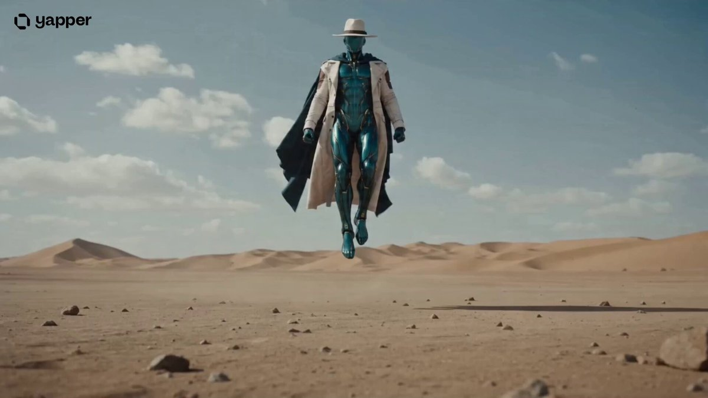
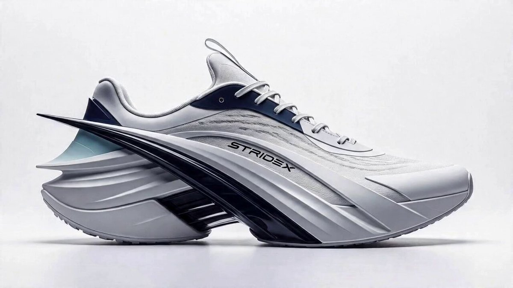
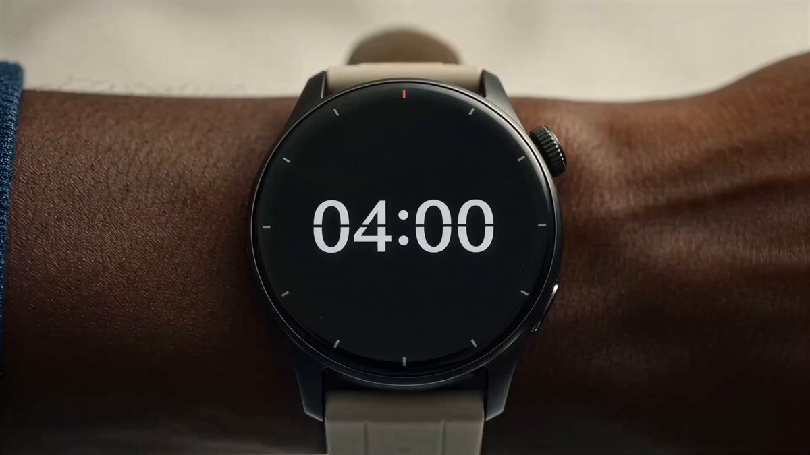
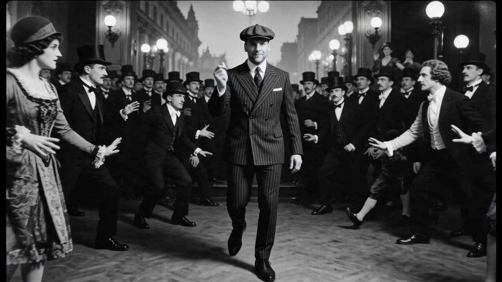
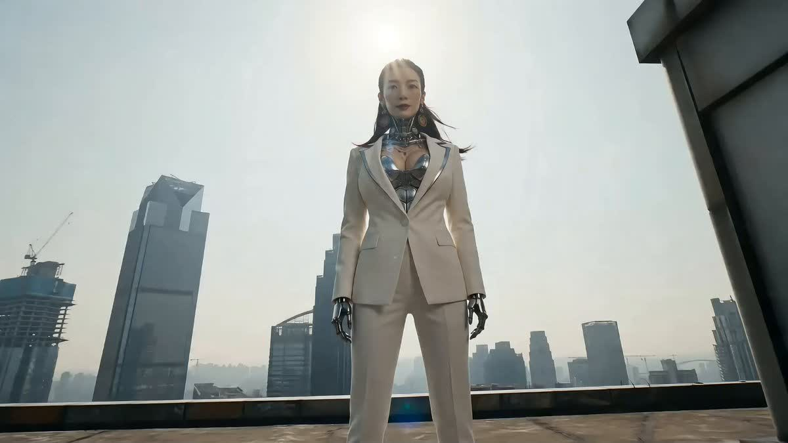

<div align="center">

<a href="https://evolink.ai/models?utm_source=github&utm_medium=banner&utm_campaign=awesome-seedance-2.0-prompts"></a>

[](LICENSE)
[](https://evolink.ai/models?utm_source=github&utm_medium=picture&utm_campaign=awesome-seedance-2.0-prompts)
[](https://evolink.ai/models?utm_source=github&utm_medium=picture&utm_campaign=awesome-seedance-2.0-prompts)
[](https://evolink.ai/models?utm_source=github&utm_medium=picture&utm_campaign=awesome-seedance-2.0-prompts)

[](README.md)
[](README.es.md)
[](README.pt.md)
[](README.ja.md)
[](README.ko.md)
[](README.de.md)
[](README.fr.md)
[](README.tr.md)
[](README.zh-TW.md)
[](README.zh-CN.md)
[](README.ru.md)

</div>

## Introduction

A curated collection of high-quality Seedance 2.0 prompts for cinematic video generation, cleaned from public community posts, translated for README readability, and organized for fast GitHub-native browsing.

Try it on Evolink: [Seedance 2.0](https://evolink.ai/models?utm_source=github&utm_medium=picture&utm_campaign=awesome-seedance-2.0-prompts)

If you find this useful, consider giving it a star. ⭐

> [!NOTE]
> This repository focuses on reusable prompt structures, reference cases, and production-ready Seedance 2.0 examples.

<a href='https://evolink.ai/models?utm_source=github&utm_medium=picture&utm_campaign=awesome-seedance-2.0-prompts'></a>
<a href='https://evolink.ai/models?utm_source=github&utm_medium=picture&utm_campaign=awesome-seedance-2.0-prompts'></a>
<a href='https://evolink.ai/models?utm_source=github&utm_medium=picture&utm_campaign=awesome-seedance-2.0-prompts'></a>
<a href='https://evolink.ai/models?utm_source=github&utm_medium=picture&utm_campaign=awesome-seedance-2.0-prompts'></a>

- API docs: [`EvoLinkAI/Seedance-2.0-Gateway-Service`](https://github.com/EvoLinkAI/Seedance-2.0-Gateway-Service)
- OpenClaw skill: [`EvoLinkAI/seedance2-video-gen-skill-for-openclaw`](https://github.com/EvoLinkAI/seedance2-video-gen-skill-for-openclaw)
- Full guide: [`EvoLinkAI/awesome-seedance-2-guide`](https://github.com/EvoLinkAI/awesome-seedance-2-guide)

## Description

This repository focuses on Seedance 2.0 **usable prompts**, not commentary about prompts.

## Menu

- [Introduction](#introduction)
- [Description](#description)
- [Statistics](#statistics)
- [How to Use This Repository](#how-to-use-this-repository)
- [Featured Prompts](#featured-prompts)
- [Prompt Categories](#prompt-categories)
  - [Action / Fantasy](#action-fantasy)
  - [Cinematic Realism](#cinematic-realism)
  - [POV / FPV](#pov-fpv)
  - [Commercial / Product](#commercial-product)
  - [Reference-Driven](#reference-driven)
  - [Surreal / VFX](#surreal-vfx)
  - [Templates & Structured Formats](#templates-structured-formats)
  - [General Cinematic](#general-cinematic)
- [Resources](#resources)
- [Contributing](#contributing)
- [License](#license)
- [Copyright Notice](#copyright-notice)

## Statistics

| Metric | Value |
| --- | --- |
| Total prompts | 178 |
| Source languages | 4 |
| Latest source date | `17 Apr 2026` |

## How to Use This Repository

1. Start with the category list below and open a section that matches your use case.
2. Compare prompts by camera logic, timing, environment design, and consistency instructions — not only by subject matter.
3. Reuse the structure first. In Seedance, shot progression and motion control often matter more than swapping nouns.
4. Keep prompt-internal tokens such as `@image1` or `<<<Image1>>>` when they are part of the intended syntax.
5. Use titles, categories, and source links as the main navigation anchors inside the cleaned dataset.

## Featured Prompts

These prompts are highlighted for variety: long-form transformation, emotional realism, commercial storyboard work, structured prompt design, and high-spectacle action.

<!-- latest-additions:start -->
### Featured Cases

<!-- Case 1: Black Swan vs Boxer -->
### Case 1: [Black Swan vs Boxer](https://x.com/KanaWorks_AI/status/2045098229847716305) (17 04 2026)


A Japanese anime fight prompt with ring choreography, aggressive counterattacks, and a clean K.O. finish.

| Output |
| :----: |
| [](https://evolink.ai/models?utm_source=github&utm_medium=picture&utm_campaign=awesome-seedance-2.0-prompts) |

**Prompt:**

```
Japanese anime style with the exhilarating feel of a competitive fighting game. Set in a boxing ring, 15 seconds, 30fps, no subtitles. High-contrast cinematic lighting, volumetric light, atmospheric particles and smoke, with a strong audience presence. The overall pacing is clean and sharp, with decisive and powerful camera movement, no dragging. High dynamic range with realistic physical feedback.
[Entrance 0–5s]
Low-angle fast tracking shot with a steady push-in. A tall blonde, blue-eyed ballet dancer descends dramatically from above in a “Black Swan” form—more flamboyant and oppressive in presence. As she spins and lands, her movement carries clear aggression; the impact is heavier, sharper, with precise yet tension-filled body control. Feathers scatter through the air like black blades.
Lighting shifts to a cold, high-contrast tone, with sharp highlights outlining her silhouette, creating a dangerous atmosphere. The crowd erupts in cheers mixed with gasps.
Cut—
A towering boxer stands at the center of the ring (red shorts, red gloves, beast-style mouthguard), radiating pressure. Like a gorilla, he pounds his chest, laughing arrogantly with disdain and provocation.
[Fight 5–15s]
Extreme close-up of the boxing bell as it rings sharply. Hard cut back to the ring.
The boxer throws a heavy punch—the Black Swan dodges with an extreme backbend, then immediately unleashes a counterattack:
A rapid upward high kick, followed by consecutive spinning kicks and slicing leg techniques. Her movements are sharper, more aggressive, with accelerated pacing and continuous, relentless attacks. Her motion is both elegant and feral.
The boxer is completely overwhelmed, forced into a defensive state, retreating step by step as his movements grow disordered.
Final move—after a high-speed spin, the Black Swan delivers a powerful horizontal whip kick (with strong kinetic force and air-tearing impact), launching the boxer high into the air before crashing heavily to the ground.
K.O.
The crowd erupts in thunderous cheers. The Black Swan slowly settles her stance, standing at the center of the spotlight. She gracefully bows like a noble black swan.
```

**[Try It →](https://evolink.ai/models?utm_source=github&utm_medium=picture&utm_campaign=awesome-seedance-2.0-prompts)**

<!-- Case 2: Ground Crack Superman Launch -->
### Case 2: [Ground Crack Superman Launch](https://x.com/techprophett/status/2045091209417249026) (17 04 2026)


A grounded ascension shot focused on impact weight, earth fracture buildup, and a violent vertical takeoff.

| Output |
| :----: |
| [](https://evolink.ai/models?utm_source=github&utm_medium=picture&utm_campaign=awesome-seedance-2.0-prompts) |

**Prompt:**

```
[SCENE SETUP] An open rugged landscape. Rocky ground, overcast sky, wide and cinematic.

[CHARACTER INTRO] The character descends slowly from above, landing firmly on the ground. The impact of his landing sends a small natural shudder through the dirt and loose rocks around his feet.

[THE CROUCH] He slowly crouches down, pressing one fist firmly into the earth. Still. Composed. Eyes forward.

[ENERGY BUILD] The ground around his fist begins cracking and splintering outward. Dirt, small rocks and dust vibrate and tremble. The air around him distorts slightly. Everything shakes — loose stones, dust lifting naturally off the ground around him.

[THE TAKEOFF] He launches violently straight up, leaving a crater where he knelt. Dirt and rocks scatter naturally from the force. He cuts through the low hanging clouds and disappears into the open sky above.

[STYLE] Cinematic. Photoreal. 4K. Natural lighting. Grounded and raw. No energy beams, no glowing effects. Gravity and weight drive everything.
```

**[Try It →](https://evolink.ai/models?utm_source=github&utm_medium=picture&utm_campaign=awesome-seedance-2.0-prompts)**

<!-- Case 3: Stridex Sneaker Commercial -->
### Case 3: [Stridex Sneaker Commercial](https://x.com/ShamsAmin56/status/2045084636695650511) (17 04 2026)


A premium product-ad storyboard with macro texture shots, side-profile reveals, and a polished hero frame.

| Output |
| :----: |
| [](https://evolink.ai/models?utm_source=github&utm_medium=picture&utm_campaign=awesome-seedance-2.0-prompts) |

**Prompt:**

```
Create a 15-second ultra-premium cinematic commercial for futuristic sneakers branded ‘Stridex’, using the provided reference image. Maintain exact design fidelity (materials, structure, colors).

Style: high-end sportswear campaign, cinematic, sharp, luxury-grade production, no motion blur, speed expressed through design only.

00:00 – 00:03
Extreme macro close-up of the sneaker surface (mesh, stitching, sculpted lines).
Lighting: dramatic studio highlights, soft shadows on pure white seamless background.
Camera: slow, controlled glide across textures.
00:03 – 00:06
Close-up tracking shot along the side profile, revealing aerodynamic curves and layered panels.
Focus on sharp lines and directional design elements that imply speed through form.
Camera: smooth lateral dolly, shallow depth of field.
00:06 – 00:09
Mid-shot rotation of the sneaker (angled 45°), showcasing sole engineering and silhouette.
Highlight structured geometry and streamlined outsole.
Lighting remains clean, premium, no visual effects.
00:09 – 00:12
Full product reveal. Sneaker centered on a white reflective surface.
Subtle reflection beneath enhances depth.
Camera: slow cinematic push-in toward the shoe.

00:12 – 00:15
Final hero frame:
Sneaker perfectly centered, sharp and still
Introduce bold ‘STRIDEX’ logo (modern sans-serif, slightly italicized)
Add minimal tagline below (optional): “Engineered for Speed”

Logo appears cleanly (fade or subtle scale-in, no flashy effects)
Lighting: balanced, high-end studio look, crisp shadows, premium finish.
```

**[Try It →](https://evolink.ai/models?utm_source=github&utm_medium=picture&utm_campaign=awesome-seedance-2.0-prompts)**

<!-- Case 4: Travel Suitcase Buddy Montage -->
### Case 4: [Travel Suitcase Buddy Montage](https://x.com/ChaseAIx/status/2045080469533057252) (17 04 2026)


A rhythmic travel commercial built from match cuts, destination jumps, and object-character comedy.

| Output |
| :----: |
| [](https://evolink.ai/models?utm_source=github&utm_medium=picture&utm_campaign=awesome-seedance-2.0-prompts) |

**Prompt:**

```
SHOT 1: ECU, 85mm push-in / 04:00 on a digital watch screen. A hand slams it. / SFX: alarm beep, palm slap.

SHOT 2: WS, 35mm handheld jolt / Rhythmic cut into the man jolting upright, grabbing the suitcase by the handle like a hand-shake, and swinging it off the bed in one motion. / SFX: mattress spring, leather creak.

SHOT 3: MCU, 50mm slide / Cut on action into a passport hitting a tray, followed by a pair of sunglasses. / SFX: plastic thud, metallic clink.

SHOT 4: Insert shot, 85mm rack focus / Match cut into the suitcase zipper closing with a satisfying, high-speed "zip." / SFX: fast zipper slide.

SHOT 5: Exterior Wide, 24mm low-angle / Object pass as the man and suitcase "sprint" into frame against the Great Pyramids. Sand kicks up. / SFX: desert wind, running footsteps in sand.

SHOT 6: Insert shot, 50mm handheld / Rhythmic cut into a chilled coconut being cracked open, the suitcase "sitting" on a beach chair beside him. / SFX: coconut crack, liquid splash.

SHOT 7: MCU, centered 50mm push-in / Match cut into a selfie-angle: The man leans his head against the suitcase like a best friend, the Eiffel Tower sparkling behind them. / SFX: camera shutter, city chatter.

SHOT 8: Bird's-eye insert, 35mm overhead / Cut on action into the suitcase wheels spinning furiously across Andean stone. / SFX: wheel hum, stone rattle.

SHOT 9: MS, 35mm pivot / Camera wipe into a chaotic market in Marrakech. The man maneuvers the suitcase through silk stalls; the suitcase "dodges" a vendor. / SFX: fabric rustle, distant flute, shouting.

SHOT 10: Insert shot, 50mm overhead / Match cut into a stamp slamming down onto a passport page. / SFX: heavy ink thud.

SHOT 11: WS, 24mm parallax / Whip pan transition into a speeding train window. The man’s reflection and the suitcase's reflection are side-by-side as mountains blur past. / SFX: train rhythm, wind whistle.

SHOT 12: MS to CU, 35mm glide into 85mm push-in / Sound bridge into the airport lounge. He rests his feet on the suitcase; they both "exhale" as the sun sets through the terminal glass. / SFX: muffled PA system, deep sigh.

SHOT 13: Insert to MCU, 50mm snap zoom / Smash cut to a front door lock turning. The man and suitcase "stumble" into the dark apartment, looking dusty but happy. / SFX: key turn, door creak.

SHOT 14: OTS, 35mm handheld / Rhythmic cut into the man kicking off his boots and the suitcase falling onto its side with a heavy, tired "flop." / SFX: boot thud, leather heavy impact.

SHOT 15: WS, 50mm pull-out / L-cut with a match from the floor to the bed. The man collapses onto the mattress; the suitcase "collapses" right next to him on the pillows. He flings an arm over the suitcase like a spouse. Lights fade. / SFX: mattress groan, collective exhale, silence.
```

**[Try It →](https://evolink.ai/models?utm_source=github&utm_medium=picture&utm_campaign=awesome-seedance-2.0-prompts)**

<!-- Case 5: Creative Director Dimension Walk -->
### Case 5: [Creative Director Dimension Walk](https://x.com/lukasersil/status/2045070342553493833) (17 04 2026)


A frontal walking prompt that jumps through creative eras while keeping motion, framing, and pace locked.

| Output |
| :----: |
| [](https://evolink.ai/models?utm_source=github&utm_medium=picture&utm_campaign=awesome-seedance-2.0-prompts) |

**Prompt:**

```
CHARACTER: attached image — confident creative director, late 30s, slim build,
short dark hair, natural wide smile; walks with calm executive energy;
outfit morphs each jump to reflect the creative era
CAMERA: frontal tracking, eye-level, full-body, dolly backward with character,
never cuts away from him
COLOR GRADE: B&W flicker → warm gold → smoke grey → neon saturation →
VHS bleed → CRT glow → ring-light pop → hypersaturated chaos →
prompt-blue ambient → holographic cyan → code-green rain → pure white
TRIGGER: finger snap mid-stride → instant dimension jump
RULE: Era-appropriate outfit with each jump. Steady calm walk throughout — pace never changes, never runs, never slows.

JUMP_MODE: creative dimension hopping
SEQUENCE:
START: white photography infinity studio, already mid-stride, looks directly into camera — casual snap → trigger
1: 1920s silent film set — B&W grain, frozen actors around him, film reel flicker → trigger
2: baroque theater stage — candlelit gold, velvet curtains, powdered wig extras scatter → trigger
3: 1960s Madison Avenue agency — cigarette haze, Helvetica posters, typewriters clacking → trigger
4: 1970s disco inferno — mirror ball overhead, polyester crowd parts, bass in the air → trigger
5: 1980s MTV studio — neon grid floor, fog machines, VHS glitch at frame edges → trigger
6: 1990s startup office — CRT glow, dial-up chaos, developers spin in chairs → trigger
7: 2010s YouTube studio — ring light forest, green screens, vlogger mid-take loses his mind → trigger
8: TikTok hyperreality — split screens multiply, emoji swarm, comments scroll the air → trigger
9: AI generation space — prompt text rains vertically, landscapes bloom and dissolve around him → trigger
10: holographic metaverse — glitching NPC crowds, architecture stutters, reality framerate drops → trigger
11: data singularity — code waterfall, neurons fire, his outline becomes wireframe → trigger
12: white void — silence, only footstep echo, wide smile, still walking forward

FINAL: one last snap → seamless loop back to white studio, identical opening shot
```

**[Try It →](https://evolink.ai/models?utm_source=github&utm_medium=picture&utm_campaign=awesome-seedance-2.0-prompts)**

<!-- Case 6: Parametric Fight Template -->
### Case 6: [Parametric Fight Template](https://x.com/aimikoda/status/2044830615434854449) (16 04 2026)


A reusable cinematic fight template with structure for character roles, environment logic, escalation, and finish beats.

| Output |
| :----: |
| [](https://evolink.ai/models?utm_source=github&utm_medium=picture&utm_campaign=awesome-seedance-2.0-prompts) |

**Prompt:**

```
Chapter 1 (0-15 seconds): Rooftop Awakening · Running and Leaping Down (Front to Back View). Style: rugged primitive realism using a 35mm handheld film camera, with natural grain and subtle shake. The dazzling direct sunlight of Chongqing noon creates high-contrast shadows and lens flares. Camera: a single continuous third-person handheld follow shot with no cuts, starting from a low front angle and smoothly transitioning to an over-the-shoulder / back view, following the protagonist Image 1 throughout. Atmosphere: high-altitude winds howl, dust and mist fly, and cloth, hair, and mechanical parts all show realistic physical motion. Sound effects: metallic echoes of mechanical high heels striking concrete, heavy rhythmic breathing, howling wind, operating mechanical joints, violent fabric flapping, sudden silence at the instant of the leap, followed by a high-speed wind-cutting shriek during descent. [Visual Reference / Description]: fully preserve the elegant female character from the reference image, wearing a white suit, silver mechanical chest plate and neck collar, silver mechanical hands, and silver high-heeled boots, with long straight black ponytail, delicate facial features, and large earrings. Physical features and clothing details must remain fully consistent. The scene takes place on the rooftop of Raffles City Chongqing, surrounded by skyscrapers, with the broad Yangtze River visible in the distance. [Timeline per Second] 0-4s: [Front Start] The handheld camera captures her full body from a low front angle. She stands at the rooftop edge, looking directly into the camera with a calm, determined expression. The mechanical cervical spine catches the noon sunlight, and her ponytail lifts in the high wind. She slowly turns around. 4-9s: [Over-the-Shoulder Follow · Full Sprint] The camera switches to an over-the-shoulder perspective and follows closely. She sprints across the concrete platform. Her mechanical high heels spark against metal with each step. The hem of the suit and the mechanical spine exoskeleton whip violently in the airflow. Dust kicks up from the roof, and the cloth simulation stays highly realistic. 9-12s: [Leaping Down] She suddenly jumps off. The instant her feet leave the ground, the camera dips slightly and switches to a fast downward tracking view. Her suit billows violently in the extreme airflow. The glass curtain walls of Raffles City streak upward on both sides, and motion blur erupts intensely. [Style and Quality Enhancement] Realistic 8K quality, ultra-fine mechanical texture and cloth physics, cinematic lighting and contrast, perfect motion blur, high dynamic range, no artifacts, coherent multimodal physical effects, stable cinematic image.

Chapter 2 (0-15 seconds): Freefall · Purple AITO M7 Enters the Frame. Style: rugged realism, 35mm handheld camera, natural grain, subtle organic shake. Camera: primarily handheld follow shots, with quick cuts between the protagonist's falling perspective and the ground car-chase perspective to create extreme tension. Maintain full real-time speed, with no slow motion. Lighting: dazzling high-contrast sunlight at Chongqing noon, strong reflections on the glass curtain walls of Raffles City, and heat haze rising from the road. Sound effects: wind-cutting shriek intensifies continuously -> engine roar approaching from a distance -> sharp tire friction on asphalt -> cyber-energy hum -> metallic thud at the moment of impact -> dull compression as four wheels land -> engine roar continues and grows stronger. [Visual Reference / Description] The protagonist remains the same female character from the reference image, preserving all details. Scene: on the Chongqing ramp road below Raffles City, a purple AITO M7 drives at high speed. It uses the upward slope of the ramp to launch naturally and precisely catch the protagonist as she falls from the rooftop. No slow-motion close-ups at any point; keep the rhythm realistic, high-speed, and cinematic. [Timeline per Second] Continuing from Video 1 and extending by 15 seconds. 0-4s: [Extreme Speed Fall · Overlooking the Ground] Protagonist Image 1 falls at high speed while maintaining a balanced gliding posture with both arms spread. The camera locks onto her back. The curtain walls of Raffles City streak upward on both sides, the ground rapidly expands, and motion blur becomes extreme. The frame quickly inserts a ground view: a purple AITO M7 races along the ramp road below Raffles City. The car emits a cyber blue-purple glow, the engine roars, and the tires leave two black marks on the asphalt. 4-9s: [Ramp Launch · Trajectory Intersection] The purple AITO M7 charges to the top of the ramp. Using the ramp's inertia, the front of the car lifts into the air and the sunroof slides open instantly. The camera alternates rapidly between the falling protagonist and the climbing AITO M7. She keeps a high-speed falling posture with arms spread, and the AITO M7 keeps accelerating up the ramp. The two trajectories converge rapidly, compressing time to the limit and maximizing tension. 9-11s: [Last Second · Posture Change · Precise Entry] With only one second left before the sunroof, the protagonist instantly pulls in her outstretched arms and sharply changes from a horizontal gliding posture to a vertical upright posture. Her legs point straight down toward the open sunroof of the airborne purple AITO M7. The action is swift, decisive, and completely without hesitation. In the next instant, she drops vertically into the open sunroof and lands in the driver's seat at extremely high speed. No slow motion at any point; the impact is realistic and violent. 11-13s: [Four Wheels Landing · Maintaining Drive] The body of the car compresses slightly under the force of catching her. All four wheels slam back to the asphalt. The suspension violently absorbs the double impact. Immediately after landing, the engine roar rises further. Without slowing or stopping, all four tires scrape the asphalt, leaving new black marks, and continue driving at full speed. 13-15s: [Stable Inside Car · Energy Accumulation] The AITO M7 continues high-speed driving. The camera tracks close to the side from a low angle as blue-purple energy patterns spread from the four wheels across the body. The sound of mechanical transmission rises subtly from the underside and keeps strengthening. The body vibrates slightly during the high-speed run. The precursor energy of the coming transformation surges and churns beneath the paint. [Style and Quality Enhancement] Realistic 8K quality, ultra-fine mechanical details and energy-light textures, cinematic volumetric light and heat haze, perfect speed blur, HDR glow, no artifacts, full real-time speed, no slow motion.

Chapter 3 (0-15 seconds): AITO M7 Transforms -> Becomes an F-14 -> Protagonist Stands on the Aircraft Back and Takes Off. Style: rugged realism, 35mm handheld film aesthetic, natural grain, subtle shake. Camera: multi-angle follow coverage including ground tracking, low angle close to the ground, aircraft side view, and protagonist first-person view, all following the aircraft tightly throughout the transformation. Transformation details must remain clearly visible. Atmosphere: light smoke and heat haze drift across the Chongqing road. Cyber blue-purple light refracts between buildings. Noon sunlight produces dazzling reflections and strong shadows across the metal surfaces. Sound effects: engine roar surges -> metal skin bursts and folds -> deep hydraulic tremor as the wings unfold -> metallic gripping sound as the protagonist climbs the exterior -> cockpit seal pops and is immediately drowned by wind noise -> explosive ignition of twin engines -> piercing shriek as the F-14 takes off and breaks the air -> powerful high-altitude wind overtakes the entire soundscape. [Visual Reference / Description] The purple AITO M7 completes a full transformation while driving on the Chongqing road, changing from a car into an F-14 fighter jet, as shown in Image 2. During the transformation, the protagonist clings to and climbs along the aircraft exterior in a dangerous and exposed position. She finally stands centered on the back of the F-14, legs slightly apart to stabilize her balance. Her white suit and ponytail whip violently in the extreme airflow. The F-14 takes off directly from the Chongqing road, and the protagonist remains standing firmly on its back. [Timeline per Second] 0-4s: [Road Acceleration · Transformation Start] The AITO M7 accelerates rapidly along the Chongqing road. Body panels burst open one after another and unfold. The hood rolls upward and becomes mechanical structure. The doors fold outward. The metal skin cracks along structural lines, revealing the cold mechanical interior. The protagonist climbs dangerously toward the top of the aircraft while gripping the transforming metal skeleton. She jumps and shifts position in sync with the aircraft's changing shape. The camera tracks every detail from close to the side of the aircraft. 4-6s: [Wings Unfold · Engines Fully Reassemble] The F-14's iconic swept wings snap open from the folded state and lock into place. The camera captures a low-angle near-ground full view of the wing deployment. Heat haze and dust are blasted up by the airflow from the wings. The twin engine nacelles violently reassemble into jet structures, emitting blue-purple thrust flames. The exhaust scorches the road surface. By now, the protagonist has climbed to the center of the aircraft's back, feet planted firmly, standing upright as the transformation completes. 6-8s: [Protagonist Stands on Aircraft Back · Takes Off] The instant the transformation completes, the protagonist stands fully upright on the back of the F-14. The hem of her white suit flies up in the strong airflow, and her ponytail extends horizontally. The silver mechanical parts reflect the noon sun intensely. The F-14's twin engines ignite at full power. The aircraft surges forward, the front wheel lifts, and the rear wheels leave the asphalt at the last possible moment. The nose pitches upward, carrying the protagonist into the Chongqing sky while she remains standing on its back. 8-15s: [Takeoff and Low City Skim · Protagonist Holds Position] The F-14 climbs vertically, then abruptly lowers its nose and skims over Chongqing at ultra-low altitude.
```

**[Try It →](https://evolink.ai/models?utm_source=github&utm_medium=picture&utm_campaign=awesome-seedance-2.0-prompts)**

